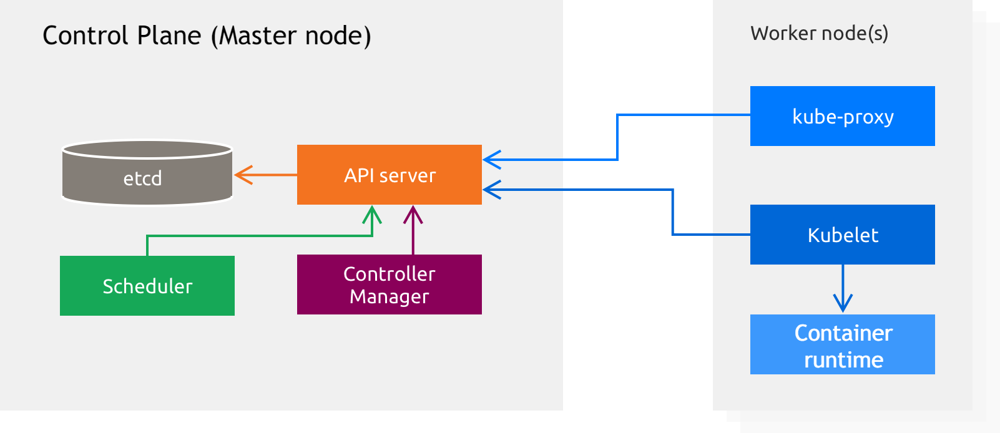
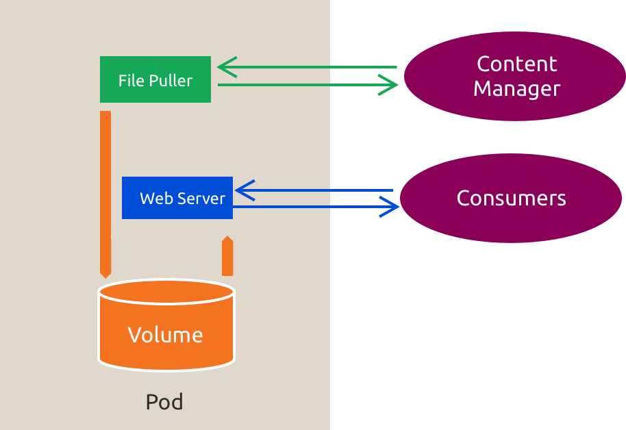
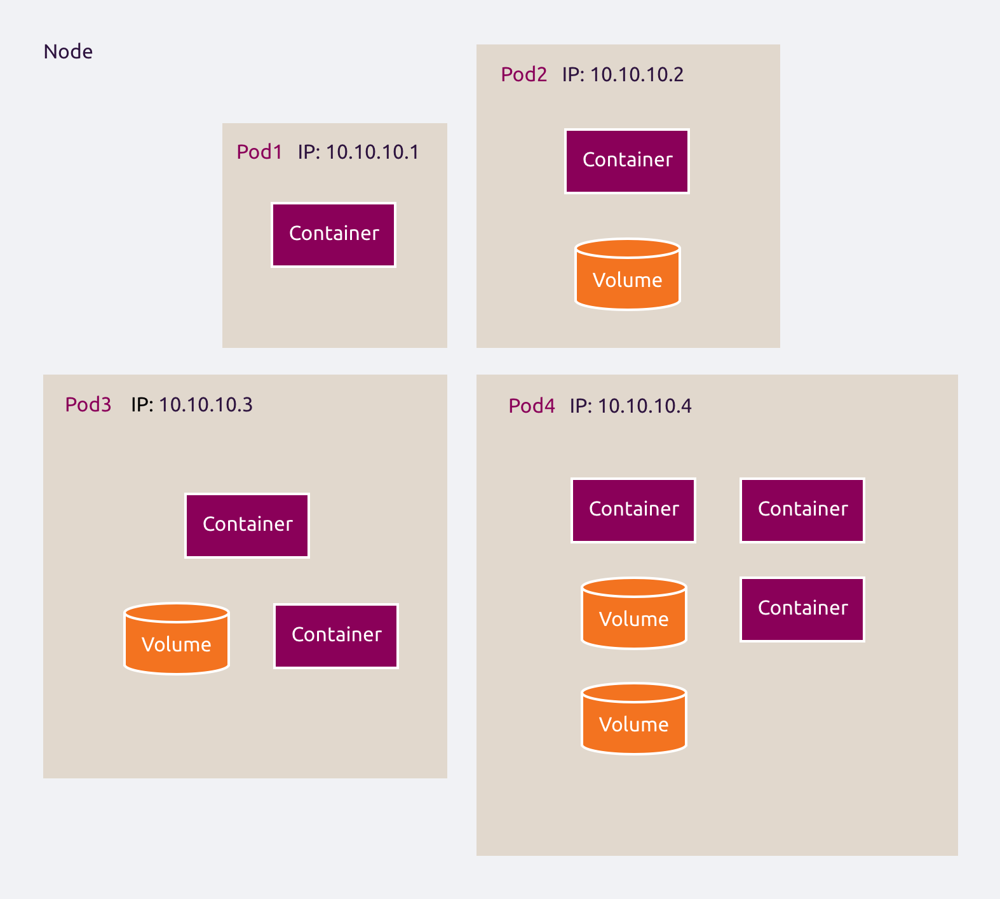

# :material-numeric-1-circle: 1. Kubernetes Basics

Kubernetes is an open-source infrastructure for automating deployment, scaling, and management of containerized
applications. Originally built by Google, it is currently maintained by the Cloud Native Computing Foundation.

The upstream Kubernetes version is comprised of:
  * control plane components:
    * etcd distributed key-value store
    * the API server
    * the Scheduler
    * the Controller Manager
  * worker nodes components:
    * the kubelet
    * the service proxy called kube-proxy
    * the container runtime - containerd

## :material-book-open-variant: Canonical Kubernetes

The official distribution of Kubernetes on Ubuntu delivers a pure 'upstream' version of Kubernetes for organizations to
use privately, plus a few more features like key distribution and overlay networking. We work directly with Google to
align with Google's GKE offering.

Like Ubuntu itself, Canonical Kubernetes is free to use, and Canonical backs it up with enterprise support, consulting,
and management services. Canonical makes it secure and easy to deploy, operate, and upgrade.

Canonical Kubernetes works on AWS, Google Cloud, Azure and Oracle Cloud as well as private infrastructure from bare-metal
racks to VMware and OpenStack. Ubuntu is the most widely used platform for container operations, and Canonical offers the
largest ecosystem of Kubernetes partners, solutions and integration options.

## :material-numeric-1-circle-outline: 1.1 Deploy Canonical Kubernetes

We will be using `MAAS` and `CAPI` to deploy and manage a Kubernetes cluster on MAAS cloud provider using LXD VMs.

First, install MAAS and LXD:

```bash
# Install MAAS.
sudo snap install maas --channel=3.6/stable
```
??? example "Expected result"
    The MAAS snap is installed.

```bash
# Install the MAAS test database.
sudo snap install maas-test-db --channel=3.6/stable
```
??? example "Expected result"
    The MAAS test database snap is installed.

```bash
# Install LXD.
sudo snap install lxd --channel=5.21/stable
```
??? example "Expected result"
    The LXD snap is installed.

Next, initialize LXD and disable IPv6:

```bash
# Initialize LXD.
sudo lxd init --auto
```
??? example "Expected result"
    No output.

```bash
# Disable IPv6 on the LXD bridge.
sudo lxc network set lxdbr0 ipv6.address none
```
??? example "Expected result"
    No output.

```bash
# Disable IPv6 NAT on the LXD bridge.
sudo lxc network unset lxdbr0 ipv6.nat
```
??? example "Expected result"
    No output.

```bash
# Disable DNS on the LXD bridge.
sudo lxc network set lxdbr0 dns.mode=none
```
??? example "Expected result"
    No output.

```bash
# Disable DHCP on the LXD bridge.
sudo lxc network set lxdbr0 ipv4.dhcp=false
```
??? example "Expected result"
    No output.

```bash
# Set the LXD HTTPS address.
sudo lxc config set core.https_address 127.0.0.1:8443
```
??? example "Expected result"
    No output.

Then, let's disable IPv6 system wide:

```bash
# Configure IPv6 to be disabled system wide.
sudo tee -a /etc/sysctl.conf <<EOF
net.ipv6.conf.all.disable_ipv6 = 1
net.ipv6.conf.default.disable_ipv6 = 1
EOF
```
??? example "Expected result"
    The IPv6 sysctl settings are echoed to the terminal.

```bash
# Reload sysctl settings.
sudo sysctl -p
```
??? example "Expected result"
    The configured sysctl settings are displayed.

```bash
# Disable IPv6 for all interfaces.
sudo sysctl -w net.ipv6.conf.all.disable_ipv6=1
```
??? example "Expected result"
    The all-interface IPv6 setting is displayed as `1`.

```bash
# Disable IPv6 for default interfaces.
sudo sysctl -w net.ipv6.conf.default.disable_ipv6=1
```
??? example "Expected result"
    The default-interface IPv6 setting is displayed as `1`.

Next, let's also initialize MAAS:

```bash
# Initialize MAAS.
IP_ADDRESS=$(hostname -I | awk '{print $1}')
sudo maas init region+rack --database-uri maas-test-db:/// --maas-url http://${IP_ADDRESS}:5240/MAAS
```
??? example "Expected result"
    MAAS initializes successfully.

Now that both LXD and MAAS are installed, let's do the initial MAAS setup and integrate it with LXD. Your local host will be registered as a LXD host inside MAAS:

```bash
# Create the MAAS administrator.
sudo maas createadmin --username=admin --password="<maas-admin-password>" --email=admin@example.com
```
??? example "Expected result"
    The MAAS administrator is created.

```bash
# Save the MAAS API key.
sudo maas apikey --username=admin > ~/maas-apikey
```
??? example "Expected result"
    No output.

```bash
# Log in to MAAS.
maas login deployprofile http://${IP_ADDRESS}:5240/MAAS - < ~/maas-apikey
```
??? example "Expected result"
    The MAAS CLI login succeeds.

```bash
# Import boot resources.
maas deployprofile boot-resources import
```
??? example "Expected result"
    Boot-resource import starts.

```bash
# Register the local LXD host.
maas deployprofile vm-hosts create type=lxd power_address=https://127.0.0.1:8443 project=default name=localhost
```
??? example "Expected result"
    The local LXD host is registered in MAAS.

```bash
# Save the LXD host certificate.
maas deployprofile vm-host parameters 1 | jq -r '.certificate' > /tmp/maas.crt
```
??? example "Expected result"
    No output.

```bash
# Trust the MAAS certificate in LXD.
sudo lxc config trust add /tmp/maas.crt
```
??? example "Expected result"
    The MAAS certificate is trusted by LXD.

```bash
# Refresh the LXD host in MAAS.
maas deployprofile vm-host refresh 1
```
??? example "Expected result"
    The LXD host refresh is requested.

```bash
# Generate an SSH key pair.
ssh-keygen -t rsa -N "" -q -f ~/.ssh/id_rsa
```
??? example "Expected result"
    No output.

```bash
# Add the SSH public key to MAAS.
maas deployprofile sshkeys create key="`cat ~/.ssh/id_rsa.pub`"
```
??? example "Expected result"
    The SSH public key is added to MAAS.

LXD has it's own network and but DNS and DHCP will be handled by MAAS. To configure MAAS to work with LXD's network, run:

```bash
# Detect the LXD network CIDR.
PROFILE="deployprofile"
NETWORK="lxdbr0"

# Extract IPv4 CIDR and normalize to x.x.x.0/24
CIDR_RAW=$(lxc network show "$NETWORK" | awk '/ipv4.address:/ {print $2}')
BASE_IP=$(echo "$CIDR_RAW" | cut -d'/' -f1)
PREFIX=$(echo "$CIDR_RAW" | cut -d'/' -f2)

# Normalize to network address (assumes /24 as in your example)
NET_PREFIX=$(echo "$BASE_IP" | awk -F. '{print $1"."$2"."$3}')
CIDR="${NET_PREFIX}.0/${PREFIX}"

echo "Detected CIDR: $CIDR"
```
??? example "Expected result"
    `Detected CIDR` is displayed.

```bash
# Get the matching MAAS subnet ID.
# Get subnet ID from MAAS
SUBNET_ID=$(maas "$PROFILE" subnets read \
  | jq -r ".[] | select(.cidr==\"$CIDR\") | .id")

if [[ -z "$SUBNET_ID" ]]; then
  echo "ERROR: No subnet found for CIDR $CIDR"
  exit 1
fi

echo "Subnet ID: $SUBNET_ID"
```
??? example "Expected result"
    `Subnet ID` is displayed.

```bash
# Create the reserved MAAS IP range.
# Define ranges
RES_START="${NET_PREFIX}.1"
RES_END="${NET_PREFIX}.50"
DYN_START="${NET_PREFIX}.51"
DYN_END="${NET_PREFIX}.60"

# Create reserved range
maas "$PROFILE" ipranges create \
  type=reserved \
  start_ip="$RES_START" \
  end_ip="$RES_END" \
  comment="Reserved range from script"
```
??? example "Expected result"
    The reserved IP range is created.

```bash
# Create the dynamic MAAS IP range.
# Create dynamic range
maas "$PROFILE" ipranges create \
  type=dynamic \
  start_ip="$DYN_START" \
  end_ip="$DYN_END" \
  comment="Dynamic range from script"
```
??? example "Expected result"
    The dynamic IP range is created.

```bash
# Set the subnet gateway and DNS servers.
# Set gateway and DNS on subnet
maas "$PROFILE" subnet update "$SUBNET_ID" \
  gateway_ip="$BASE_IP" \
  dns_servers="1.1.1.1 1.0.0.1"
```
??? example "Expected result"
    The subnet configuration is updated.

```bash
# Enable DHCP on the MAAS VLAN.
# Get VLAN info
VLAN_JSON=$(maas "$PROFILE" subnet read "$SUBNET_ID")
FABRIC_ID=$(echo "$VLAN_JSON" | jq -r '.vlan.fabric_id')
VID=$(echo "$VLAN_JSON" | jq -r '.vlan.vid')

# Pick first rack controller (or choose explicitly)
PRIMARY_RACK=$(maas "$PROFILE" rack-controllers read | jq -r '.[0].system_id')

echo "Using rack controller: $PRIMARY_RACK"

# Enable DHCP with rack controller
maas "$PROFILE" vlan update "$FABRIC_ID" "$VID" \
  primary_rack="$PRIMARY_RACK" \
  dhcp_on=true
```
??? example "Expected result"
    `Using rack controller` is displayed and DHCP is enabled.

```bash
# Set the MAAS upstream DNS server.
maas "$PROFILE" maas set-config name=upstream_dns value="1.1.1.1"
```
??? example "Expected result"
    The updated MAAS configuration is displayed.

```bash
# Configure systemd-resolved to use the local MAAS DNS server.
# also, make sure your OS uses your local IP for resolving:
sudo mkdir -p /etc/systemd/resolved.conf.d && \
DNS=$(ip -4 -o addr show lxdbr0 | awk '{print $4}' | cut -d/ -f1) && \
sudo tee /etc/systemd/resolved.conf.d/90-maas.conf >/dev/null <<EOF
[Resolve]
DNS=$DNS
FallbackDNS=
Domains=~.
EOF
sudo systemctl restart systemd-resolved
```
??? example "Expected result"
    No output.

Finally, let's create the VMs required by our setup:

```bash
# Set the VM CPU overcommit ratio.
maas deployprofile vm-host update 1 cpu_over_commit_ratio=2
```
??? example "Expected result"
    The VM host CPU overcommit ratio is updated.

```bash
# Create the management VM.
maas deployprofile vm-host compose 1 cores=2 memory=4096 storage="1:40(default)" hostname=cluster-ctrl architecture="amd64/generic" interfaces=eth0:subnet=$SUBNET_ID
```
??? example "Expected result"
    The management VM is created.

```bash
# Create the Kubernetes control-plane VM.
maas deployprofile vm-host compose 1 cores=4 memory=8192 storage="1:80(default)" hostname=k8s-ctrl architecture="amd64/generic" interfaces=eth0:subnet=$SUBNET_ID
```
??? example "Expected result"
    The Kubernetes control-plane VM is created.

```bash
# Create the first Kubernetes worker VM.
maas deployprofile vm-host compose 1 cores=4 memory=8192 storage="1:80(default)" hostname=k8s-worker1 architecture="amd64/generic" interfaces=eth0:subnet=$SUBNET_ID
```
??? example "Expected result"
    The first Kubernetes worker VM is created.

```bash
# Create the second Kubernetes worker VM.
maas deployprofile vm-host compose 1 cores=4 memory=8192 storage="1:80(default)" hostname=k8s-worker2 architecture="amd64/generic" interfaces=eth0:subnet=$SUBNET_ID
```
??? example "Expected result"
    The second Kubernetes worker VM is created.

VMs are created and commissioned automatically. Before we can proceed, we need to tag those machines:

```bash
# Tag the commissioned machines.
maas "$PROFILE" machines read \
| jq -r '.[] | "\(.hostname) \(.system_id)"' \
| while read -r HOST ID; do
    echo "Processing $HOST ($ID)"

    case "$HOST" in
        k8s-worker1|k8s-worker2)
            TAG="k8s-worker"
            ;;
        *)
            TAG="$HOST"
            ;;
    esac

    # Create tag (ignore error if it already exists)
    maas "$PROFILE" tags create name="$TAG" 2>/dev/null || true

    # Assign tag to this machine
    maas "$PROFILE" tag update-nodes "$TAG" add="$ID"
done
```
??? example "Expected result"
    `Processing` is displayed for each machine.

Next, let's deploy an operating system to your management machine. On `cluster-ctrl` we'll be running our Kubernetes management cluster that can further provision other clusters.

```bash
# Get the management machine system ID.
CLUSTERCTL_SYSTEM_ID=$(maas "$PROFILE" machines read \
  | jq -r '.[] | select(.tag_names[] == "cluster-ctrl") | .system_id')
```
??? example "Expected result"
    No output.

```bash
# Deploy Ubuntu Noble to the management machine.
maas "$PROFILE" machine deploy "$CLUSTERCTL_SYSTEM_ID" distro_series="ubuntu/noble"
```
??? example "Expected result"
    Deployment of the management machine starts.

After the machine gets deployed with Ubuntu Noble (24.04), we will need to install the necessary tools to have Cluster API up and running:

```bash
# Get the management machine IP address.
CLUSTERCTL_IP=$(maas "$PROFILE" machine read "$CLUSTERCTL_SYSTEM_ID" \
  | jq -r '.interface_set[].links[].ip_address // empty' \
  | head -n1)
```
??? example "Expected result"
    No output.

```bash
# Install Canonical Kubernetes on the management machine.
ssh -o BatchMode=yes -o ConnectTimeout=5 -o StrictHostKeyChecking=no ubuntu@$CLUSTERCTL_IP "sudo snap install k8s --classic --channel=1.35-classic/stable"
```
??? example "Expected result"
    Canonical Kubernetes is installed on the management machine.

```bash
# Bootstrap Canonical Kubernetes on the management machine.
ssh -o BatchMode=yes -o ConnectTimeout=5 -o StrictHostKeyChecking=no ubuntu@$CLUSTERCTL_IP "sudo k8s bootstrap && sudo k8s status --wait-ready"
```
??? example "Expected result"
    Canonical Kubernetes bootstraps and reports ready on the management machine.

```bash
# Create the management cluster kubeconfig.
ssh -o BatchMode=yes -o ConnectTimeout=5 -o StrictHostKeyChecking=no ubuntu@$CLUSTERCTL_IP "mkdir -p ~/.kube/ && sudo k8s config > ~/.kube/config"
```
??? example "Expected result"
    No output.

```bash
# Download clusterctl to the management machine.
ssh -o BatchMode=yes -o ConnectTimeout=5 -o StrictHostKeyChecking=no ubuntu@$CLUSTERCTL_IP "curl -L https://github.com/kubernetes-sigs/cluster-api/releases/download/v1.13.5/clusterctl-linux-amd64 -o clusterctl"
```
??? example "Expected result"
    `clusterctl` is downloaded to the management machine.

```bash
# Install clusterctl on the management machine.
ssh -o BatchMode=yes -o ConnectTimeout=5 -o StrictHostKeyChecking=no ubuntu@$CLUSTERCTL_IP "sudo install -o root -g root -m 0755 clusterctl /usr/local/bin/clusterctl"
```
??? example "Expected result"
    No output.

Last step before actually creating the cluster is to generate a Cluster API manifest that will be used by plain `kubectl` to create our cluster:

```bash
# Set the variables used to generate the Cluster API manifest.
IP_ADDRESS=$(hostname -I | awk '{print $2}')
MAAS_API_KEY=$(cat ~/maas-apikey)
MAAS_ENDPOINT="http://${IP_ADDRESS}:5240/MAAS"
MAAS_DNS_DOMAIN="maas"
CONTROL_PLANE_MACHINE_TAGS="k8s-ctrl"
WORKER_MACHINE_TAGS="k8s-worker"
CHANNEL="1.35-classic/stable"
CONTROL_PLANE_MACHINE_IMAGE="ubuntu/noble"
CONTROL_PLANE_MACHINE_MINCPU=4
CONTROL_PLANE_MACHINE_MINMEMORY=8192
CONTROL_PLANE_MACHINE_COUNT=1
KUBERNETES_VERSION="1.35.7"
WORKER_MACHINE_IMAGE="ubuntu/noble"
WORKER_MACHINE_MINCPU=4
WORKER_MACHINE_MINMEMORY=8192
WORKER_MACHINE_COUNT=2

CAPI_VERSION="v1.13.5"
CK8S_PROVIDER_VERSION="v0.6.2"
MAAS_PROVIDER_VERSION="v0.9.0"
```
??? example "Expected result"
    No output.

```bash
# Initialize the providers and generate the Cluster API manifest remotely.
ssh -o BatchMode=yes -o ConnectTimeout=5 -o StrictHostKeyChecking=no ubuntu@$CLUSTERCTL_IP << EOF
export MAAS_API_KEY=$MAAS_API_KEY
export MAAS_ENDPOINT=$MAAS_ENDPOINT
export MAAS_DNS_DOMAIN=$MAAS_DNS_DOMAIN
export CONTROL_PLANE_MACHINE_TAGS=$CONTROL_PLANE_MACHINE_TAGS
export WORKER_MACHINE_TAGS=$WORKER_MACHINE_TAGS
export CHANNEL=$CHANNEL
export CONTROL_PLANE_MACHINE_IMAGE=$CONTROL_PLANE_MACHINE_IMAGE
export CONTROL_PLANE_MACHINE_MINCPU=$CONTROL_PLANE_MACHINE_MINCPU
export CONTROL_PLANE_MACHINE_MINMEMORY=$CONTROL_PLANE_MACHINE_MINMEMORY
export CONTROL_PLANE_MACHINE_COUNT=$CONTROL_PLANE_MACHINE_COUNT
export KUBERNETES_VERSION=$KUBERNETES_VERSION
export WORKER_MACHINE_IMAGE=$WORKER_MACHINE_IMAGE
export WORKER_MACHINE_MINCPU=$WORKER_MACHINE_MINCPU
export WORKER_MACHINE_MINMEMORY=$WORKER_MACHINE_MINMEMORY
export WORKER_MACHINE_COUNT=$WORKER_MACHINE_COUNT

clusterctl init \
  --core "cluster-api:${CAPI_VERSION}" \
  --bootstrap "canonical-kubernetes:${CK8S_PROVIDER_VERSION}" \
  --control-plane "canonical-kubernetes:${CK8S_PROVIDER_VERSION}" \
  --infrastructure "maas:${MAAS_PROVIDER_VERSION}"

git clone https://github.com/canonical/cluster-api-k8s
cd cluster-api-k8s
export CLUSTER_NAME=myk8scluster
clusterctl generate cluster \${CLUSTER_NAME} --from ./templates/maas/cluster-template.yaml --list-variables
clusterctl generate cluster \${CLUSTER_NAME} --from ./templates/maas/cluster-template.yaml > cluster.yaml
EOF
```
??? example "Expected result"
    `cluster.yaml` is generated.

Now that the cluster template is generated, we can apply it to create the cluster:

```bash
# Connect to the management machine.
ssh $CLUSTERCTL_IP
```
??? example "Expected result"
    A remote shell opens on the management machine.

```bash
# Enter the Cluster API provider directory.
cd cluster-api-k8s
```
??? example "Expected result"
    No output.

```bash
# Apply the generated cluster template.
sudo k8s kubectl apply -f cluster.yaml
```
??? example "Expected result"
    The cluster resources are created.

```bash
# Verify status with:
watch "sudo k8s kubectl get clusters; sudo k8s kubectl get machines"
```
??? example "Expected result"
    Cluster and machine status are displayed.

```bash
# and
watch clusterctl describe cluster myk8scluster
```
??? example "Expected result"
    The cluster description is displayed.

```bash
# Exit the management machine.
exit
```
??? example "Expected result"
    The local shell resumes.

## :material-numeric-1-circle-outline: 1.2 Interacting with the cluster and observability

After the cluster is deployed you may assume control over the Kubernetes
cluster from any k8s node.

`kubectl` is the command line tool for Kubernetes. It controls the Kubernetes cluster manager.

`config` are files used to organize information about clusters, users, namespaces, and authentication mechanisms.
The `kubectl` command-line tool uses `config` files to find the information it needs to choose a cluster and communicate
with the API server of a cluster. By default, the config files are created on the `k8s` nodes. Create
the `kubectl` config directory and copy the cluster `config` file to the default location:

```bash
# Create the kubectl configuration directory.
mkdir -p ~/.kube && cd ~/.kube
```
??? example "Expected result"
    No output.

Once the cluster is done being installed, you'll need the configuration file `kubectl` uses to connect to the cluster. To get it:

```bash
# Connect to the management machine.
ssh $CLUSTERCTL_IP
```
??? example "Expected result"
    A remote shell opens on the management machine.

```bash
# Retrieve the deployed cluster kubeconfig.
clusterctl get kubeconfig myk8scluster > ~/.kube/myk8scluster_config
```
??? example "Expected result"
    No output.

```bash
# Exit the management machine.
exit
```
??? example "Expected result"
    The local shell resumes.

`myk8scluster_config` file gets created inside `.kube` folder. Also, you'll need the `kubectl` CLI installed, so:

```bash
# Install kubectl.
sudo snap install kubectl --channel=1.35/stable --classic
```
??? example "Expected result"
    The kubectl snap is installed.

Then, check `kubectl` has access to the cluster:

```bash
# Select the deployed cluster kubeconfig.
export KUBECONFIG=~/.kube/myk8scluster_config
```
??? example "Expected result"
    No output.

```bash
# List all cluster nodes.
kubectl get nodes -A -o wide
```
??? example "Expected result"
    Nodes are displayed.

```bash
# List all cluster pods.
kubectl get pods -A -o wide
```
??? example "Expected result"
    Pods are displayed.

```bash
# Exit the current shell.
exit
```
??? example "Expected result"
    The parent shell resumes.

Now that config files have been tested, they can be copied on your lab environment:

```bash
# Create the local kubeconfig directory.
mkdir -p ~/.kube
```
??? example "Expected result"
    No output.

```bash
# Copy the deployed cluster kubeconfig to the lab environment.
scp $CLUSTERCTL_IP:~/.kube/myk8scluster_config ~/.kube/
```
??? example "Expected result"
    The deployed cluster kubeconfig is copied.

```bash
# Copy the management cluster kubeconfig to the lab environment.
scp $CLUSTERCTL_IP:~/.kube/config ~/.kube/
```
??? example "Expected result"
    The management cluster kubeconfig is copied.

```bash
# Install kubectl in the lab environment.
sudo snap install kubectl --channel=1.35/stable --classic
```
??? example "Expected result"
    The kubectl snap is installed.

Once you have both config files and `kubectl` client, you can inspect both management and deployed clusters.

```bash
# Inspect the management cluster.
kubectl get nodes
```
??? example "Expected result"
    ```text
    NAME           STATUS   ROLES                  AGE   VERSION
    cluster-ctrl   Ready    control-plane,worker   54m   v1.35.7
    ```

Also, you can inspect the deployed cluster:

```bash
# Select the deployed cluster kubeconfig.
export KUBECONFIG=~/.kube/myk8scluster_config
```
??? example "Expected result"
    No output.

```bash
# Inspect the deployed cluster.
kubectl get nodes
```
??? example "Expected result"
    ```text
    NAME          STATUS   ROLES                  AGE   VERSION
    k8s-ctrl      Ready    control-plane,worker   45m   v1.35.7
    k8s-worker1   Ready    worker                 37m   v1.35.7
    k8s-worker2   Ready    worker                 37m   v1.35.7
    ```

Multiple clusters can be managed with the help of `config` file. Users can switch between different clusters. For more information on
this please visit:

https://kubernetes.io/docs/tasks/access-application-cluster/configure-access-multiple-clusters

**Note**: A file that is used to configure access to a cluster is also sometimes called a `kubeconfig` file. This is just a
generic way of referring to configuration files. It does not mean that there is a file named `kubeconfig`.

For information on how to install `kubectl` on other systems, please visit the links:

https://kubernetes.io/docs/tasks/tools/

Good documentation on `kubectl` can be found here:

https://kubernetes.io/docs/reference/kubectl/

Also, let's add command autocompletion for `kubectl`:

```bash
# Enable kubectl command completion.
kubectl completion bash | sudo tee /etc/bash_completion.d/kubectl > /dev/null
```
??? example "Expected result"
    No output.

```bash
# Make the kubectl completion file readable.
sudo chmod a+r /etc/bash_completion.d/kubectl
```
??? example "Expected result"
    No output.

After that, let's logout and re-login:

```bash
# Log out of the lab machine.
exit
```
??? example "Expected result"
    The local shell resumes.

```bash
# Reconnect to the lab machine.
ssh ubuntu@<public IP address of your lab>
```
??? example "Expected result"
    A shell opens on the lab machine.

Query the cluster:

```bash
# Select the deployed cluster kubeconfig.
export KUBECONFIG=~/.kube/myk8scluster_config
```
??? example "Expected result"
    No output.

```bash
# Query cluster information.
kubectl cluster-info
```
??? example "Expected result"
    ```text
    Kubernetes control plane is running at https://myk8scluster-d02f62.maas:6443
    CoreDNS is running at https://myk8scluster-d02f62.maas:6443/api/v1/namespaces/kube-system/services/coredns:udp-53/proxy

    To further debug and diagnose cluster problems, use 'kubectl cluster-info dump'.
    ```

Kubernetes components like the scheduler or the distributed database can be checked to ensure cluster functionality:

```bash
# Check Kubernetes component readiness.
kubectl get --raw='/readyz?verbose'
```
??? example "Expected result"
    ```text
    [+]ping ok
    [+]log ok
    [+]etcd ok
    [+]etcd-readiness ok
    [+]informer-sync ok
    [+]poststarthook/start-apiserver-admission-initializer ok
    [+]poststarthook/generic-apiserver-start-informers ok
    [+]poststarthook/priority-and-fairness-config-consumer ok
    [+]poststarthook/priority-and-fairness-filter ok
    [+]poststarthook/storage-object-count-tracker-hook ok
    [+]poststarthook/start-apiextensions-informers ok
    [+]poststarthook/start-apiextensions-controllers ok
    [+]poststarthook/crd-informer-synced ok
    [+]poststarthook/start-system-namespaces-controller ok
    [+]poststarthook/peer-endpoint-reconciler-controller ok
    [+]poststarthook/start-cluster-authentication-info-controller ok
    [+]poststarthook/start-kube-apiserver-identity-lease-controller ok
    [+]poststarthook/start-kube-apiserver-identity-lease-garbage-collector ok
    [+]poststarthook/storage-readiness ok
    [+]poststarthook/start-legacy-token-tracking-controller ok
    [+]poststarthook/start-service-ip-repair-controllers ok
    [+]poststarthook/rbac/bootstrap-roles ok
    [+]poststarthook/scheduling/bootstrap-system-priority-classes ok
    [+]poststarthook/priority-and-fairness-config-producer ok
    [+]poststarthook/bootstrap-controller ok
    [+]poststarthook/start-kubernetes-service-cidr-controller ok
    [+]poststarthook/aggregator-reload-proxy-client-cert ok
    [+]poststarthook/start-kube-aggregator-informers ok
    [+]poststarthook/apiservice-status-local-available-controller ok
    [+]poststarthook/apiservice-status-remote-available-controller ok
    [+]poststarthook/apiservice-registration-controller ok
    [+]poststarthook/apiservice-discovery-controller ok
    [+]poststarthook/kube-apiserver-autoregistration ok
    [+]autoregister-completion ok
    [+]poststarthook/apiservice-openapi-controller ok
    [+]poststarthook/apiservice-openapiv3-controller ok
    [+]shutdown ok
    readyz check passed
    ```

In Kubernetes terminology, the workers which run the `kubelet` service are called `nodes`. This cluster is modeled
with two purely worker `nodes` and one control plane `node` that also runs `kubelet`, but more can be added at any time:

```bash
# List deployed cluster nodes.
kubectl get nodes
```
??? example "Expected result"
    ```text
    NAME          STATUS   ROLES                  AGE   VERSION
    k8s-ctrl      Ready    control-plane,worker   50m   v1.36.4
    k8s-worker1   Ready    worker                 42m   v1.36.4
    k8s-worker2   Ready    worker                 42m   v1.36.4
    ```

You can get even more detailed information by running `kubectl get nodes -o wide`.

Additionally, check a specific node status, CPU and memory data, system information:

```bash
# Describe a specific node.
kubectl describe node <node_name>
```
??? example "Expected result"
    Node status, CPU and memory data, and system information are displayed.

We can check how much resources are consumed (current resource usage) on each node:

```bash
# Show current node resource usage.
kubectl top nodes
```
??? example "Expected result"
    ```text
    NAME          CPU(cores)   CPU(%)   MEMORY(bytes)   MEMORY(%)
    k8s-ctrl      153m         3%       1948Mi          24%
    k8s-worker1   89m          2%       1324Mi          16%
    k8s-worker2   72m          1%       1147Mi          14%
    ```

Resource utilization per pod can also be inspected. You may get an error in the beginning, don't worry,
the metrics take some time to be collected, try again in a minute:

```bash
# Show current pod resource usage.
kubectl top pods --all-namespaces
```
??? example "Expected result"
    Pod resource usage is displayed.



## :material-numeric-1-circle-outline: 1.3 Pods and namespaces

A `pod` is smallest deployment unit that a user can create. It is an encapsulation of one or more containers
with a shared network and storage scope. The shared context of a pod is implemented with Linux namespaces,
cgroups, among others, the same used for Docker or Containerd containers isolation.

Containers within a pod share an IP address and a port space, of the pod. They communicate with each other inside pods
using standard IPC. Containers in different pods have distinct IPs and communicate on that IP.

Using pods, applications can be designed in a highly distributed manner. Microservice architectures are common for
applications that run on Kubernetes.

Pods are considerate to have ephemeral life and should be treated like cattle. Another important mention is that pods alone
do not offer application high availability. For that, kubernetes has mechanism that make use of pods, but more of that later.

List the pods:

```bash
# List all pods.
kubectl get pods -o wide --all-namespaces
```
??? example "Expected result"
    Pods are displayed.

Multiple pods can be seen, buy why? Kubernetes itself runs it's services (api server, dashboard, etc.) inside
pods. Those pods run in a special namespace called `kube-system`, a system reserved namespace. `Namespaces` are a way
to create scopes for different projects. For example, the development team can work in their `dev` namespace, and the
support team can work in their `support` namespace. The two can be considered different projects, resources are not shared
and the two namespaces are isolated from each other.

By default, a `default` namespace is created along with the kube-system one. List all the namespaces:

```bash
# List all namespaces.
kubectl get namespaces
```
??? example "Expected result"
    Namespaces are displayed.

## :material-numeric-1-circle-outline: 1.4 Work with pods and volumes

Kubernetes treats everything as objects, including pods, and each object has a definition. A definition is a declaration of
a desired state. Kubernetes ensures that the current state matches the desired state. For example, when you create a Pod and
declare that the containers in it to be running. If the containers are not running due to an app failure, kubernetes will
recreate the pod in order to drive the pod to desired state.



Take a look at this simple nginx pod definition. The definition is present in a file in `~/resources/nginx-pod.yaml`:

```yaml
apiVersion: v1
kind: Pod
metadata:
  name: nginx
  labels:
    app: nginx
spec:
  containers:
  - name: nginx
    image: nginx:latest
    ports:
      - containerPort: 80
```

Create the pod:

```bash
# Create the nginx pod.
export KUBECONFIG=~/.kube/myk8scluster_config
kubectl create -f ~/resources/nginx-pod.yaml
```
??? example "Expected result"
    `pod/nginx` is created.

List the pods and describe the newly created pod, try to understand what is in there and talk with the trainer on the bits
that you do not understand:

```bash
# List the nginx pod.
kubectl get pods -o wide
```
??? example "Expected result"
    The nginx pod is displayed.

```bash
# Describe the nginx pod.
kubectl describe pod nginx
```
??? example "Expected result"
    Pod details are displayed.

Delete the pod:

```bash
# Delete the nginx pod.
kubectl delete pod nginx
```
??? example "Expected result"
    `pod "nginx"` is deleted.

That's good for a simple web server, but what if persistent storage is needed? The container file system only lives as
long as the container does. Volumes should be used for any persistent storage needs.

There are many volume types available, with some being cloud platform specific (e.g. `azureDisk`, `gcePersistentDisk`,
`azureDisk`, `awsElasticBlockStore`). The standard types include:

`EmptyDir`: is first created when a Pod is assigned to a Node, and exists as long as that Pod is running on that node.
It is initially empty and is stored on whatever medium is backing the node - that might be disk or HDD/SSD or network storage,
depending on your environment.

`HostPath`: Mounts an existing directory on the node’s file system. For example `/var/logs`.

Here is an example of how volumes will look like in a pod definition:

```yaml
apiVersion: v1
kind: Pod
metadata:
  name: redis
spec:
  containers:
  - name: redis
    image: redis
    volumeMounts:
    - name: redis-storage
      mountPath: /data/redis
  volumes:
  - name: redis-storage
    emptyDir: {}
```

Create the pod in `~/resources/redis-volume-pod.yaml` and run the `describe pod` command on it afterwards to see
the volumes attached. Delete the pod once done.

```bash
# Create the redis volume pod.
export KUBECONFIG=~/.kube/myk8scluster_config
kubectl create -f ~/resources/redis-volume-pod.yaml
```
??? example "Expected result"
    `pod/redis` is created.

```bash
# Describe the redis pod.
kubectl describe pod redis
```
??? example "Expected result"
    Pod details and attached volumes are displayed.

Multiple containers can also exist in one pod. Take a look at this example:

```bash
# Display the multi-container pod definition.
cat ~/resources/multi-container-pod.yaml
```
??? example "Expected result"
    The multi-container pod definition is displayed.

There are two containers, `nginx-container` and `debian-container`. The `debian-container` is responsible for generating the index file, while `nginx-container` serves it to the clients.

Finally, delete the pod:

```bash
# Delete the redis pod.
kubectl delete pod redis
```
??? example "Expected result"
    `pod "redis"` is deleted.


