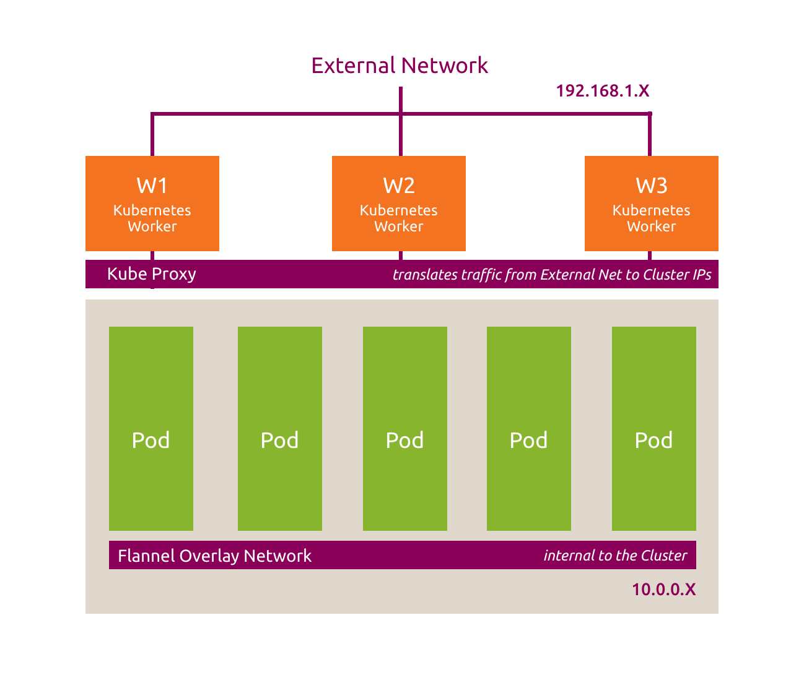
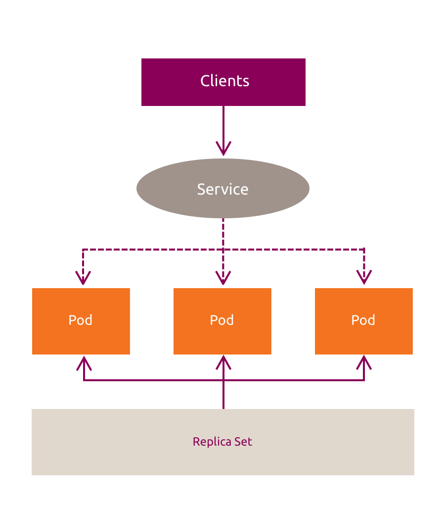
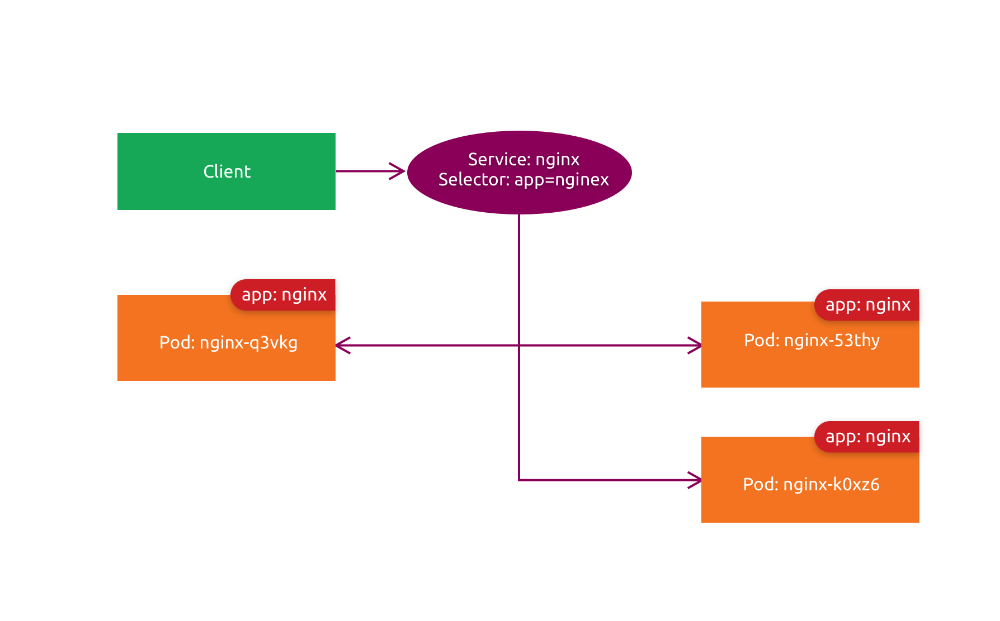
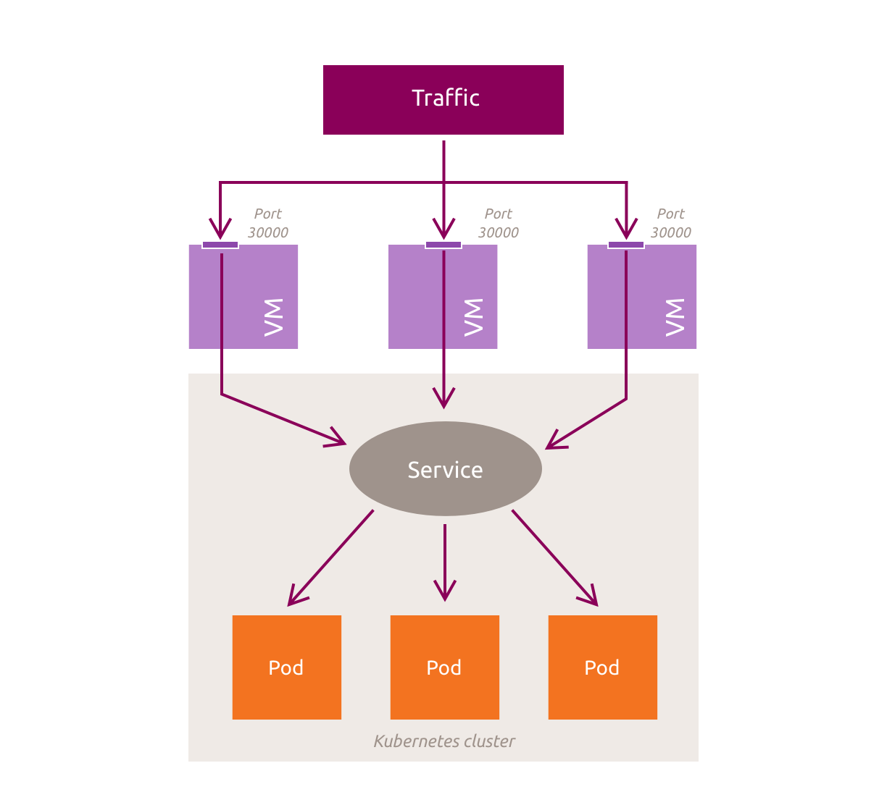
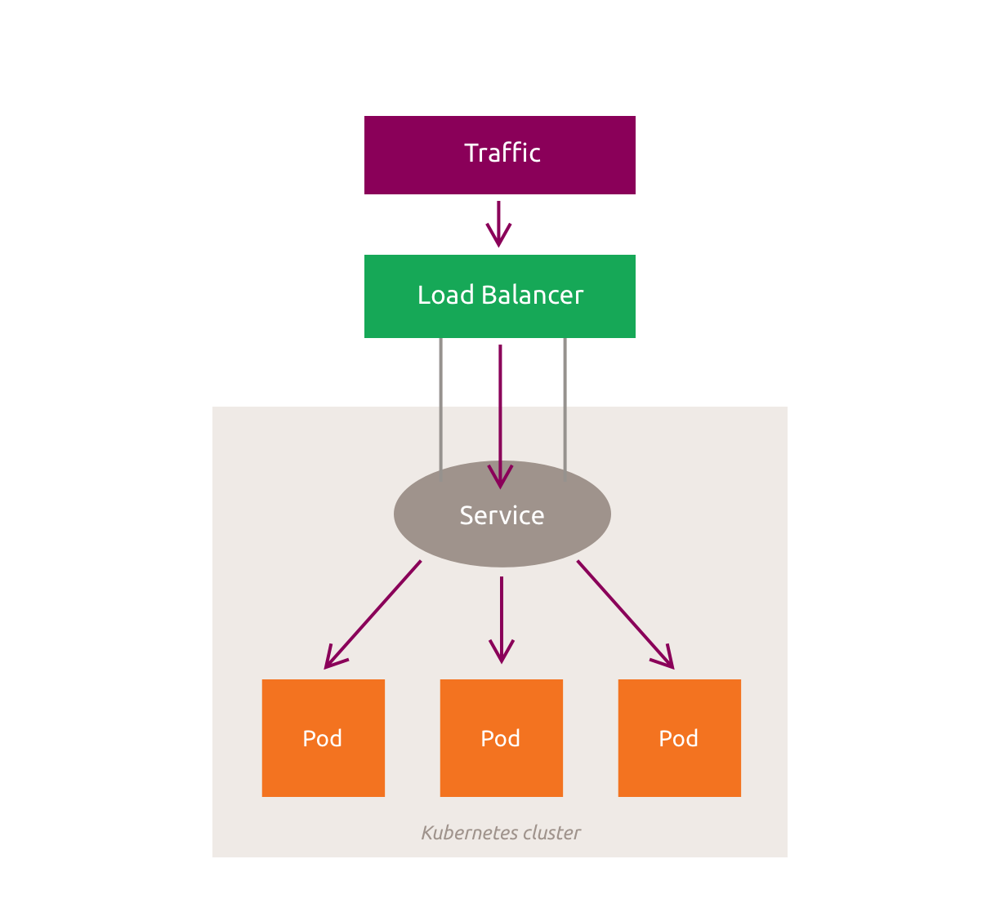
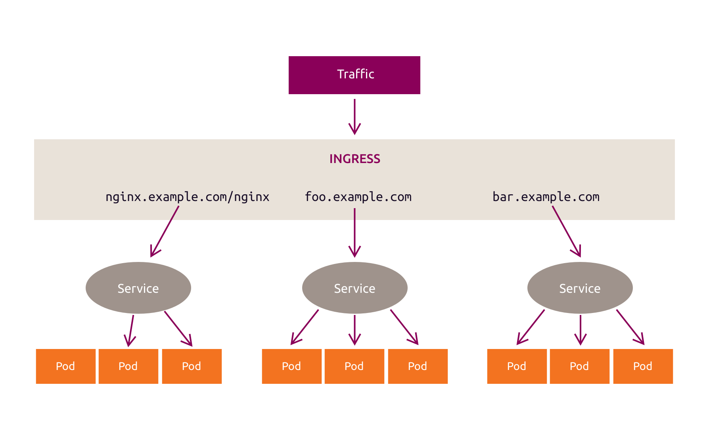

# :material-numeric-2-circle: 2. Networking

## :material-book-open-page-variant-outline: 2.1 Exposing apps using Services and Labels

The applications created so far are not exposed outside the cluster. Directly addressing Pods is unreliable for several reasons:

  * Pods are ephemeral.
  * Kubernetes assigns IP addresses to Pods after they are scheduled, so clients should not rely on addresses known in advance.
  * Applications can scale across multiple Pods, and clients should not need to track their addresses or locations.

Kubernetes provides the `Service` resource to give clients a stable way to reach these Pods.



A Service provides a stable access point for a group of Pods. Most Services receive a virtual IP address that remains stable for the lifetime of the Service. Connections to the Service are forwarded to eligible backend Pods, so clients do not need to track individual Pod addresses or locations. Headless and `ExternalName` Services do not use a virtual IP address.



There are four Service types:
  * `ClusterIP`: exposes the Service on an internal virtual IP address.
  * `NodePort`: exposes the Service on a static port on every node.
  * `LoadBalancer`: requests an externally reachable address from the platform's load-balancer implementation.
  * `ExternalName`: maps the Service to an external DNS name by returning a CNAME record. It does not configure proxying.

Labels are key-value metadata attached to objects such as Pods. A Service selector identifies the Pods that provide its endpoints.

For example, suppose three Pods running an application have the label `app: nginx`. A Service with the selector `app: nginx` sends traffic to eligible Pods with that label.



The Canonical Kubernetes cluster deployed in this lab uses Cilium for networking and MetalLB to allocate addresses for `LoadBalancer` Services. Configure a MetalLB `IPAddressPool`:

Create a YAML file named `metallb.yaml` with the following content:

```yaml
apiVersion: metallb.io/v1beta1
kind: IPAddressPool
metadata:
  name: lb-pool
  namespace: metallb-system
spec:
  addresses:
  - XX.XX.XX.10-XX.XX.XX.40
```

Replace `XX.XX.XX` with the first three octets of the LXD bridge's IPv4 address shown by:

```bash
# Display the LXD bridge address.
ip add sh dev lxdbr0
```
??? example "Expected result"
    ```text
    3: lxdbr0: <BROADCAST,MULTICAST,UP,LOWER_UP> mtu 1500 qdisc noqueue state UP group default qlen 1000
        link/ether 00:16:3e:d9:14:a7 brd ff:ff:ff:ff:ff:ff
        inet 10.219.64.1/24 scope global lxdbr0
           valid_lft forever preferred_lft forever
    ```

In this case, the file should look like:

```yaml
apiVersion: metallb.io/v1beta1
kind: IPAddressPool
metadata:
  name: lb-pool
  namespace: metallb-system
spec:
  addresses:
  - 10.219.64.10-10.219.64.40
```

Apply the configuration with:

```bash
# Apply the MetalLB IP address pool.
kubectl apply -f metallb.yaml
```
??? example "Expected result"
    The IPAddressPool is configured.

Verify the configuration has been applied with:

```bash
# List MetalLB IP address pools.
kubectl get IPAddressPool -n metallb-system
```
??? example "Expected result"
    The IPAddressPool is displayed.

```bash
# Describe the MetalLB IP address pool.
kubectl describe IPAddressPool -n metallb-system lb-pool
```
??? example "Expected result"
    IPAddressPool details are displayed.

Also, create a L2Advertisement - `metallb-l2advertisement.yaml`:

```yaml
apiVersion: metallb.io/v1beta1
kind: L2Advertisement
metadata:
  name: lb-pool
  namespace: metallb-system
spec:
  ipAddressPools:
  - lb-pool
```

Apply the configuration with:

```bash
# Apply the MetalLB L2 advertisement.
kubectl apply -f metallb-l2advertisement.yaml
```
??? example "Expected result"
    The L2Advertisement is configured.

The `cilium-ingress` EndpointSlice also needs the Service label:

```bash
# Label the cilium-ingress endpoint slice.
kubectl label endpointslice cilium-ingress \
  -n kube-system \
  kubernetes.io/service-name=cilium-ingress \
  --overwrite
```
??? example "Expected result"
    The EndpointSlice label is applied.

Now, let's take a look at the existing services:

```bash
# List services in all namespaces.
kubectl get svc --all-namespaces
```
??? example "Expected result"
    ```text
    NAMESPACE        NAME                                TYPE           CLUSTER-IP       EXTERNAL-IP   PORT(S)                      AGE
    default          kubernetes                          ClusterIP      10.152.0.1       <none>        443/TCP                      68m
    kube-system      cilium-ingress                      LoadBalancer   10.152.84.241    10.219.64.10  80:31695/TCP,443:31146/TCP   68m
    kube-system      ck-storage-rawfile-csi-controller   ClusterIP      None             <none>        <none>                       68m
    kube-system      ck-storage-rawfile-csi-node         ClusterIP      10.152.211.218   <none>        9100/TCP                     68m
    kube-system      coredns                             ClusterIP      10.152.27.35     <none>        53/UDP,53/TCP                68m
    kube-system      hubble-peer                         ClusterIP      10.152.17.16     <none>        443/TCP                      68m
    kube-system      metrics-server                      ClusterIP      10.152.75.38     <none>        443/TCP                      68m
    metallb-system   metallb-webhook-service             ClusterIP      10.152.195.15    <none>        443/TCP                      68m
    ```

This output lists Services used by cluster components and applications. Only the `cilium-ingress` Service has the `LoadBalancer` type. A ClusterIP is an internal virtual address implemented by the cluster networking data plane and is normally reachable only from the cluster network. Adding `-o wide` displays each Service selector, when present.

**NOTE**: Workload controllers such as Deployments and ReplicaSets also use selectors to associate with Pods.

Redeploy `nginx` with a label. Display `~/resources/nginx-pod.yaml` and note the `labels` field:

```bash
# Display the nginx pod definition.
cat ~/resources/nginx-pod.yaml
```
??? example "Expected result"
    ```text
    apiVersion: v1
    kind: Pod
    metadata:
      name: nginx
      labels:
        app: nginx
    spec:
      containers:
      - name: nginx
        image: nginx:latest
        ports:
          - containerPort: 80
    ```

```bash
# Create the nginx pod.
kubectl create -f ~/resources/nginx-pod.yaml
```
??? example "Expected result"
    The nginx Pod is created.

Now it's time to create the Service. The Service definition file should be found under `~/resources/nginx-service.yaml`. Let's
examine the contents and create the Service:

```bash
# Display the nginx service definition.
cat ~/resources/nginx-service.yaml
```
??? example "Expected result"
    ```text
    apiVersion: v1
    kind: Service
    metadata:
      name: nginx
    spec:
      ports:
      - port: 8080
        targetPort: 80
      selector:
        app: nginx
    ```

```bash
# Create the nginx service.
kubectl create -f ~/resources/nginx-service.yaml
```
??? example "Expected result"
    The nginx Service is created.

The service should now be visible:

```bash
# List services with selectors.
kubectl get svc -o wide
```
??? example "Expected result"
    ```text
    NAME         TYPE        CLUSTER-IP      EXTERNAL-IP   PORT(S)    AGE   SELECTOR
    kubernetes   ClusterIP   10.152.0.1      <none>        443/TCP    70m   <none>
    nginx        ClusterIP   10.152.95.221   <none>        8080/TCP   5s    app=nginx
    ```

The application can now be accessed through the Service from within the cluster, but not from outside it.

The following probes demonstrate internal Service connectivity. External access methods are introduced later in this chapter.

In the default Kubernetes network model, nodes can reach Pods without NAT unless network policies or infrastructure rules restrict that traffic. To probe the application from a node, use the Service's ClusterIP and port shown by `kubectl get svc -o wide`:

```bash
# Enter the k8s-ctrl node shell.
lxc shell k8s-ctrl
```
??? example "Expected result"
    A shell opens on the k8s-ctrl node.

```bash
# Install pandoc on the k8s-ctrl node.
apt install -y pandoc
```
??? example "Expected result"
    Pandoc is installed successfully.

```bash
# Probe nginx from the k8s-ctrl node.
curl -s 10.152.95.221:8080 | pandoc -f html -t plain
```
??? example "Expected result"
    ```text
    Welcome to nginx!

    If you see this page, nginx is successfully installed and working.
    Further configuration is required for the web server, reverse proxy, API
    gateway, load balancer, content cache, or other features.

    For online documentation and support please refer to nginx.org.
    To engage with the community please visit community.nginx.org.
    For enterprise grade support, professional services, additional security
    features and capabilities please refer to f5.com/nginx.

    Thank you for using nginx.
    ```

```bash
# Exit the k8s-ctrl node.
exit
```
??? example "Expected result"
    The student machine shell resumes.

Repeat the probe from another worker node:

```bash
# Enter the k8s-worker1 node shell.
lxc shell k8s-worker1
```
??? example "Expected result"
    A shell opens on the k8s-worker1 node.

```bash
# Install pandoc on the k8s-worker1 node.
apt install -y pandoc
```
??? example "Expected result"
    Pandoc is installed successfully.

```bash
# Probe nginx from the k8s-worker1 node.
curl -s 10.152.95.221:8080 | pandoc -f html -t plain
```
??? example "Expected result"
    ```text
    Welcome to nginx!

    If you see this page, nginx is successfully installed and working.
    Further configuration is required for the web server, reverse proxy, API
    gateway, load balancer, content cache, or other features.

    For online documentation and support please refer to nginx.org.
    To engage with the community please visit community.nginx.org.
    For enterprise grade support, professional services, additional security
    features and capabilities please refer to f5.com/nginx.

    Thank you for using nginx.
    ```

Go back to the student machine:

```bash
# Exit the k8s-worker1 node.
exit
```
??? example "Expected result"
    The student machine shell resumes.

## :material-book-open-page-variant-outline: 2.2 Service discovery

In the default Kubernetes network model, Pods can communicate across nodes without NAT unless network policies or infrastructure rules restrict that traffic. Rather than use a Service's ClusterIP directly, clients can use its DNS name.

Kubernetes can inject environment variables for existing Services into newly created Pods, including `NGINX_SERVICE_HOST` and `NGINX_SERVICE_PORT` in this example. New Services are not added to already-running Pods, so DNS is the preferred discovery method.

Canonical Kubernetes uses CoreDNS for cluster DNS. Pods are configured through `/etc/resolv.conf` to send cluster-domain queries to the DNS Service.

CoreDNS runs in Pods in the `kube-system` namespace. More information is available at https://coredns.io.

A Service receives a DNS record such as `service-name.namespace.svc.cluster.local`. For example, the `nginx` Service in the `default` namespace can be reached as `nginx.default.svc.cluster.local`, or simply as `nginx` from the same namespace.

Alongside the existing nginx Pod and Service, create another Pod and query the nginx DNS name from it. Commands can be run in a Pod with `kubectl exec`. You can also launch an interactive shell if the container image provides one.

List the CoreDNS Pods:

```bash
# List CoreDNS pods.
kubectl get pods -n kube-system | { head -n 1; grep "coredns"; }
```
??? example "Expected result"
    ```text
    NAME                                  READY   STATUS    RESTARTS   AGE
    coredns-7b7cc6b5fc-hbbbg              1/1     Running   0          63m
    coredns-7b7cc6b5fc-nmrb6              1/1     Running   0          63m
    ```

The Pod can be created without a Pod definition file:

```bash
# Create and enter the shell pod.
kubectl run shell -i --tty --image ubuntu -- /bin/bash
```
??? example "Expected result"
    An interactive shell opens in the pod.

```bash
# Exit the shell pod.
exit
```
??? example "Expected result"
    The student machine shell resumes.

After which we can reconnect to the pod:

```bash
# Reconnect to the shell pod.
kubectl exec -it shell -- /bin/bash
```
??? example "Expected result"
    An interactive shell opens in the pod.

```bash
# Update package information in the shell pod.
apt update
```
??? example "Expected result"
    Package information is updated successfully.

```bash
# Install curl and pandoc in the shell pod.
apt install curl pandoc -y
```
??? example "Expected result"
    Curl and pandoc are installed successfully.

```bash
# Probe nginx using service discovery.
curl -s nginx:8080 | pandoc -f html -t plain
```
??? example "Expected result"
    ```text
    Welcome to nginx!

    If you see this page, nginx is successfully installed and working.
    Further configuration is required for the web server, reverse proxy, API
    gateway, load balancer, content cache, or other features.

    For online documentation and support please refer to nginx.org.
    To engage with the community please visit community.nginx.org.
    For enterprise grade support, professional services, additional security
    features and capabilities please refer to f5.com/nginx.

    Thank you for using nginx.
    ```

```bash
# Exit the shell pod.
exit
```
??? example "Expected result"
    The student machine shell resumes.

Here `nginx` is the name of the Service:

```bash
# List services with selectors.
kubectl get svc -o wide
```
??? example "Expected result"
    ```text
    NAME         TYPE        CLUSTER-IP      EXTERNAL-IP   PORT(S)    AGE   SELECTOR
    kubernetes   ClusterIP   10.152.0.1      <none>        443/TCP    95m   <none>
    nginx        ClusterIP   10.152.95.221   <none>        8080/TCP   25m   app=nginx
    ```

## :material-book-open-page-variant-outline: 2.3 NodePort and LoadBalancer Services

Until now we made the web app available only inside the cluster. There are a couple of ways to allow outside access.

A `NodePort` Service exposes the same port on every node. Clients connect through a reachable node IP address and that port, subject to routing and firewall rules.



This is a `NodePort` Service definition for the nginx application:

```bash
# Display the NodePort service definition.
cat ~/resources/nodeport-service.yaml
```
??? example "Expected result"
    ```text
    apiVersion: v1
    kind: Service
    metadata:
      name: nginx-nodeport
    spec:
      type: NodePort
      ports:
      - port: 8080
        targetPort: 80
        nodePort: 30111
      selector:
        app: nginx
    ```

```bash
# Create the NodePort service.
kubectl create -f ~/resources/nodeport-service.yaml
```
??? example "Expected result"
    The NodePort Service is created.

Inspect the service:

```bash
# List services with selectors.
kubectl get svc -o wide
```
??? example "Expected result"
    ```text
    NAME             TYPE        CLUSTER-IP      EXTERNAL-IP   PORT(S)          AGE   SELECTOR
    kubernetes       ClusterIP   10.152.0.1      <none>        443/TCP          96m   <none>
    nginx            ClusterIP   10.152.95.221   <none>        8080/TCP         25m   app=nginx
    nginx-nodeport   NodePort    10.152.57.213   <none>        8080:30111/TCP   5s    app=nginx
    ```

The `nodePort: 30111` field selects the port exposed on each node. A client connects to `<NodeIP>:30111`:

First, install `pandoc` to render the HTML output from `curl` as text:

```bash
# Install pandoc on the student machine.
sudo apt update && sudo apt install -y pandoc
```
??? example "Expected result"
    Package information is updated and pandoc is installed successfully.

Then, identify the IP addresses of the control plane and worker nodes:

```bash
# List node IP addresses.
lxc list -c n,4
```
??? example "Expected result"
    ```text
    +--------------+--------------------------+
    |     NAME     |           IPV4           |
    +--------------+--------------------------+
    | cluster-ctrl | 10.219.64.21 (eth0)      |
    |              | 10.1.0.177 (cilium_host) |
    +--------------+--------------------------+
    | k8s-ctrl     | 10.219.64.22 (eth0)      |
    |              | 10.1.0.44 (cilium_host)  |
    +--------------+--------------------------+
    | k8s-worker1  | 10.219.64.23 (eth0)      |
    |              | 10.1.1.202 (cilium_host) |
    +--------------+--------------------------+
    | k8s-worker2  | 10.219.64.24 (eth0)      |
    |              | 10.1.2.3 (cilium_host)   |
    +--------------+--------------------------+
    ```

Lastly, use the IP address of any reachable node whose name starts with `k8s-` to access the nginx Service:

```bash
# Probe nginx through the NodePort.
curl -s 10.219.64.24:30111 | pandoc -f html -t plain
```
??? example "Expected result"
    ```text
    Welcome to nginx!

    If you see this page, nginx is successfully installed and working.
    Further configuration is required for the web server, reverse proxy, API
    gateway, load balancer, content cache, or other features.

    For online documentation and support please refer to nginx.org.
    To engage with the community please visit community.nginx.org.
    For enterprise grade support, professional services, additional security
    features and capabilities please refer to f5.com/nginx.

    Thank you for using nginx.
    ```

**NOTE**: Firewall and routing rules must allow access to port `30111` on the selected node.

Consider these NodePort characteristics in production:
  * Only one Service can use a given NodePort.
  * The default NodePort range is 30000 to 32767, although it is configurable.
  * Clients or an external load balancer must use reachable node addresses and handle node availability.

A `LoadBalancer` Service requests an externally reachable address from the platform's load-balancer implementation. Cloud providers commonly supply this integration. In this local deployment, Cilium and MetalLB provide it, and the allocated address is not necessarily public.



**NOTE** the IPs and ports from the diagram differ from the exercise ones.

Create a `LoadBalancer` Service for the nginx application:

```bash
# Display the LoadBalancer service definition.
cat ~/resources/loadbalancer-service.yaml
```
??? example "Expected result"
    ```text
    apiVersion: v1
    kind: Service
    metadata:
      name: nginx-loadbalancer
    spec:
      type: LoadBalancer
      ports:
      - port: 8080
        targetPort: 80
      selector:
        app: nginx
    ```

```bash
# Create the LoadBalancer service.
kubectl create -f ~/resources/loadbalancer-service.yaml
```
??? example "Expected result"
    The LoadBalancer Service is created.

MetalLB may take a few seconds to allocate an address. List the Services:

```bash
# List services.
kubectl get svc
```
??? example "Expected result"
    ```text
    NAME                 TYPE           CLUSTER-IP       EXTERNAL-IP   PORT(S)          AGE     SELECTOR
    kubernetes           ClusterIP      10.152.0.1       <none>        443/TCP          98m     <none>
    nginx                ClusterIP      10.152.95.221    <none>        8080/TCP         28m     app=nginx
    nginx-loadbalancer   LoadBalancer   10.152.170.223   10.219.64.11  8080:32294/TCP   4s      app=nginx
    nginx-nodeport       NodePort       10.152.57.213    <none>        8080:30111/TCP   2m46s   app=nginx
    ```

The `EXTERNAL-IP` column shows the address allocated by MetalLB. In this example, the endpoint is `10.219.64.11:8080`. If your cluster reports a different address, substitute it in the browser and the following command:

```bash
# Probe nginx through the LoadBalancer.
curl -s 10.219.64.11:8080 | pandoc -f html -t plain
```
??? example "Expected result"
    The nginx page is displayed.

Clean up the resources created so far:

```bash
# Delete the nginx services.
kubectl delete svc nginx nginx-loadbalancer nginx-nodeport
```
??? example "Expected result"
    The nginx Services are deleted.

```bash
# Delete the nginx and shell pods.
kubectl delete pod nginx shell
```
??? example "Expected result"
    The nginx and shell Pods are deleted.

## :material-book-open-page-variant-outline: 2.4 Ingress controllers

An Ingress defines HTTP(S) routing rules that expose Services. An Ingress controller implements those rules and can provide load balancing, name-based virtual hosting, and TLS termination.



This lab uses Cilium for container networking and Ingress support.

Check that the Cilium Pods are running on each node:

```bash
# List Cilium pods.
kubectl get pods -A -o wide | awk 'NR==1 || tolower($0) ~ /cilium/'
```
??? example "Expected result"
    ```text
    NAMESPACE        NAME                                  READY   STATUS    RESTARTS      AGE    IP             NODE          NOMINATED NODE   READINESS GATES
    kube-system      cilium-4v7dx                          1/1     Running   0             29m    10.219.64.23   k8s-worker1   <none>           <none>
    kube-system      cilium-6glws                          1/1     Running   0             29m    10.219.64.22   k8s-ctrl      <none>           <none>
    kube-system      cilium-m5mlm                          1/1     Running   0             29m    10.219.64.24   k8s-worker2   <none>           <none>
    kube-system      cilium-operator-54487fb5d6-4bmvk      1/1     Running   0             29m    10.219.64.22   k8s-ctrl      <none>           <none>
    ```

```bash
# List Cilium services.
kubectl get svc -A |  awk 'NR==1 || tolower($0) ~ /cilium/'
```
??? example "Expected result"
    ```text
    NAMESPACE        NAME                                TYPE           CLUSTER-IP       EXTERNAL-IP   PORT(S)                      AGE
    kube-system      cilium-ingress                      LoadBalancer   10.152.84.241    10.219.64.5   80:31695/TCP,443:31146/TCP   144m
    ```

Imagine a web application with two microservices, red and blue. These examples display only text, but the same routing pattern applies to real-world applications.

Check the red microservice definition:

```bash
# Display the red microservice definition.
cat ~/resources/red-app.yaml
```
??? example "Expected result"
    ```text
    kind: Pod
    apiVersion: v1
    metadata:
      name: red-app
      labels:
        app: red
    spec:
      containers:
        - name: red-app
          image: hashicorp/http-echo
          args:
            - "-text=red-microservice"
    ---
    kind: Service
    apiVersion: v1
    metadata:
      name: red-service
    spec:
      selector:
        app: red
      ports:
        - port: 5678
    ```

The blue microservice looks the same but instead of red, it displays blue.

Also, check the Ingress resource definition:

```bash
# Display the Ingress resource definition.
cat ~/resources/ingress.yaml
```
??? example "Expected result"
    ```text
    apiVersion: networking.k8s.io/v1
    kind: Ingress
    metadata:
      name: bluered-ingress
      annotations:
        ingress.kubernetes.io/rewrite-target: /
    spec:
      ingressClassName: cilium
      rules:
      - http:
          paths:
            - path: /blue
              pathType: Prefix
              backend:
                service:
                  name: blue-service
                  port:
                    number: 5678
            - path: /red
              pathType: Prefix
              backend:
                service:
                  name: red-service
                  port:
                    number: 5678
    ```

Each HTTP rule contains the following information:
1. An optional `host`. If no host is specified, the rule applies to inbound HTTP traffic that reaches the Ingress address.

2. A list of paths, such as `/red` and `/blue`, each associated with a backend Service. The Ingress controller evaluates the host and path before routing a request.

3. A backend that identifies a Service and one of its ports by name or number. Matching requests are sent to that Service.

Create the objects:

```bash
# Create the blue microservice objects.
kubectl create -f ~/resources/blue-app.yaml
```
??? example "Expected result"
    The blue microservice objects are created.

```bash
# Create the red microservice objects.
kubectl create -f ~/resources/red-app.yaml
```
??? example "Expected result"
    The red microservice objects are created.

```bash
# Create the Ingress object.
kubectl create -f ~/resources/ingress.yaml
```
??? example "Expected result"
    The Ingress is created.

Verify the Ingress resource:

```bash
# List Ingress resources.
kubectl get ingress
```
??? example "Expected result"
    ```text
    NAME              CLASS    HOSTS   ADDRESS       PORTS   AGE
    bluered-ingress   cilium   *       10.219.64.10   80      6s
    ```

The `ADDRESS` column shows the address used to reach the Ingress. Open your tunneled browser and use that address for the `/blue` and `/red` paths.

**NOTE**: Your LoadBalancer IP address may differ from the example output.

After testing, remove the Ingress and Pods.

```bash
# Delete the blue microservice objects.
kubectl delete -f ~/resources/blue-app.yaml
```
??? example "Expected result"
    The blue microservice objects are deleted.

```bash
# Delete the red microservice objects.
kubectl delete -f ~/resources/red-app.yaml
```
??? example "Expected result"
    The red microservice objects are deleted.

```bash
# Delete the Ingress object.
kubectl delete -f ~/resources/ingress.yaml
```
??? example "Expected result"
    The Ingress is deleted.

For more Ingress-related information, see:

https://kubernetes.io/docs/concepts/services-networking/ingress/
https://docs.cilium.io/en/stable/network/servicemesh/ingress/
