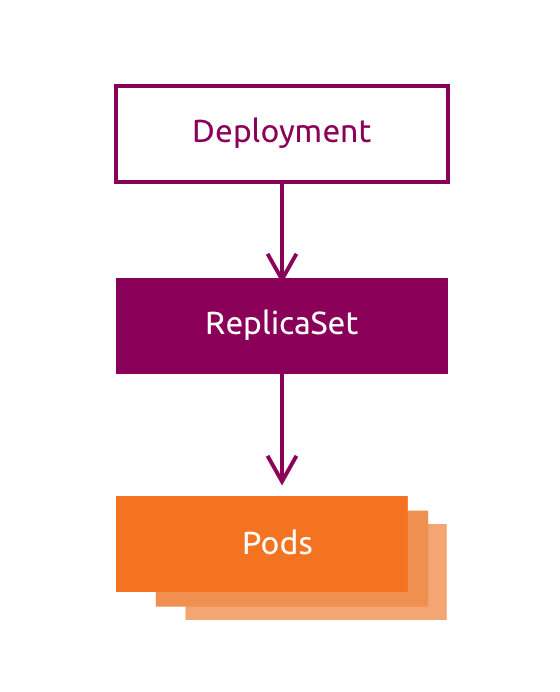
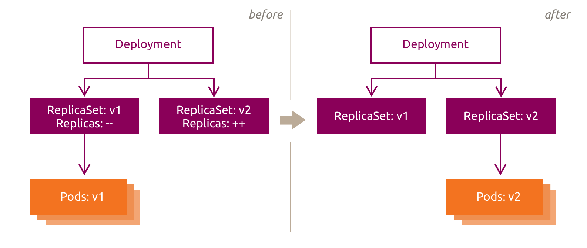

# :material-numeric-3-circle: 3. Keeping apps healthy

## :material-book-open-page-variant-outline: 3.1 ReplicaSets

A ReplicaSet maintains a specified number of Pod replicas. This helps an application tolerate Pod deletion or failure, but availability also depends on scheduling and application health.

If there are too many Pods, the ReplicaSet terminates the excess Pods. If there are too few, it creates replacements. Container failures are normally handled by the `kubelet`, which restarts containers within the existing Pod according to its restart policy.

ReplicaSets and Deployments maintain Pod count; they do not determine whether application code is healthy. Readiness probes control whether a Pod receives Service traffic, while liveness probes can cause an unresponsive container to restart.

`ReplicaSet` is often abbreviated as `rs` in `kubectl` commands.


Create a ReplicaSet from the `~/resources/nginx-rs.yaml` definition:

```bash
# Display the ReplicaSet definition.
cat ~/resources/nginx-rs.yaml
```
??? example "Expected result"
    ```text
    apiVersion: apps/v1
    kind: ReplicaSet
    metadata:
      name: nginx-rs
    spec:
      replicas: 3
      selector:
        matchLabels:
          app: nginx
      template:
        metadata:
          labels:
            app: nginx
        spec:
          containers:
          - name: nginx
            image: nginx:latest
            ports:
            - containerPort: 80
    ```

The three most important fields are:

* replica count: the desired number of Pod replicas
* label selector: identifies the Pods managed by the ReplicaSet
* Pod template: defines the new Pod replicas

Create the `rs`:

```bash
# Create the ReplicaSet.
kubectl create -f ~/resources/nginx-rs.yaml
```
??? example "Expected result"
    The ReplicaSet is created.

Inspect the `rs`:

```bash
# List the ReplicaSet.
kubectl get rs nginx-rs -o wide
```
??? example "Expected result"
    ```text
    NAME       DESIRED   CURRENT   READY   AGE   CONTAINERS   IMAGES         SELECTOR
    nginx-rs   3         3         3       9s    nginx        nginx:latest   app=nginx
    ```

```bash
# Describe the ReplicaSet.
kubectl describe rs nginx-rs
```
??? example "Expected result"
    ```text
    Name:         nginx-rs
    Namespace:    default
    Selector:     app=nginx
    Labels:       <none>
    Annotations:  <none>
    Replicas:     3 current / 3 desired
    Pods Status:  3 Running / 0 Waiting / 0 Succeeded / 0 Failed
    Pod Template:
      Labels:  app=nginx
      Containers:
       nginx:
        Image:         nginx:latest
        Port:          80/TCP
        Host Port:     0/TCP
        Environment:   <none>
        Mounts:        <none>
      Volumes:         <none>
      Node-Selectors:  <none>
      Tolerations:     <none>
    Events:
      Type    Reason            Age   From                   Message
      ----    ------            ----  ----                   -------
      Normal  SuccessfulCreate  23s   replicaset-controller  Created pod: nginx-rs-b9s4g
      Normal  SuccessfulCreate  23s   replicaset-controller  Created pod: nginx-rs-6vldg
      Normal  SuccessfulCreate  23s   replicaset-controller  Created pod: nginx-rs-47z7s
    ```

```bash
# List the ReplicaSet pods.
kubectl get pods
```
??? example "Expected result"
    ```text
    NAME             READY   STATUS    RESTARTS   AGE
    nginx-rs-47z7s   1/1     Running   0          55s
    nginx-rs-6vldg   1/1     Running   0          55s
    nginx-rs-b9s4g   1/1     Running   0          55s
    ```

The ReplicaSet now maintains three replicas. To access them consistently, recreate the LoadBalancer Service from Chapter 2. Its selector matches the `app=nginx` label and routes traffic to eligible Ready endpoints.

Recreate the `LoadBalancer` service:

```bash
# Create the LoadBalancer service.
kubectl create -f ~/resources/loadbalancer-service.yaml
```
??? example "Expected result"
    The LoadBalancer service is created.

Get the LoadBalancer address:

```bash
# List the LoadBalancer service.
kubectl get svc nginx-loadbalancer
```
??? example "Expected result"
    ```text
    NAME                 TYPE           CLUSTER-IP      EXTERNAL-IP   PORT(S)          AGE
    nginx-loadbalancer   LoadBalancer   10.152.188.44   10.219.64.11   8080:31731/TCP   21s
    ```

Use the `EXTERNAL-IP` reported by your cluster to access the website. Substitute it in the following command if it differs from the example:

```bash
# Probe nginx through the LoadBalancer.
curl -s 10.219.64.11:8080 | pandoc -f html -t plain
```
??? example "Expected result"
    ```text
    Welcome to nginx!

    If you see this page, nginx is successfully installed and working.
    Further configuration is required for the web server, reverse proxy, API
    gateway, load balancer, content cache, or other features.

    For online documentation and support please refer to nginx.org.
    To engage with the community please visit community.nginx.org.
    For enterprise grade support, professional services, additional security
    features and capabilities please refer to f5.com/nginx.

    Thank you for using nginx.
    ```

The Service can now distribute connections across the three eligible Pods.

Inspect each Pod's access log to see which Pods received requests. Repeated requests may not reach every Pod:

```bash
# List the ReplicaSet pods.
kubectl get pods
```
??? example "Expected result"
    ```text
    NAME             READY   STATUS    RESTARTS   AGE
    nginx-rs-47z7s   1/1     Running   0          33m
    nginx-rs-6vldg   1/1     Running   0          33m
    nginx-rs-b9s4g   1/1     Running   0          33m
    ```

```bash
# View logs for nginx-rs-47z7s.
kubectl logs nginx-rs-47z7s
```
??? example "Expected result"
    Nginx access-log entries are displayed if this pod handled a request.

```bash
# View logs for nginx-rs-6vldg.
kubectl logs nginx-rs-6vldg
```
??? example "Expected result"
    Nginx access-log entries are displayed if this pod handled a request.

```bash
# View logs for nginx-rs-b9s4g.
kubectl logs nginx-rs-b9s4g
```
??? example "Expected result"
    Nginx access-log entries are displayed if this pod handled a request.

Delete a Pod to observe the ReplicaSet restore its desired replica count. First, list the Pods and choose one to delete:

```bash
# List the ReplicaSet pods.
kubectl get pods
```
??? example "Expected result"
    The ReplicaSet pods are listed.

```bash
# Delete a ReplicaSet pod.
kubectl delete pod nginx-rs-47z7s
```
??? example "Expected result"
    The selected pod is deleted.

List the Pods again. A replacement Pod should appear with a recent age:

```bash
# List the ReplicaSet pods.
kubectl get pods
```
??? example "Expected result"
    ```text
    NAME             READY   STATUS    RESTARTS   AGE
    nginx-rs-6vldg   1/1     Running   0          34m
    nginx-rs-b9s4g   1/1     Running   0          34m
    nginx-rs-dgcn6   1/1     Running   0          11s
    ```

Delete the `rs` and the Service:

```bash
# Delete the ReplicaSet.
kubectl delete rs nginx-rs
```
??? example "Expected result"
    The ReplicaSet is deleted.

```bash
# Delete the LoadBalancer service.
kubectl delete svc nginx-loadbalancer
```
??? example "Expected result"
    The LoadBalancer service is deleted.

## :material-book-open-page-variant-outline: 3.2 Deployments

ReplicaSets cover many application deployment use cases, while Deployments add controlled, declarative updates. A Deployment can update an application from one version to another, often without downtime when the application and update settings support it.

The Deployment controller manages ReplicaSets, which manage Pods, and changes the observed state toward the desired state described in the Deployment.




Display the Deployment definition in `~/resources/nginx-deploy.yaml`:

```bash
# Display the Deployment definition.
cat ~/resources/nginx-deploy.yaml
```
??? example "Expected result"
    ```text
    apiVersion: apps/v1
    kind: Deployment
    metadata:
      name: nginx-deploy
      labels:
        app: nginx
    spec:
      replicas: 3
      selector:
        matchLabels:
          app: nginx
      template:
        metadata:
          labels:
            app: nginx
        spec:
          containers:
          - name: nginx
            image: nginx:1.28
            ports:
            - containerPort: 80
    ```

As with a ReplicaSet, the most important fields are:

* replica count: the desired number of Pod replicas
* label selector: identifies the Pods managed by the Deployment
* Pod template: defines the new Pod replicas


Create the Deployment:

```bash
# Create the Deployment.
kubectl create -f ~/resources/nginx-deploy.yaml
```
??? example "Expected result"
    The Deployment is created.

Inspect what was created:

```bash
# List the Deployment.
kubectl get deploy nginx-deploy -o wide
```
??? example "Expected result"
    ```text
    NAME           READY   UP-TO-DATE   AVAILABLE   AGE   CONTAINERS   IMAGES       SELECTOR
    nginx-deploy   3/3     3            3           14s   nginx        nginx:1.28   app=nginx
    ```

```bash
# Describe the Deployment.
kubectl describe deploy nginx-deploy
```
??? example "Expected result"
    ```text
    Name:                   nginx-deploy
    Namespace:              default
    CreationTimestamp:      Wed, 18 Mar 2026 11:27:51 +0000
    Labels:                 app=nginx
    Annotations:            deployment.kubernetes.io/revision: 1
    Selector:               app=nginx
    Replicas:               3 desired | 3 updated | 3 total | 3 available | 0 unavailable
    StrategyType:           RollingUpdate
    MinReadySeconds:        0
    RollingUpdateStrategy:  25% max unavailable, 25% max surge
    Pod Template:
      Labels:  app=nginx
      Containers:
       nginx:
        Image:         nginx:1.28
        Port:          80/TCP
        Host Port:     0/TCP
        Environment:   <none>
        Mounts:        <none>
      Volumes:         <none>
      Node-Selectors:  <none>
      Tolerations:     <none>
    Conditions:
      Type           Status  Reason
      ----           ------  ------
      Available      True    MinimumReplicasAvailable
      Progressing    True    NewReplicaSetAvailable
    OldReplicaSets:  <none>
    NewReplicaSet:   nginx-deploy-7f9c8bf8cd (3/3 replicas created)
    Events:
      Type    Reason             Age   From                   Message
      ----    ------             ----  ----                   -------
      Normal  ScalingReplicaSet  24s   deployment-controller  Scaled up replica set nginx-deploy-7f9c8bf8cd from 0 to 3
    ```

```bash
# List the Deployment pods.
kubectl get pods
```
??? example "Expected result"
    ```text
    NAME                            READY   STATUS    RESTARTS   AGE
    nginx-deploy-7f9c8bf8cd-5srlj   1/1     Running   0          39s
    nginx-deploy-7f9c8bf8cd-nmw77   1/1     Running   0          39s
    nginx-deploy-7f9c8bf8cd-tqx4m   1/1     Running   0          39s
    ...
    ```

So far, the result resembles a ReplicaSet. A Deployment also provides controlled rollouts and revision history. Check the initial rollout status; it should report successful completion:

```bash
# Check the Deployment rollout status.
kubectl rollout status deploy nginx-deploy
```
??? example "Expected result"
    ```text
    deployment "nginx-deploy" successfully rolled out
    ```

A Deployment rollout is triggered when its Pod template changes, such as when the container image changes. Scaling a Deployment changes its replica count but does not create a new revision.



Suppose that we now want to update the nginx Pods to use the `nginx:1.29` image instead of the `nginx:1.28` image:

```bash
# Update the Deployment nginx image.
kubectl set image deploy nginx-deploy nginx=nginx:1.29
```
??? example "Expected result"
    ```text
    deployment.extensions/nginx-deploy image updated
    ```

!!! tip "Alternative editing method"
    You can also edit the Deployment interactively with `kubectl edit deploy nginx-deploy`. The `kubectl edit` command
    supports many Kubernetes resource types.

Check Deployment status:

```bash
# Check the Deployment rollout status.
kubectl rollout status deploy nginx-deploy
```
??? example "Expected result"
    ```text
    Waiting for deployment "nginx-deploy" rollout to finish: 1 out of 3 new replicas have been updated...
    Waiting for deployment "nginx-deploy" rollout to finish: 1 out of 3 new replicas have been updated...
    Waiting for deployment "nginx-deploy" rollout to finish: 1 out of 3 new replicas have been updated...
    Waiting for deployment "nginx-deploy" rollout to finish: 2 out of 3 new replicas have been updated...
    Waiting for deployment "nginx-deploy" rollout to finish: 2 out of 3 new replicas have been updated...
    Waiting for deployment "nginx-deploy" rollout to finish: 2 out of 3 new replicas have been updated...
    Waiting for deployment "nginx-deploy" rollout to finish: 1 old replicas are pending termination...
    Waiting for deployment "nginx-deploy" rollout to finish: 1 old replicas are pending termination...
    deployment "nginx-deploy" successfully rolled out
    #hit CTRL+C
    ```

```bash
# List Deployments.
kubectl get deploy -o wide
```
??? example "Expected result"
    ```text
    NAME           READY   UP-TO-DATE   AVAILABLE   AGE    CONTAINERS   IMAGES       SELECTOR
    nginx-deploy   3/3     3            3           105s   nginx        nginx:1.29   app=nginx
    ```

```bash
# List the Deployment pods.
kubectl get pods
```
??? example "Expected result"
    ```text
    NAME                            READY   STATUS    RESTARTS   AGE
    nginx-deploy-578c8ff859-8t46m   1/1     Running   0          44s
    nginx-deploy-578c8ff859-jrn9q   1/1     Running   0          45s
    nginx-deploy-578c8ff859-spd85   1/1     Running   0          43s
    ...
    ```

```bash
# Describe the Deployment.
kubectl describe deploy nginx-deploy
```
??? example "Expected result"
    ```text
    Name:                   nginx-deploy
    Namespace:              default
    CreationTimestamp:      Wed, 18 Mar 2026 11:27:51 +0000
    Labels:                 app=nginx
    Annotations:            deployment.kubernetes.io/revision: 2
    Selector:               app=nginx
    Replicas:               3 desired | 3 updated | 3 total | 3 available | 0 unavailable
    StrategyType:           RollingUpdate
    MinReadySeconds:        0
    RollingUpdateStrategy:  25% max unavailable, 25% max surge
    Pod Template:
      Labels:  app=nginx
      Containers:
       nginx:
        Image:         nginx:1.29
        Port:          80/TCP
        Host Port:     0/TCP
        Environment:   <none>
        Mounts:        <none>
      Volumes:         <none>
      Node-Selectors:  <none>
      Tolerations:     <none>
    Conditions:
      Type           Status  Reason
      ----           ------  ------
      Available      True    MinimumReplicasAvailable
      Progressing    True    NewReplicaSetAvailable
    OldReplicaSets:  nginx-deploy-7f9c8bf8cd (0/0 replicas created)
    NewReplicaSet:   nginx-deploy-578c8ff859 (3/3 replicas created)
    Events:
      Type    Reason             Age    From                   Message
      ----    ------             ----   ----                   -------
      Normal  ScalingReplicaSet  2m19s  deployment-controller  Scaled up replica set nginx-deploy-7f9c8bf8cd from 0 to 3
      Normal  ScalingReplicaSet  62s    deployment-controller  Scaled up replica set nginx-deploy-578c8ff859 from 0 to 1
      Normal  ScalingReplicaSet  61s    deployment-controller  Scaled down replica set nginx-deploy-7f9c8bf8cd from 3 to 2
      Normal  ScalingReplicaSet  61s    deployment-controller  Scaled up replica set nginx-deploy-578c8ff859 from 1 to 2
      Normal  ScalingReplicaSet  60s    deployment-controller  Scaled down replica set nginx-deploy-7f9c8bf8cd from 2 to 1
      Normal  ScalingReplicaSet  60s    deployment-controller  Scaled up replica set nginx-deploy-578c8ff859 from 2 to 3
      Normal  ScalingReplicaSet  59s    deployment-controller  Scaled down replica set nginx-deploy-7f9c8bf8cd from 1 to 0
    ```

The Deployment is up to date and uses the `nginx:1.29` image. The rollout process is also recorded in the `Events` section of the Deployment description.

The same Services continue to select these Pods because the `app=nginx` label is unchanged.

Deployments support two update strategies:

* `Recreate`: terminates all old Pods before creating new Pods
* `RollingUpdate`: gradually replaces old Pods with new Pods according to the rollout settings

`RollingUpdate` is the default strategy and allows old and new versions to overlap. It can avoid downtime when the application supports mixed versions and the readiness checks, capacity, and rollout settings are appropriate. `Recreate` normally causes a period without available Pods.

If an update causes problems, a Deployment can be manually rolled back to a previous revision.

Check and inspect the revision history:

```bash
# List the Deployment revision history.
kubectl rollout history deploy nginx-deploy
```
??? example "Expected result"
    ```text
    deployment.apps/nginx-deploy
    REVISION  CHANGE-CAUSE
    1         <none>
    2         <none>
    ```

```bash
# This command does not do anything, it just inspects the revision.
kubectl rollout history deploy nginx-deploy --revision=1
```
??? example "Expected result"
    ```text
    deployment.apps/nginx-deploy with revision #1
    Pod Template:
      Labels:	app=nginx
      pod-template-hash=7f9c8bf8cd
      Containers:
       nginx:
        Image:	nginx:1.28
        Port:	80/TCP
        Host Port:	0/TCP
        Environment:	<none>
        Mounts:	<none>
      Volumes:	<none>
      Node-Selectors:	<none>
      Tolerations:	<none>
    ```

```bash
# This command does not do anything, it just inspects the revision.
kubectl rollout history deploy nginx-deploy --revision=2
```
??? example "Expected result"
    ```text
    deployment.apps/nginx-deploy with revision #2
    Pod Template:
      Labels:	app=nginx
      pod-template-hash=578c8ff859
      Containers:
       nginx:
        Image:	nginx:1.29
        Port:	80/TCP
        Host Port:	0/TCP
        Environment:	<none>
        Mounts:	<none>
      Volumes:	<none>
      Node-Selectors:	<none>
      Tolerations:	<none>
    ```

Revision `1` is the initial deployment version. Revision `2` is the upgraded version.

Roll back to the Pod template recorded in revision `1`. This creates a new revision rather than deleting the revision history:

```bash
# Roll back the Deployment to revision 1.
kubectl rollout undo deploy nginx-deploy --to-revision=1
```
??? example "Expected result"
    ```text
    deployment.extensions/nginx-deploy
    ```

Check the Deployment. It should now use the previous `nginx:1.28` image:

```bash
# Describe the Deployment.
kubectl describe deploy nginx-deploy
```
??? example "Expected result"
    ```text
    Name:                   nginx-deploy
    Namespace:              default
    CreationTimestamp:      Wed, 18 Mar 2026 11:27:51 +0000
    Labels:                 app=nginx
    Annotations:            deployment.kubernetes.io/revision: 3
    Selector:               app=nginx
    Replicas:               3 desired | 3 updated | 3 total | 3 available | 0 unavailable
    StrategyType:           RollingUpdate
    MinReadySeconds:        0
    RollingUpdateStrategy:  25% max unavailable, 25% max surge
    Pod Template:
      Labels:  app=nginx
      Containers:
       nginx:
        Image:         nginx:1.28
        Port:          80/TCP
        Host Port:     0/TCP
        Environment:   <none>
        Mounts:        <none>
      Volumes:         <none>
      Node-Selectors:  <none>
      Tolerations:     <none>
    Conditions:
      Type           Status  Reason
      ----           ------  ------
      Available      True    MinimumReplicasAvailable
      Progressing    True    NewReplicaSetAvailable
    OldReplicaSets:  nginx-deploy-578c8ff859 (0/0 replicas created)
    NewReplicaSet:   nginx-deploy-7f9c8bf8cd (3/3 replicas created)
    Events:
      Type    Reason             Age                From                   Message
      ----    ------             ----               ----                   -------
      Normal  ScalingReplicaSet  3m48s              deployment-controller  Scaled up replica set nginx-deploy-7f9c8bf8cd from 0 to 3
      Normal  ScalingReplicaSet  2m31s              deployment-controller  Scaled up replica set nginx-deploy-578c8ff859 from 0 to 1
      Normal  ScalingReplicaSet  2m30s              deployment-controller  Scaled down replica set nginx-deploy-7f9c8bf8cd from 3 to 2
      Normal  ScalingReplicaSet  2m30s              deployment-controller  Scaled up replica set nginx-deploy-578c8ff859 from 1 to 2
      Normal  ScalingReplicaSet  2m29s              deployment-controller  Scaled down replica set nginx-deploy-7f9c8bf8cd from 2 to 1
      Normal  ScalingReplicaSet  2m29s              deployment-controller  Scaled up replica set nginx-deploy-578c8ff859 from 2 to 3
      Normal  ScalingReplicaSet  2m28s              deployment-controller  Scaled down replica set nginx-deploy-7f9c8bf8cd from 1 to 0
      Normal  ScalingReplicaSet  16s                deployment-controller  Scaled up replica set nginx-deploy-7f9c8bf8cd from 0 to 1
      Normal  ScalingReplicaSet  15s                deployment-controller  Scaled down replica set nginx-deploy-578c8ff859 from 3 to 2
      Normal  ScalingReplicaSet  13s (x4 over 15s)  deployment-controller  (combined from similar events): Scaled down replica set nginx-deploy-578c8ff859 from 1 to 0
    ```

List the ReplicaSets managed by the Deployment. The current ReplicaSet has three replicas, while the previous one remains at zero for revision history:

```bash
# List ReplicaSets.
kubectl get rs
```
??? example "Expected result"
    ```text
    NAME                      DESIRED   CURRENT   READY   AGE
    nginx-deploy-578c8ff859   0         0         0       2m55s
    nginx-deploy-7f9c8bf8cd   3         3         3       4m12s
    ```

To conclude the chapter, clean up the Deployment:

```bash
# Delete the Deployment.
kubectl delete deploy nginx-deploy
```
??? example "Expected result"
    The Deployment is deleted.
