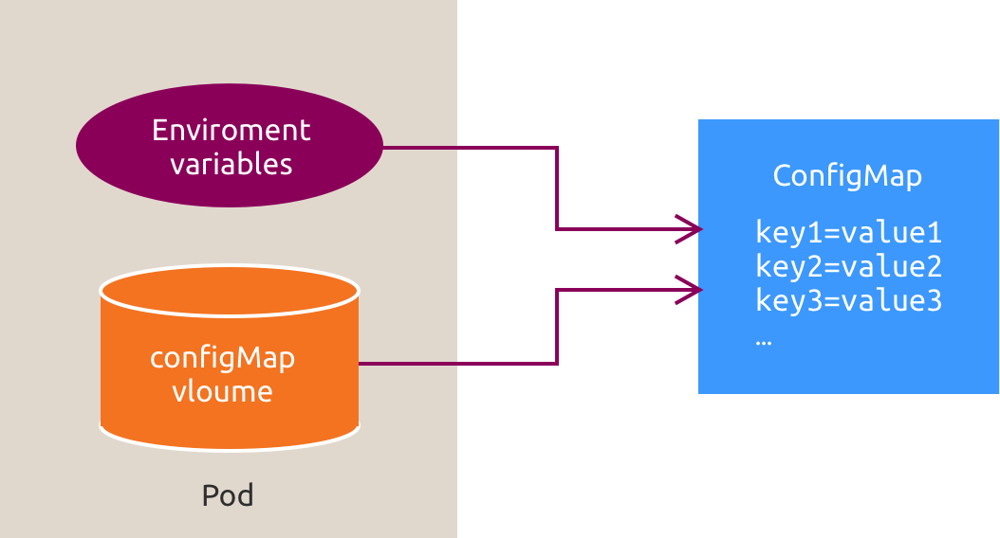
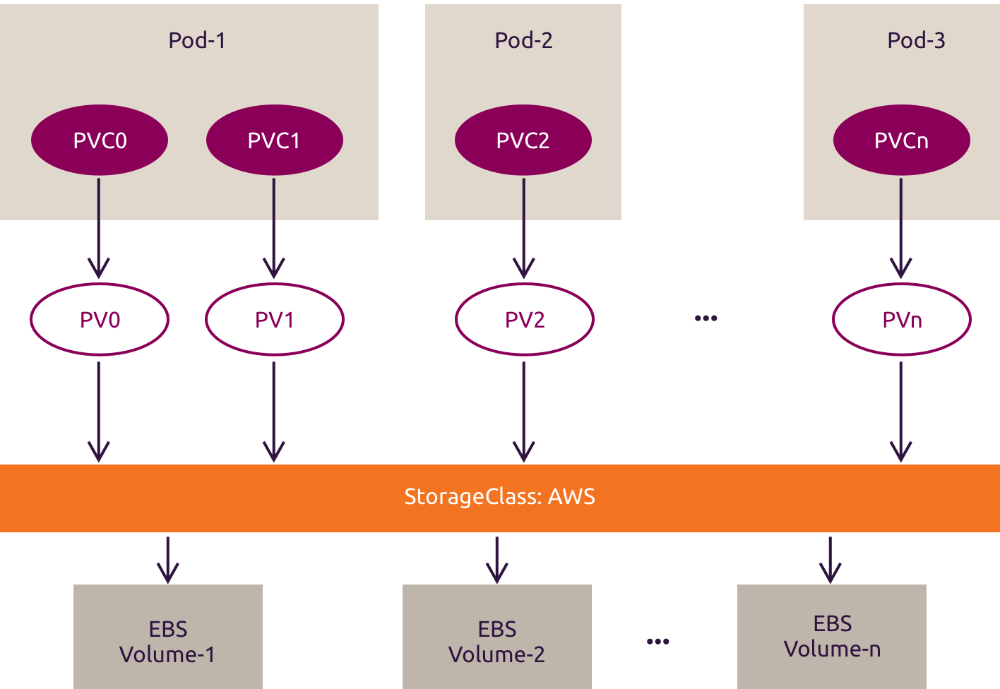

# :material-numeric-4-circle: 4. Storage and User Data

Select the workload cluster kubeconfig:

```bash
# Select the workload cluster kubeconfig.
export KUBECONFIG=~/.kube/myk8scluster_config
```
??? example "Expected result"
    ```text
    No output.
    ```

Confirm that `kubectl` uses the workload cluster:

```bash
# Display the active Kubernetes context.
kubectl config current-context
```
??? example "Expected result"
    ```text
    myk8scluster-admin@myk8scluster
    ```

Applications can read and write data in a container's filesystem, but that data is isolated from other containers and is lost
when the container is replaced. Pods often need to share data among containers or retain data beyond a container's lifetime.

## :material-book-open-page-variant-outline: 4.1 Volumes

Kubernetes volumes make data available to containers in a Pod. A volume can be mounted by multiple containers in that Pod.
Some volume types are ephemeral and tied to the Pod's lifetime, while persistent storage can outlive individual Pods.

Kubernetes supports many volume types. Examples include:

* `emptyDir`: starts empty when a Pod is assigned to a node and exists as long as that Pod remains on the node. Its data survives container restarts but is deleted when the Pod is removed. By default, it uses the storage medium that backs the node's ephemeral storage.
* `hostPath`: mounts a file or directory from the host node's filesystem. It can provide access to host resources such as `/sys`, but it ties the Pod to a specific node and can introduce security risks.
* `fc`: mounts an existing Fibre Channel block storage volume into a Pod.
* `image`: makes an OCI object, such as a container image or artifact, available to a Pod as a read-only volume.
* `nfs`: mounts an existing NFS share into a Pod.
* `iscsi`: mounts an existing iSCSI volume into a Pod.

Let's create a Pod with two containers and a shared `emptyDir` volume. The manifest is available at
`~/resources/multi-container-pod.yaml`:

```bash
# Display the multi-container pod definition.
cat ~/resources/multi-container-pod.yaml
```
??? example "Expected result"
    ```text
    apiVersion: v1
    kind: Pod
    metadata:
      name: two-containers
      labels:
        app: two-containers
    spec:
      restartPolicy: Never
      volumes:
      - name: shared-data
        emptyDir: {}
      containers:
      - name: nginx-container
        image: nginx:latest
        volumeMounts:
        - name: shared-data
          mountPath: /usr/share/nginx/html
      - name: debian-container
        image: debian
        volumeMounts:
        - name: shared-data
          mountPath: /pod-data
        command: ["/bin/sh"]
        args: ["-c", "echo Hello from the debian container > /pod-data/index.html; sleep 900000"]
    ```

The volume is named `shared-data`. Each container references it by name in its `volumeMounts` entry. `mountPath` specifies where
the volume is available inside that container. The paths `/usr/share/nginx/html/index.html` and `/pod-data/index.html` therefore
refer to the same shared file. Review the manifest and discuss any questions with the trainer.

Create the Pod and a Service for it. The manifest files are already provisioned at `~/resources/multi-container-pod.yaml` and
`~/resources/multi-container-pod-service.yaml`:

```bash
# Create the multi-container pod.
kubectl create -f ~/resources/multi-container-pod.yaml
```
??? example "Expected result"
    ```text
    pod/two-containers created
    ```

Wait for both containers in the Pod to become ready:

```bash
# Wait for the multi-container pod to become ready.
kubectl wait --for=condition=Ready pod/two-containers --timeout=180s
```
??? example "Expected result"
    ```text
    pod/two-containers condition met
    ```

```bash
# Create the multi-container pod service.
kubectl create -f ~/resources/multi-container-pod-service.yaml
```
??? example "Expected result"
    ```text
    service/two-containers-svc created
    ```

Wait for the Service to have a ready endpoint. The generated EndpointSlice suffix in the expected result varies:

```bash
# Wait for a ready Service endpoint.
kubectl wait --for=jsonpath='{.endpoints[0].conditions.ready}'=true endpointslice -l kubernetes.io/service-name=two-containers-svc --timeout=180s
```
??? example "Expected result"
    ```text
    endpointslice.discovery.k8s.io/two-containers-svc-gf2wd condition met
    ```

The generated EndpointSlice suffix varies. Display the Service and note its dynamically assigned ClusterIP:

```bash
# Display the multi-container service.
kubectl get svc two-containers-svc
```
??? example "Expected result"
    ```text
    NAME                 TYPE        CLUSTER-IP      EXTERNAL-IP   PORT(S)    AGE
    two-containers-svc   ClusterIP   10.152.82.178   <none>        8080/TCP   1s
    ```

The ClusterIP assigned to your Service will differ.

Save the assigned ClusterIP:

```bash
# Save the Service ClusterIP.
CLUSTER_IP=$(kubectl get svc two-containers-svc -o jsonpath='{.spec.clusterIP}')
```
??? example "Expected result"
    ```text
    No output.
    ```

Display the saved ClusterIP:

```bash
# Display the Service ClusterIP.
printf "%s\n" "$CLUSTER_IP"
```
??? example "Expected result"
    ```text
    10.152.82.178
    ```

Use a non-interactive node command to send a request to the Service:

```bash
# Probe the service from the node.
lxc exec k8s-worker1 -- curl -fsS "http://$CLUSTER_IP:8080"
```
??? example "Expected result"
    ```text
    Hello from the debian container
    ```

The two containers work together through the shared volume. More complex applications can use the same pattern.

Delete the Service and Pod:

```bash
# Delete the multi-container service.
kubectl delete svc two-containers-svc --wait=true --timeout=180s
```
??? example "Expected result"
    ```text
    service "two-containers-svc" deleted from default namespace
    ```

```bash
# Delete the multi-container pod.
kubectl delete pod two-containers --wait=true --timeout=180s
```
??? example "Expected result"
    ```text
    pod "two-containers" deleted from default namespace
    ```

Confirm that the Service was deleted:

```bash
# Check for the deleted multi-container service.
kubectl get svc two-containers-svc -o name --ignore-not-found
```
??? example "Expected result"
    ```text
    No output.
    ```

Confirm that the Pod was deleted:

```bash
# Check for the deleted multi-container pod.
kubectl get pod two-containers -o name --ignore-not-found
```
??? example "Expected result"
    ```text
    No output.
    ```

## :material-book-open-page-variant-outline: 4.2 ConfigMaps

`ConfigMaps` allow developers to decouple configuration options from the app source code or container image.



There are four ways to use a ConfigMap to configure a container in a Pod:

* Set the container command and arguments.
* Set environment variables for the container.
* Mount ConfigMap keys as files in a read-only volume.
* Run code in the Pod that uses the Kubernetes API to read the ConfigMap.

When a ConfigMap mounted as a volume is updated, its projected keys are eventually updated. The kubelet checks the mounted ConfigMap
during periodic synchronization. ConfigMaps consumed as environment variables are not updated automatically and require a Pod restart.

!!! warning "ConfigMaps are not secret storage"
    A `ConfigMap` does not provide secrecy or encryption. For confidential data, use a `Secret` and configure appropriate
    access controls and encryption at rest.

Create a `ConfigMap` with literal values:

```bash
# Create a ConfigMap with literal values.
kubectl create configmap test-configmap --from-literal=val1=dan --from-literal=val2=bill --from-literal=val3=ben
```
??? example "Expected result"
    ```text
    configmap/test-configmap created
    ```

Inspect the `ConfigMap`:

```bash
# Describe the ConfigMap.
kubectl describe configmap test-configmap
```
??? example "Expected result"
    ```text
    Name:         test-configmap
    Namespace:    default
    Labels:       <none>
    Annotations:  <none>

    Data
    ====
    val1:
    ----
    dan
    val2:
    ----
    bill
    val3:
    ----
    ben

    BinaryData
    ====

    Events:  <none>
    ```

The following Pod manifest imports all entries from the `ConfigMap` as environment variables with the `CONFIG_DATA_` prefix:

```yaml
apiVersion: v1
kind: Pod
metadata:
  name: configmap-pod
spec:
  containers:
  - name: pod-with-configmap
    image: alpine
    command: ["sleep", "999999"]
    envFrom:
    - prefix: CONFIG_DATA_
      configMapRef:
        name: test-configmap
```

```bash
# Create the ConfigMap pod.
kubectl create -f ~/resources/pod-with-configmap.yaml
```
??? example "Expected result"
    ```text
    pod/configmap-pod created
    ```

Wait for the Pod to become ready:

```bash
# Wait for the ConfigMap pod to become ready.
kubectl wait --for=condition=Ready pod/configmap-pod --timeout=180s
```
??? example "Expected result"
    ```text
    pod/configmap-pod condition met
    ```

Check whether the Pod received the values:

```bash
# Display ConfigMap environment variables in the pod.
kubectl exec configmap-pod -- env | grep "^CONFIG_DATA_" | sort
```
??? example "Expected result"
    ```text
    CONFIG_DATA_val1=dan
    CONFIG_DATA_val2=bill
    CONFIG_DATA_val3=ben
    ```

Delete the Pod and ConfigMap:

```bash
# Delete the ConfigMap pod.
kubectl delete pod configmap-pod --wait=true --timeout=180s
```
??? example "Expected result"
    ```text
    pod "configmap-pod" deleted from default namespace
    ```

```bash
# Delete the ConfigMap.
kubectl delete configmap test-configmap --wait=true --timeout=180s
```
??? example "Expected result"
    ```text
    configmap "test-configmap" deleted from default namespace
    ```

Confirm that the Pod was deleted:

```bash
# Check for the deleted ConfigMap pod.
kubectl get pod configmap-pod -o name --ignore-not-found
```
??? example "Expected result"
    ```text
    No output.
    ```

Confirm that the ConfigMap was deleted:

```bash
# Check for the deleted ConfigMap.
kubectl get configmap test-configmap -o name --ignore-not-found
```
??? example "Expected result"
    ```text
    No output.
    ```

For more information, see the
[Kubernetes ConfigMap documentation](https://kubernetes.io/docs/concepts/configuration/configmap/).

## :material-book-open-page-variant-outline: 4.3 Secrets

`Secrets` keep sensitive data such as credentials, encryption keys, and tokens separate from application code. Their API
representation contains base64-encoded values; base64 is encoding, not encryption. Protect Secrets with appropriate access controls
and encryption at rest.

Secrets can be created with `kubectl` or from a manifest. This lab uses the CLI method:

```bash
# Create a Secret with username and password values.
kubectl create secret generic bob-secret --from-literal=username="bob" --from-literal=password="Passw0rd"
```
??? example "Expected result"
    ```text
    secret/bob-secret created
    ```

!!! note "Secret value encoding"
    `kubectl create secret` encodes the supplied literal values. In a manifest, use `stringData` for unencoded strings or
    `data` for base64-encoded values.

Inspect the Secret metadata:

```bash
# Display the Secret.
kubectl get secret bob-secret
```
??? example "Expected result"
    ```text
    NAME         TYPE     DATA   AGE
    bob-secret   Opaque   2      0s
    ```

`type: Opaque` means that the Secret has no required structure and can contain arbitrary key-value pairs.
Other Secret types include `kubernetes.io/service-account-token`, `kubernetes.io/dockercfg`,
`kubernetes.io/dockerconfigjson`, `kubernetes.io/basic-auth`, `kubernetes.io/ssh-auth`, and `kubernetes.io/tls`.
For more information, see the
[Kubernetes Secret types documentation](https://kubernetes.io/docs/concepts/configuration/secret/#secret-types).

```bash
# Describe the Secret.
kubectl describe secret bob-secret
```
??? example "Expected result"
    ```text
    Name:         bob-secret
    Namespace:    default
    Labels:       <none>
    Annotations:  <none>

    Type:  Opaque

    Data
    ====
    password:  8 bytes
    username:  3 bytes
    ```

Display the Secret's YAML representation to see the base64-encoded data:

```bash
# Display the Secret manifest.
kubectl get secret bob-secret -o yaml
```
??? example "Expected result"
    ```yaml
    apiVersion: v1
    data:
      password: UGFzc3cwcmQ=
      username: Ym9i
    kind: Secret
    metadata:
      name: bob-secret
      namespace: default
    type: Opaque
    ```

Now create a Pod that accesses the `Secret` through environment variables. The manifest is available at
`~/resources/pod-with-secrets.yaml`:

```bash
# Display the pod-with-secrets definition.
cat ~/resources/pod-with-secrets.yaml
```
??? example "Expected result"
    ```text
    apiVersion: v1
    kind: Pod
    metadata:
      name: pod-with-secrets
    spec:
      containers:
      - name: container-with-secrets
        image: nginx:latest
        env:
        - name: SECRET_USERNAME
          valueFrom:
            secretKeyRef:
              name: bob-secret
              key: username
        - name: SECRET_PASSWORD
          valueFrom:
            secretKeyRef:
              name: bob-secret
              key: password
    ```

Create the Pod:

```bash
# Create the pod with Secret environment variables.
kubectl create -f ~/resources/pod-with-secrets.yaml
```
??? example "Expected result"
    ```text
    pod/pod-with-secrets created
    ```

Wait for the Pod to become ready:

```bash
# Wait for the Secret pod to become ready.
kubectl wait --for=condition=Ready pod/pod-with-secrets --timeout=180s
```
??? example "Expected result"
    ```text
    pod/pod-with-secrets condition met
    ```

Verify that the Secret values were passed to the Pod:

```bash
# Display Secret environment variables.
kubectl exec pod-with-secrets -- env | grep "^SECRET_" | sort
```
??? example "Expected result"
    ```text
    SECRET_PASSWORD=Passw0rd
    SECRET_USERNAME=bob
    ```

An application, such as a database, can now read its credentials from these environment variables.

Delete the resources you created:

```bash
# Delete the pod with Secret environment variables.
kubectl delete pod pod-with-secrets --wait=true --timeout=180s
```
??? example "Expected result"
    ```text
    pod "pod-with-secrets" deleted from default namespace
    ```

```bash
# Delete the Secret.
kubectl delete secret bob-secret --wait=true --timeout=180s
```
??? example "Expected result"
    ```text
    secret "bob-secret" deleted from default namespace
    ```

Confirm that the Pod was deleted:

```bash
# Check for the deleted Secret pod.
kubectl get pod pod-with-secrets -o name --ignore-not-found
```
??? example "Expected result"
    ```text
    No output.
    ```

Confirm that the Secret was deleted:

```bash
# Check for the deleted Secret.
kubectl get secret bob-secret -o name --ignore-not-found
```
??? example "Expected result"
    ```text
    No output.
    ```

## :material-book-open-page-variant-outline: 4.4 PersistentVolumes, PersistentVolumeClaims and StorageClasses

An `emptyDir` volume is limited to a Pod's lifetime, while `hostPath` ties a workload to storage on a specific node. Applications
that need durable storage should be able to request it without depending directly on backend details.

`PersistentVolumes`, `PersistentVolumeClaims`, and `StorageClasses` provide this abstraction. A `StorageClass` describes a class
of storage and its provisioner, while a `PersistentVolumeClaim` requests storage. The provisioner can then create a
`PersistentVolume` dynamically.

!!! note "Terminology"
    This chapter abbreviates PersistentVolumes as `PVs`, PersistentVolumeClaims as `PVCs`, and StorageClasses as `SCs`.

`PVs` are cluster storage resources whose lifecycle is independent of any Pod. A workload requests storage through a `PVC`,
which Kubernetes binds to a suitable `PV`.



Administrators can create `PVs` statically when storage is pre-provisioned. Alternatively, an `SC` can provision a matching `PV`
dynamically when a workload makes a request through a `PVC`.

Your cluster uses the `csi-rawfile-default` StorageClass backed by node-local storage. Display the configured default StorageClass:

```bash
# List storage classes.
kubectl get sc
```
??? example "Expected result"
    ```text
    NAME                            PROVISIONER              RECLAIMPOLICY   VOLUMEBINDINGMODE      ALLOWVOLUMEEXPANSION   AGE
    csi-rawfile-default (default)   rawfile.csi.openebs.io   Delete          WaitForFirstConsumer   false                  6h28m
    ```

Display details about the StorageClass:

```bash
# Describe the default storage class.
kubectl describe sc csi-rawfile-default
```
??? example "Expected result"
    ```text
    Name:                  csi-rawfile-default
    IsDefaultClass:        Yes
    Annotations:           meta.helm.sh/release-name=ck-storage,meta.helm.sh/release-namespace=kube-system,storageclass.kubernetes.io/is-default-class=true
    Provisioner:           rawfile.csi.openebs.io
    Parameters:            <none>
    AllowVolumeExpansion:  False
    MountOptions:          <none>
    ReclaimPolicy:         Delete
    VolumeBindingMode:     WaitForFirstConsumer
    Events:                <none>
    ```

For more information, see the
[Kubernetes StorageClass documentation](https://kubernetes.io/docs/concepts/storage/storage-classes/) and the
[Canonical Kubernetes storage documentation](https://documentation.ubuntu.com/canonical-kubernetes/latest/snap/howto/storage/).

The cluster can now dynamically provision volumes in response to workload requests.

Create a `PVC` using this `SC`. The manifest is available at `~/resources/hostpath-pvc.yaml`:

```yaml
kind: PersistentVolumeClaim
apiVersion: v1
metadata:
  name: hostpath-pvc
spec:
  accessModes:
    - ReadWriteOnce
  resources:
    requests:
      storage: 10Gi
  storageClassName: csi-rawfile-default
```

A `PVC` requests storage and is bound to a matching `PV`. Create the `PVC`:

```bash
# Create the PersistentVolumeClaim.
kubectl create -f ~/resources/hostpath-pvc.yaml
```
??? example "Expected result"
    ```text
    persistentvolumeclaim/hostpath-pvc created
    ```

```bash
# Display PersistentVolumeClaims.
kubectl get pvc
```
??? example "Expected result"
    ```text
    NAME           STATUS    VOLUME   CAPACITY   ACCESS MODES   STORAGECLASS          VOLUMEATTRIBUTESCLASS   AGE
    hostpath-pvc   Pending                                      csi-rawfile-default   <unset>                 1s
    ```

```bash
# Describe the PersistentVolumeClaim.
kubectl describe pvc hostpath-pvc
```
??? example "Expected result"
    ```text
    Name:          hostpath-pvc
    Namespace:     default
    StorageClass:  csi-rawfile-default
    Status:        Pending
    Volume:
    Labels:        <none>
    Annotations:   <none>
    Finalizers:    [kubernetes.io/pvc-protection]
    Capacity:
    Access Modes:
    VolumeMode:    Filesystem
    Used By:       <none>
    Events:
      Type    Reason                Age   From                         Message
      ----    ------                ----  ----                         -------
      Normal  WaitForFirstConsumer  1s    persistentvolume-controller  waiting for first consumer to be created before binding
    ```

Because the StorageClass uses `WaitForFirstConsumer`, the `PVC` remains pending until a Pod uses it.

```bash
# Display PersistentVolumes.
kubectl get pv
```
??? example "Expected result"
    ```text
    No resources found
    ```

The provisioner creates the volume after a Pod that uses the claim is created.

Create a Pod that uses the `PVC` with `~/resources/busybox-with-pv.yaml`:

```yaml
apiVersion: v1
kind: Pod
metadata:
  name: busybox
  namespace: default
spec:
  containers:
    - image: busybox
      command:
        - sleep
        - "3600"
      imagePullPolicy: IfNotPresent
      name: busybox
      volumeMounts:
        - mountPath: "/pv"
          name: testvolume
  restartPolicy: Always
  volumes:
    - name: testvolume
      persistentVolumeClaim:
        claimName: hostpath-pvc
```

```bash
# Create the busybox pod with the PersistentVolumeClaim.
kubectl create -f ~/resources/busybox-with-pv.yaml
```
??? example "Expected result"
    ```text
    pod/busybox created
    ```

Wait for the consumer to trigger dynamic provisioning and bind the `PVC`:

```bash
# Wait for the PersistentVolumeClaim to become bound.
kubectl wait --for=jsonpath='{.status.phase}'=Bound pvc/hostpath-pvc --timeout=180s
```
??? example "Expected result"
    ```text
    persistentvolumeclaim/hostpath-pvc condition met
    ```

Wait for the Pod to become ready:

```bash
# Wait for the busybox pod to become ready.
kubectl wait --for=condition=Ready pod/busybox --timeout=180s
```
??? example "Expected result"
    ```text
    pod/busybox condition met
    ```

Check the `PVC` status again:

```bash
# Display the PersistentVolumeClaim.
kubectl get pvc hostpath-pvc
```
??? example "Expected result"
    ```text
    NAME           STATUS   VOLUME                                     CAPACITY   ACCESS MODES   STORAGECLASS          VOLUMEATTRIBUTESCLASS   AGE
    hostpath-pvc   Bound    pvc-d9a10756-3433-4237-840e-17181b4417b0   10Gi       RWO            csi-rawfile-default   <unset>                 37s
    ```

The generated `PV` name in your output will differ.

The generated `PV` name varies. Save it for inspection and cleanup verification:

```bash
# Save the generated PersistentVolume name.
PV_NAME=$(kubectl get pvc hostpath-pvc -o jsonpath='{.spec.volumeName}')
```
??? example "Expected result"
    ```text
    No output.
    ```

Display the saved name:

```bash
# Display the generated PersistentVolume name.
printf '%s\n' "$PV_NAME"
```
??? example "Expected result"
    ```text
    pvc-d9a10756-3433-4237-840e-17181b4417b0
    ```

Display the dynamically provisioned `PV`:

```bash
# Display the generated PersistentVolume.
kubectl get pv "$PV_NAME"
```
??? example "Expected result"
    ```text
    NAME                                       CAPACITY   ACCESS MODES   RECLAIM POLICY   STATUS   CLAIM                  STORAGECLASS          VOLUMEATTRIBUTESCLASS   REASON   AGE
    pvc-d9a10756-3433-4237-840e-17181b4417b0   10Gi       RWO            Delete           Bound    default/hostpath-pvc   csi-rawfile-default   <unset>                          6s
    ```

Check inside the Pod to verify that the volume was mounted:

```bash
# Display the mount for the PersistentVolume.
kubectl exec busybox -- mount | grep " on /pv "
```
??? example "Expected result"
    ```text
    /dev/loop3 on /pv type ext4 (rw,relatime)
    ```

If the new device appears, the `PV` was successfully provisioned and mounted.

Write data to the `PV` by creating a file named `hello-world.txt`.

```bash
# Create a file on the PersistentVolume.
kubectl exec busybox -- touch /pv/hello-world.txt
```
??? example "Expected result"
    ```text
    No output.
    ```

Write text to the file without opening an interactive shell:

```bash
# Write text to the PersistentVolume file.
kubectl exec busybox -- sh -c "echo 'Hello world from busybox pod!' > /pv/hello-world.txt"
```
??? example "Expected result"
    ```text
    No output.
    ```

```bash
# Display the PersistentVolume file.
kubectl exec busybox -- cat /pv/hello-world.txt
```
??? example "Expected result"
    ```text
    Hello world from busybox pod!
    ```

Delete the Pod, then verify that the `PV` data persists:

```bash
# Delete the busybox pod.
kubectl delete pod busybox --wait=true --timeout=180s
```
??? example "Expected result"
    ```text
    pod "busybox" deleted from default namespace
    ```

Create a new Pod that uses the same `PVC`.

```bash
# Create the nginx pod with the PersistentVolumeClaim.
kubectl create -f ~/resources/nginx-with-pv.yaml
```
??? example "Expected result"
    ```text
    pod/nginx created
    ```

Wait for the replacement Pod to become ready:

```bash
# Wait for the nginx pod to become ready.
kubectl wait --for=condition=Ready pod/nginx --timeout=180s
```
??? example "Expected result"
    ```text
    pod/nginx condition met
    ```

Verify that the file is still present:

```bash
# List the PersistentVolume file.
kubectl exec nginx -- ls -l /pv/hello-world.txt
```
??? example "Expected result"
    ```text
    -rw-r--r-- 1 root root 30 Sep  8 16:26 /pv/hello-world.txt
    ```

```bash
# Display the PersistentVolume file.
kubectl exec nginx -- cat /pv/hello-world.txt
```
??? example "Expected result"
    ```text
    Hello world from busybox pod!
    ```

Dynamic provisioning lets workloads request storage through `PVCs` without requiring administrators to create each `PV` in advance.
Refresh the generated `PV` name before cleanup:

```bash
# Save the generated PersistentVolume name.
PV_NAME=$(kubectl get pvc hostpath-pvc -o jsonpath='{.spec.volumeName}')
```
??? example "Expected result"
    ```text
    No output.
    ```

Clean up the remaining Pod and `PVC`:

```bash
# Delete the nginx pod.
kubectl delete pod nginx --wait=true --timeout=180s
```
??? example "Expected result"
    ```text
    pod "nginx" deleted from default namespace
    ```

```bash
# Delete the PersistentVolumeClaim.
kubectl delete pvc hostpath-pvc --wait=true --timeout=180s
```
??? example "Expected result"
    ```text
    persistentvolumeclaim "hostpath-pvc" deleted from default namespace
    ```

The StorageClass uses the `Delete` reclaim policy. Wait for it to remove the generated `PV`:

```bash
# Wait for the generated PersistentVolume to be deleted.
kubectl wait --for=delete "pv/$PV_NAME" --timeout=180s
```
??? example "Expected result"
    ```text
    No output.
    ```

Confirm that the replacement Pod was deleted:

```bash
# Check for the deleted nginx pod.
kubectl get pod nginx -o name --ignore-not-found
```
??? example "Expected result"
    ```text
    No output.
    ```

Confirm that the `PVC` was deleted:

```bash
# Check for the deleted PersistentVolumeClaim.
kubectl get pvc hostpath-pvc -o name --ignore-not-found
```
??? example "Expected result"
    ```text
    No output.
    ```

Confirm that the generated `PV` was deleted:

```bash
# Check for the deleted PersistentVolume.
kubectl get pv "$PV_NAME" -o name --ignore-not-found
```
??? example "Expected result"
    ```text
    No output.
    ```
