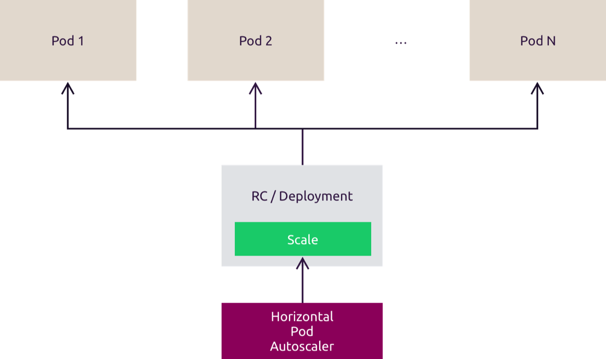
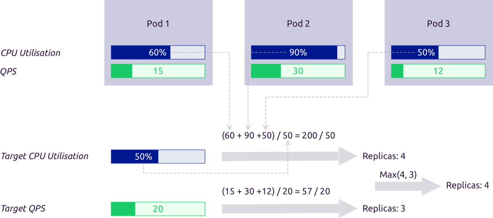

# 5. Autoscaling

Select the workload cluster kubeconfig:

```bash
# Select the workload cluster kubeconfig.
export KUBECONFIG=~/.kube/myk8scluster_config
```
??? example "Expected result"
    ```text
    No output.
    ```

Confirm that `kubectl` uses the workload cluster:

```bash
# Display the active Kubernetes context.
kubectl config current-context
```
??? example "Expected result"
    ```text
    myk8scluster-admin@myk8scluster
    ```

!!! abstract "Lab goals"
    In this lab, you will create a CPU-based `HorizontalPodAutoscaler`, generate bounded load, observe the application scale up,
    stop the load, and verify that the application scales back down.

Kubernetes can automatically adjust an application's replica count based on observed load. For CPU utilization, Kubernetes
compares measured usage with the containers' CPU requests.

The `HorizontalPodAutoscaler` (`HPA`) reads metrics, calculates the number of replicas required to meet its target, and updates a
workload that supports the scale subresource. Resource metrics are exposed through the `metrics.k8s.io` API, which is commonly
provided by Metrics Server.



Metrics Server collects CPU and memory metrics from kubelets. It supports resource autoscaling and `kubectl top`, but it is not a
long-term monitoring or alerting system. Use a dedicated monitoring system such as Prometheus for those purposes.

The autoscaling process has three main steps:

* Collect metrics for the Pods managed by the target workload.
* Calculate the replica count required to meet the configured target.
* Update the desired replica count of the target workload.



For more information, see the
[Kubernetes resource metrics pipeline documentation](https://kubernetes.io/docs/tasks/debug-application-cluster/resource-metrics-pipeline/).

## :material-book-open-page-variant-outline: 5.1 Autoscale a Deployment resource

### :material-application-edit-outline: Verify resource metrics

Confirm that Metrics Server returns node metrics before creating the `HPA`:

```bash
# Display current node resource usage.
kubectl top nodes
```
??? example "Expected result"
    ```text
    NAME          CPU(cores)   CPU(%)   MEMORY(bytes)   MEMORY(%)
    k8s-ctrl      191m         4%       1824Mi          23%
    k8s-worker1   90m          2%       1067Mi          13%
    k8s-worker2   96m          2%       1093Mi          13%
    ```

CPU and memory values vary with current cluster activity.

### :material-application-edit-outline: Create the application and HPA

Create an nginx Deployment as the application to scale:

```bash
# Create the nginx Deployment.
kubectl create deployment nginx-hpa --image=nginx
```
??? example "Expected result"
    ```text
    deployment.apps/nginx-hpa created
    ```

Expose the Deployment through a Service:

```bash
# Expose the nginx Deployment on port 80.
kubectl expose deployment nginx-hpa --port=80
```
??? example "Expected result"
    ```text
    service/nginx-hpa exposed
    ```

Set a CPU request because the utilization target is calculated as a percentage of requested CPU:

```bash
# Set the nginx container CPU request.
kubectl set resources deployment nginx-hpa --requests=cpu=100m
```
??? example "Expected result"
    ```text
    deployment.apps/nginx-hpa resource requirements updated
    ```

Wait for the updated Deployment to become available:

```bash
# Wait for the nginx Deployment rollout.
kubectl rollout status deployment/nginx-hpa --timeout=180s
```
??? example "Expected result"
    ```text
    deployment "nginx-hpa" successfully rolled out
    ```

Wait for the Service to have a ready endpoint:

```bash
# Wait for a ready nginx Service endpoint.
kubectl wait --for=jsonpath='{.endpoints[0].conditions.ready}'=true endpointslice -l kubernetes.io/service-name=nginx-hpa --timeout=180s
```
??? example "Expected result"
    ```text
    endpointslice.discovery.k8s.io/nginx-hpa-9fr9v condition met
    ```

The generated EndpointSlice suffix varies.

Display the ready Deployment:

```bash
# Display the nginx Deployment.
kubectl get deployment nginx-hpa
```
??? example "Expected result"
    ```text
    NAME        READY   UP-TO-DATE   AVAILABLE   AGE
    nginx-hpa   1/1     1            1           70s
    ```

Display the Service:

```bash
# Display the nginx Service.
kubectl get service nginx-hpa
```
??? example "Expected result"
    ```text
    NAME        TYPE        CLUSTER-IP       EXTERNAL-IP   PORT(S)   AGE
    nginx-hpa   ClusterIP   10.152.124.160   <none>        80/TCP    60s
    ```

The assigned ClusterIP varies.

Verify the CPU request:

```bash
# Display the nginx container CPU request.
kubectl get deployment nginx-hpa -o jsonpath='{.spec.template.spec.containers[0].resources.requests.cpu}{"\n"}'
```
??? example "Expected result"
    ```text
    100m
    ```

Create an `HPA` with a target average CPU utilization of 30%. Keep the Deployment between one and five replicas:

```bash
# Create the nginx HorizontalPodAutoscaler.
kubectl autoscale deployment nginx-hpa --cpu 30% --min=1 --max=5
```
??? example "Expected result"
    ```text
    horizontalpodautoscaler.autoscaling/nginx-hpa autoscaled
    ```

Wait until the `HPA` can calculate replicas from a valid metric:

```bash
# Wait for the HPA metric to become active.
kubectl wait --for=condition=ScalingActive hpa/nginx-hpa --timeout=180s
```
??? example "Expected result"
    ```text
    horizontalpodautoscaler.autoscaling/nginx-hpa condition met
    ```

Verify the minimum, maximum, and CPU target values:

```bash
# Display the HPA replica bounds and CPU target.
kubectl get hpa nginx-hpa -o jsonpath='{.spec.minReplicas}{"\t"}{.spec.maxReplicas}{"\t"}{.spec.metrics[0].resource.target.averageUtilization}{"%\n"}'
```
??? example "Expected result"
    ```text
    1    5    30%
    ```

Display the initial `HPA` status:

```bash
# Display the initial HPA status.
kubectl get hpa nginx-hpa
```
??? example "Expected result"
    ```text
    NAME        REFERENCE              TARGETS       MINPODS   MAXPODS   REPLICAS   AGE
    nginx-hpa   Deployment/nginx-hpa   cpu: 0%/30%   1         5         1          44s
    ```

The current CPU percentage and age vary. Continue only after the current metric is numeric rather than `<unknown>`.

### :material-application-edit-outline: Generate bounded load and scale up

Create a load-generator Pod with four request loops. Each loop has a six-minute limit, so the load stops even if the remaining
commands are interrupted:

```bash
# Start bounded load against the nginx Service.
kubectl run load-generator --image=busybox --restart=Never -- /bin/sh -c 'for worker in 1 2 3 4; do timeout 360 sh -c "while true; do wget -q -O /dev/null http://nginx-hpa; done" & done; wait'
```
??? example "Expected result"
    ```text
    pod/load-generator created
    ```

Wait for the load-generator Pod to become ready:

```bash
# Wait for the load-generator Pod.
kubectl wait --for=condition=Ready pod/load-generator --timeout=180s
```
??? example "Expected result"
    ```text
    pod/load-generator condition met
    ```

Wait up to five minutes for the `HPA` to increase the current replica count above one:

```bash
# Wait for the HPA to scale above one replica.
timeout 300 bash -c 'until replicas=$(kubectl get hpa nginx-hpa -o jsonpath="{.status.currentReplicas}"); [[ "$replicas" =~ ^[2-5]$ ]]; do sleep 10; done'
```
??? example "Expected result"
    ```text
    No output.
    ```

Wait for at least two nginx Pods to become ready:

```bash
# Wait for multiple nginx Pods to become ready.
timeout 180 bash -c 'until replicas=$(kubectl get deployment nginx-hpa -o jsonpath="{.status.readyReplicas}"); [[ "$replicas" =~ ^[2-5]$ ]]; do sleep 5; done'
```
??? example "Expected result"
    ```text
    No output.
    ```

Display the scaled `HPA`:

```bash
# Display the HPA after scale-up.
kubectl get hpa nginx-hpa
```
??? example "Expected result"
    ```text
    NAME        REFERENCE              TARGETS        MINPODS   MAXPODS   REPLICAS   AGE
    nginx-hpa   Deployment/nginx-hpa   cpu: 37%/30%   1         5         5          3m15s
    ```

The current utilization and resulting replica count vary. The important result is that utilization exceeded the target and the
replica count increased without exceeding five.

Display the nginx Pods:

```bash
# Display the scaled nginx Pods.
kubectl get pods -l app=nginx-hpa
```
??? example "Expected result"
    ```text
    NAME                         READY   STATUS    RESTARTS   AGE
    nginx-hpa-7698f65fcb-49m27   1/1     Running   0          4m23s
    nginx-hpa-7698f65fcb-fq8qs   1/1     Running   0          75s
    nginx-hpa-7698f65fcb-prwvp   1/1     Running   0          60s
    nginx-hpa-7698f65fcb-pv7n5   1/1     Running   0          75s
    nginx-hpa-7698f65fcb-xjhwq   1/1     Running   0          75s
    ```

Pod names, ages, and the number of replicas vary.

Confirm that the load generator is still running:

```bash
# Display the load-generator Pod.
kubectl get pod load-generator
```
??? example "Expected result"
    ```text
    NAME             READY   STATUS    RESTARTS   AGE
    load-generator   1/1     Running   0          104s
    ```

### :material-application-edit-outline: Stop load and scale down

Delete the load-generator Pod to stop the requests:

```bash
# Stop and delete the load-generator Pod.
kubectl delete pod load-generator --wait=true --timeout=180s
```
??? example "Expected result"
    ```text
    pod "load-generator" deleted from default namespace
    ```

The default scale-down stabilization window is 300 seconds. Wait up to ten minutes for both the `HPA` and the Deployment to return
to one replica:

```bash
# Wait for the HPA and Deployment to scale down to one replica.
timeout 600 bash -c 'until [[ "$(kubectl get hpa nginx-hpa -o jsonpath="{.status.currentReplicas}")" == "1" && "$(kubectl get deployment nginx-hpa -o jsonpath="{.status.readyReplicas}")" == "1" ]]; do sleep 15; done'
```
??? example "Expected result"
    ```text
    No output.
    ```

Display the `HPA` after scale-down:

```bash
# Display the HPA after scale-down.
kubectl get hpa nginx-hpa
```
??? example "Expected result"
    ```text
    NAME        REFERENCE              TARGETS       MINPODS   MAXPODS   REPLICAS   AGE
    nginx-hpa   Deployment/nginx-hpa   cpu: 0%/30%   1         5         1          10m
    ```

Display the Deployment after scale-down:

```bash
# Display the Deployment after scale-down.
kubectl get deployment nginx-hpa
```
??? example "Expected result"
    ```text
    NAME        READY   UP-TO-DATE   AVAILABLE   AGE
    nginx-hpa   1/1     1            1           11m
    ```

Confirm that one nginx Pod remains:

```bash
# Display the nginx Pod after scale-down.
kubectl get pods -l app=nginx-hpa
```
??? example "Expected result"
    ```text
    NAME                         READY   STATUS    RESTARTS   AGE
    nginx-hpa-7698f65fcb-pv7n5   1/1     Running   0          8m21s
    ```

The generated Pod name varies.

Inspect the `HPA` details:

```bash
# Describe the nginx HorizontalPodAutoscaler.
kubectl describe hpa nginx-hpa
```
??? example "Expected result"
    ```text
    Name:                                                  nginx-hpa
    Namespace:                                             default
    Reference:                                             Deployment/nginx-hpa
    Metrics:                                               ( current / target )
      resource cpu on pods  (as a percentage of request):  0% (0) / 30%
    Min replicas:                                          1
    Max replicas:                                          5
    Deployment pods:                                       1 current / 1 desired
    Conditions:
      Type            Status  Reason            Message
      AbleToScale     True    ReadyForNewScale  recommended size matches current size
      ScalingActive   True    ValidMetricFound  the HPA was able to successfully calculate a replica count
    ```

View the scaling decisions recorded in the `HPA` events:

```bash
# Display events for the nginx HorizontalPodAutoscaler.
kubectl events --for hpa/nginx-hpa
```
??? example "Expected result"
    ```text
    LAST SEEN   TYPE     REASON              OBJECT                              MESSAGE
    8m21s       Normal   SuccessfulRescale   HorizontalPodAutoscaler/nginx-hpa   New size: 4; reason: cpu resource utilization (percentage of request) above target
    8m6s        Normal   SuccessfulRescale   HorizontalPodAutoscaler/nginx-hpa   New size: 5; reason:
    66s         Normal   SuccessfulRescale   HorizontalPodAutoscaler/nginx-hpa   New size: 4; reason: All metrics below target
    51s         Normal   SuccessfulRescale   HorizontalPodAutoscaler/nginx-hpa   New size: 1; reason: All metrics below target
    ```

Event ages, intermediate replica counts, and messages vary.

The default `HorizontalPodAutoscaler` behavior is equivalent to this configuration:

```yaml
behavior:
  scaleDown:
    stabilizationWindowSeconds: 300
    policies:
    - type: Percent
      value: 100
      periodSeconds: 15
  scaleUp:
    stabilizationWindowSeconds: 0
    policies:
    - type: Percent
      value: 100
      periodSeconds: 15
    - type: Pods
      value: 4
      periodSeconds: 15
    selectPolicy: Max
```

### :material-application-edit-outline: Clean up

Delete the `HPA` before deleting its target:

```bash
# Delete the nginx HorizontalPodAutoscaler.
kubectl delete hpa nginx-hpa --ignore-not-found --wait=true --timeout=180s
```
??? example "Expected result"
    ```text
    horizontalpodautoscaler.autoscaling "nginx-hpa" deleted from default namespace
    ```

Delete the Deployment:

```bash
# Delete the nginx Deployment.
kubectl delete deployment nginx-hpa --ignore-not-found --wait=true --timeout=180s
```
??? example "Expected result"
    ```text
    deployment.apps "nginx-hpa" deleted from default namespace
    ```

Delete the Service:

```bash
# Delete the nginx Service.
kubectl delete service nginx-hpa --ignore-not-found --wait=true --timeout=180s
```
??? example "Expected result"
    ```text
    service "nginx-hpa" deleted from default namespace
    ```

Verify that the named resources are absent:

```bash
# Check for remaining Chapter 5 resources.
kubectl get deployment/nginx-hpa service/nginx-hpa horizontalpodautoscaler/nginx-hpa pod/load-generator -o name --ignore-not-found
```
??? example "Expected result"
    ```text
    No output.
    ```

Verify that no nginx ReplicaSets or Pods remain:

```bash
# Check for remaining nginx ReplicaSets and Pods.
kubectl get replicaset,pod -l app=nginx-hpa -o name
```
??? example "Expected result"
    ```text
    No output.
    ```

Confirm that every cluster node remains Ready:

```bash
# Wait for all cluster nodes to remain ready.
kubectl wait --for=condition=Ready nodes --all --timeout=180s
```
??? example "Expected result"
    ```text
    node/k8s-ctrl condition met
    node/k8s-worker1 condition met
    node/k8s-worker2 condition met
    ```

Display the final node status:

```bash
# Display the final cluster node status.
kubectl get nodes
```
??? example "Expected result"
    ```text
    NAME          STATUS   ROLES                  AGE     VERSION
    k8s-ctrl      Ready    control-plane,worker   7h28m   v1.35.7
    k8s-worker1   Ready    worker                 7h17m   v1.35.7
    k8s-worker2   Ready    worker                 7h17m   v1.35.7
    ```

Node ages change over time.

For more information, see the
[Horizontal Pod Autoscaling walkthrough](https://kubernetes.io/docs/tasks/run-application/horizontal-pod-autoscale-walkthrough/)
and the [Horizontal Pod Autoscaling documentation](https://kubernetes.io/docs/tasks/run-application/horizontal-pod-autoscale/).
