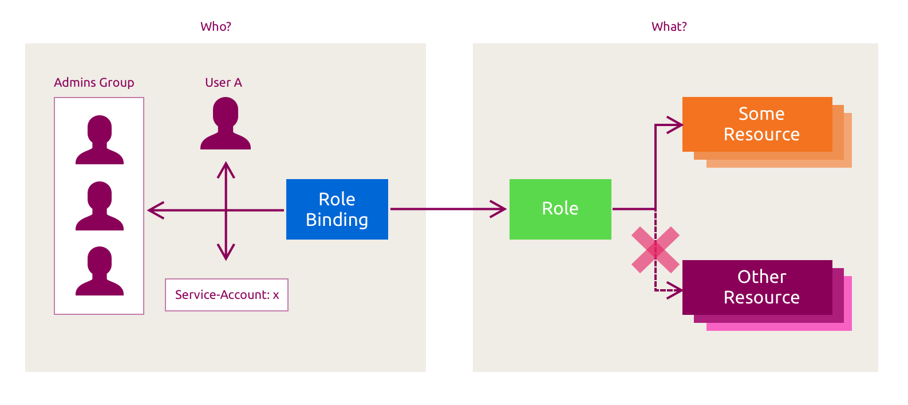

# :material-numeric-6-circle: 6. Authentication and Authorization

## :material-book-open-page-variant-outline: 6.1 Users and ServiceAccounts

Kubernetes has no built-in `User` API object. Human identities are managed outside the cluster, while `ServiceAccount` (`SA`) objects
are namespaced identities for workloads.

`ServiceAccounts` give Pods an identity for communicating with the Kubernetes API server. Pods normally receive a projected volume
that contains a short-lived ServiceAccount token, the cluster CA certificate, and the Pod's namespace. The token authenticates API
requests; authorization rules determine which operations the Pod may perform.

Kubernetes distinguishes user accounts from service accounts for several reasons:

* User accounts represent people and are managed externally to the cluster.
* Service accounts represent Pods and the processes running in them.
* User identities are cluster-wide rather than namespaced.
* Service accounts are namespaced.
* Auditing requirements for people and workloads may differ.

Each namespace has a `default` `SA`. Create separate `SAs` to follow least privilege, granting each workload only the API
permissions it requires.

Each Pod is assigned an `SA` when it is created. If the Pod manifest does not specify one, Kubernetes uses the namespace's
`default` `SA`. Unless token automounting is disabled, Kubernetes injects a projected credential volume for the selected `SA`.

In this chapter, you will create a Pod with `curl`, inspect its projected ServiceAccount volume, and send a request to the API server.

First, inspect the namespaces and `SAs`:

```bash
# List namespaces.
kubectl get namespace
```
??? example "Expected result"
    ```text
    NAME              STATUS   AGE
    cilium-secrets    Active   6h4m
    default           Active   6h4m
    kube-node-lease   Active   6h4m
    kube-public       Active   6h4m
    kube-system       Active   6h4m
    metallb-system    Active   6h4m
    ```

Get the `SA` in the default namespace:

```bash
# List ServiceAccounts in the default namespace.
kubectl get sa
```
??? example "Expected result"
    ```text
    # as mentioned, each Namespace has a default ServiceAccount within it.
    NAME      SECRETS   AGE
    default   0         25h
    ```

Get the `SAs` in all namespaces:

```bash
# List ServiceAccounts in all namespaces.
kubectl get sa --all-namespaces
```
??? example "Expected result"
    ServiceAccounts for all namespaces are displayed.

Inspect the default namespace's `SA`:

```bash
# Describe the default ServiceAccount.
kubectl describe sa default
```
??? example "Expected result"
    ```text
    Name:                default
    Namespace:           default
    Labels:              <none>
    Annotations:         <none>
    Image pull secrets:  <none>
    Events:              <none>
    ```

Since Kubernetes v1.24, ServiceAccounts no longer receive long-lived token Secrets automatically. Pods still receive short-lived,
projected tokens by default. The following manifest defines a legacy long-lived token Secret for the default ServiceAccount:

```bash
# Display the default ServiceAccount token Secret definition.
cat ~/resources/service-account-token.yaml
```
??? example "Expected result"
    ```yaml
    apiVersion: v1
    kind: Secret
    metadata:
      name: default-serviceaccount-secret
      annotations:
        kubernetes.io/service-account.name: default
    type: kubernetes.io/service-account-token
    ```

Create the token Secret:

```bash
# Create the default ServiceAccount token Secret.
kubectl create -f ~/resources/service-account-token.yaml
```
??? example "Expected result"
    The Secret is created.

Inspect the generated ServiceAccount token Secret:

```bash
# Describe the default ServiceAccount token Secret.
kubectl describe secret default-serviceaccount-secret
```
??? example "Expected result"
    ```text
    Name:         default-serviceaccount-secret
    Namespace:    default
    Labels:       <none>
    Annotations:  kubernetes.io/service-account.name: default
                  kubernetes.io/service-account.uid: a0c53e14-fd50-476c-a085-b013256ccf3c

    Type:  kubernetes.io/service-account-token

    Data
    ====
    ca.crt:     1139 bytes
    namespace:  7 bytes
    token:      eyJhbGciOiJSUzI1NiIsImtpZCI6Ik....
    ```

This manually created Secret is separate from the short-lived token that Kubernetes projects into Pods. Create the `alpine` Pod
and inspect its projected ServiceAccount volume:

```bash
# Create the curl pod.
kubectl create -f ~/resources/curl-pod.yaml
```
??? example "Expected result"
    The Pod is created.

```bash
# Describe the curl pod.
kubectl describe pod curl
```
??? example "Expected result"
    ```text
    ...
    Volumes:
      kube-api-access-7qjdk:
        Type:                    Projected (a volume that contains injected data from multiple sources)
        TokenExpirationSeconds:  3607
        ConfigMapName:           kube-root-ca.crt
        Optional:                false
        DownwardAPI:             true
    ...
    ```

Kubernetes mounts the projected volume at `/var/run/secrets/kubernetes.io/serviceaccount/` inside the container. The CA certificate
verifies the API server's identity, and the token authenticates the application:

```bash
# Enter the curl pod shell.
kubectl exec -it curl -- sh
```
??? example "Expected result"
    A shell opens in the curl pod.

```bash
# List the mounted ServiceAccount files.
ls -l /var/run/secrets/kubernetes.io/serviceaccount/
```
??? example "Expected result"
    ```text
    lrwxrwxrwx    1 root     root            13 Jul 25 17:35 ca.crt -> ..data/ca.crt
    lrwxrwxrwx    1 root     root            16 Jul 25 17:35 namespace -> ..data/namespace
    lrwxrwxrwx    1 root     root            12 Jul 25 17:35 token -> ..data/token
    ```

Install `curl` inside the container:

```bash
# Install curl in the container.
apk add curl
```
??? example "Expected result"
    The curl package is installed.

From a Pod in the default namespace, the API server Service is available through the short DNS name `kubernetes`. You can also
retrieve its ClusterIP with `kubectl get svc`.

```bash
# Read the ServiceAccount token and query the API root.
TOKEN=$(cat /var/run/secrets/kubernetes.io/serviceaccount/token)
curl --cacert /var/run/secrets/kubernetes.io/serviceaccount/ca.crt \
-H "Authorization: Bearer $TOKEN" https://kubernetes/api
```
??? example "Expected result"
    A long list of API should be listed and the available verbs for those APIs.

```bash
# Query the v1 API.
curl --cacert /var/run/secrets/kubernetes.io/serviceaccount/ca.crt \
-H "Authorization: Bearer $TOKEN" https://kubernetes/api/v1
```
??? example "Expected result"
    A long list of API should be listed and the available verbs for those APIs.

The responses contain API discovery information. The CA certificate validates the server, the token authenticates the request as
the default ServiceAccount, and authorization rules control subsequent access to API resources.

!!! note "ServiceAccount assignment"
    A Pod's `serviceAccountName` is set when the Pod is created and cannot be changed later. Each Pod uses one `SA`, but
    multiple Pods in a namespace can use the same `SA`.

Return to the student machine:

```bash
# Exit the curl pod shell.
exit
```
??? example "Expected result"
    The student machine shell resumes.

Delete the Pod:

```bash
# Delete the curl pod.
kubectl delete pod curl
```
??? example "Expected result"
    The Pod is deleted.

## :material-book-open-page-variant-outline: 6.2 RBAC, Roles and ClusterRoles

Role-based access control (`RBAC`) authorizes Kubernetes API requests based on permissions granted to subjects such as users, groups,
and ServiceAccounts. RBAC uses four principal authorization resource kinds:

* `Role`: contains additive permission rules for resources in one namespace. RBAC has no `deny` rules.
* `ClusterRole`: contains rules that can cover cluster-scoped resources or be reused in any namespace.
* `RoleBinding`: grants a `Role` or `ClusterRole` to subjects within one namespace.
* `ClusterRoleBinding`: grants a `ClusterRole` to subjects across the cluster.



Canonical Kubernetes enables `RBAC` by default. Verify this by checking the authorization mode:

```bash
# Check the API server authorization mode.
lxc exec k8s-ctrl -- sh -c 'ps aux | grep kube-apiserver'
```
??? example "Expected result"
    ```text
    ...
    --authorization-mode=Node,RBAC
    ...
    ```

Users can define their own `Roles` and `ClusterRoles`, and Kubernetes also provides a default set of `ClusterRoles`. The `edit` role
allows common application-management actions, `view` provides read-only access to most non-sensitive resources, `admin` grants
administrative access within a namespace, and `cluster-admin` grants full control across the cluster. List them:

```bash
# List ClusterRoles.
kubectl get clusterroles
```
??? example "Expected result"
    ClusterRoles are displayed.

### :material-application-edit-outline: Create a ServiceAccount and grant permissions

In this exercise, you will create a `ServiceAccount`, a `Role`, and a `RoleBinding`. The `Role` allows the `get`, `watch`, and `list`
verbs for Pods in the default namespace, and the `RoleBinding` grants those permissions to the ServiceAccount.

The `SA` manifest is available at `~/resources/student-sa.yaml`:

```bash
# Display the student ServiceAccount definition.
cat ~/resources/student-sa.yaml
```
??? example "Expected result"
    ```yaml
    apiVersion: v1
    kind: ServiceAccount
    metadata:
     name: student-sa
     namespace: default
    ```

Create the `SA`:

```bash
# Create the student ServiceAccount.
kubectl create -f ~/resources/student-sa.yaml
```
??? example "Expected result"
    The ServiceAccount is created.

The `Role` manifest is available at `~/resources/pod-reader-role.yaml`:

```bash
# Display the pod-reader Role definition.
cat ~/resources/pod-reader-role.yaml
```
??? example "Expected result"
    ```yaml
    kind: Role
    apiVersion: rbac.authorization.k8s.io/v1
    metadata:
      namespace: default
      name: pod-reader
    rules:
    - apiGroups: [""]
      resources: ["pods"]
      verbs: ["get", "watch", "list"]
    ```

Create the `Role`:

```bash
# Create the pod-reader Role.
kubectl create -f ~/resources/pod-reader-role.yaml
```
??? example "Expected result"
    The Role is created.

The `RoleBinding` at `~/resources/pod-reader-rb.yaml` grants the `Role` to the `student-sa` ServiceAccount:

```bash
# Display the pod-reader RoleBinding definition.
cat ~/resources/pod-reader-rb.yaml
```
??? example "Expected result"
    ```yaml
    apiVersion: rbac.authorization.k8s.io/v1
    kind: RoleBinding
    metadata:
      name: read-pods
      namespace: default
    subjects:
    - kind: ServiceAccount
      name: student-sa
    roleRef:
      kind: Role #this must be Role or ClusterRole
      name: pod-reader # this must match the name of the Role or ClusterRole you wish to bind to
      apiGroup: rbac.authorization.k8s.io
    ```

```bash
# Create the pod-reader RoleBinding.
kubectl create -f ~/resources/pod-reader-rb.yaml
```
??? example "Expected result"
    The RoleBinding is created.

Inspect the `RoleBinding` and confirm that it references `student-sa`:

```bash
# Describe the read-pods RoleBinding.
kubectl describe rolebinding read-pods
```
??? example "Expected result"
    ```text
    Name:         read-pods
    Labels:       <none>
    Annotations:  <none>
    Role:
      Kind:  Role
      Name:  pod-reader
    Subjects:
      Kind            Name        Namespace
      ----            ----        ---------
      ServiceAccount  student-sa
    ```

Create a Pod that uses the new `SA`. Its manifest is available at `~/resources/curl-pod-with-sa.yaml`:

```bash
# Display the curl pod definition with the student ServiceAccount.
cat ~/resources/curl-pod-with-sa.yaml
```
??? example "Expected result"
    ```yaml
    apiVersion: v1
    kind: Pod
    metadata:
      name: curl
    spec:
      serviceAccountName: student-sa
      containers:
      - name: curl
        image: alpine
        command: ["sleep", "999999"]
    ```

The key field here is `serviceAccountName: student-sa`. Create the Pod:

```bash
# Create the curl pod with the student ServiceAccount.
kubectl create -f ~/resources/curl-pod-with-sa.yaml
```
??? example "Expected result"
    The Pod is created.

Start a shell inside the container and attach to it:

```bash
# Enter the curl pod shell.
kubectl exec -it curl -- sh
```
??? example "Expected result"
    A shell opens in the curl pod.

Install `curl` inside the container:

```bash
# Install curl in the container.
apk add curl
```
??? example "Expected result"
    The curl package is installed.

Query the API server for Pods. The assigned `Role` allows this action:

```bash
# Read the ServiceAccount token and list pods through the API.
TOKEN=$(cat /var/run/secrets/kubernetes.io/serviceaccount/token)
curl --cacert /var/run/secrets/kubernetes.io/serviceaccount/ca.crt \
-H "Authorization: Bearer $TOKEN" https://kubernetes/api/v1/namespaces/default/pods
```
??? example "Expected result"
    ```json
    {
      "kind": "PodList",
      "apiVersion": "v1",
      "metadata": {
        "resourceVersion": "98947"
      },
      "items": [
        {
          "metadata": {
            "name": "curl",
            "namespace": "default",
            "uid": "aed4abe5-490b-477b-a100-cec137cceb9f",
            "resourceVersion": "98907",
            "generation": 1,
            "creationTimestamp": "2026-03-19T10:50:58Z",
            "managedFields": [
              {
                "manager": "kubectl-create",
                "operation": "Update",
                "apiVersion": "v1",
                "time": "2026-03-19T10:50:58Z",
                "fieldsType": "FieldsV1",
                "fieldsV1": {
                  "f:spec": {
                    "f:containers": {
                      "k:{\"name\":\"curl\"}": {
                        ".": {},
                        "f:command": {},
                        "f:image": {},
                        "f:imagePullPolicy": {},
                        "f:name": {},
                        "f:resources": {},
                        "f:terminationMessagePath": {},
                        "f:terminationMessagePolicy": {}
                      }
    ...
    ```

Now try to list `Secrets`, which the assigned `Role` does not allow:

```bash
# List Secrets through the API.
curl --cacert /var/run/secrets/kubernetes.io/serviceaccount/ca.crt \
-H "Authorization: Bearer $TOKEN" https://kubernetes/api/v1/namespaces/default/secrets
```
??? example "Expected result"
    ```json
    {
      "kind": "Status",
      "apiVersion": "v1",
      "metadata": {},
      "status": "Failure",
      "message": "secrets is forbidden: User \"system:serviceaccount:default:student-sa\" cannot list resource \"secrets\" in API group \"\" in the namespace \"default\"",
      "reason": "Forbidden",
      "details": {
        "kind": "secrets"
      },
      "code": 403
    }
    ```

As expected, the API server returns a `403 Forbidden` response.

Return to the student machine:

```bash
# Exit the curl pod shell.
exit
```
??? example "Expected result"
    The student machine shell resumes.

Delete the exercise resources:

```bash
# Delete the curl pod.
kubectl delete pod curl
```
??? example "Expected result"
    The Pod is deleted.

```bash
# Delete the read-pods RoleBinding.
kubectl delete rolebinding read-pods
```
??? example "Expected result"
    The RoleBinding is deleted.

```bash
# Delete the pod-reader Role.
kubectl delete role pod-reader
```
??? example "Expected result"
    The Role is deleted.

```bash
# Delete the student ServiceAccount.
kubectl delete sa student-sa
```
??? example "Expected result"
    The ServiceAccount is deleted.
