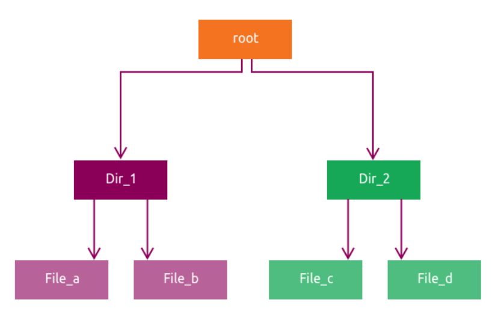
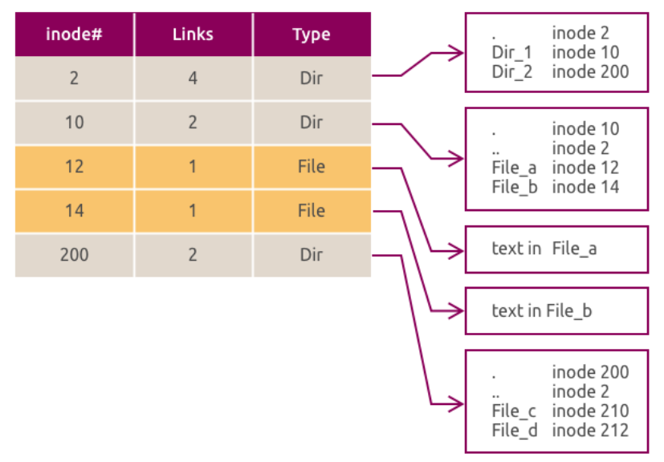

# Advanced Filesystem Concepts

This chapter introduces filesystem internals, `ext4` administration, extended attributes, ACLs, and special permission bits.

In this chapter you will:

- describe how Linux filesystems organize metadata and data
- inspect and tune `ext4` filesystem settings
- manage extended attributes and POSIX ACLs
- review `setuid`, `setgid`, and sticky-bit behavior

## :material-book-open-page-variant-outline: 6.1 Filesystem Internals

### :material-application-edit-outline: 6.1.1 Inodes

An **inode** is the core metadata record for a file or directory in most Unix-style filesystems.

An inode stores:

- file type
- ownership and permissions
- size
- timestamps
- pointers to the file's data blocks

An inode does not store:

- the file name
- the full path

Directory entries map names to inode numbers. You can inspect inode numbers with `ls -i`.

The filesystem creates the inode table when it is formatted. The superblock records where that table is stored and how large it is.

In a directory, the inode points to directory data that contains file names and their inode numbers.

The figure below shows a simple directory tree:



```bash
# Show the inode number for a file.
ls -i filename
```
??? quote "Reference output"
    ```text
    123456 filename
    ```

```bash
# Count how many entries each directory contains.
find / -xdev -printf '%h\n' | sort | uniq -c | sort -k 1 -n
```
??? quote "Reference output"
    ```text
          1 /lost+found
          2 /boot
         14 /etc
        120 /usr/bin
    ```

The next figure shows the same structure represented using inodes:



Read the example from the root directory outward. The root directory points to child directory and file inodes, and file inodes then point to their data blocks.

!!! note
    The link count shows how many directory entries reference the same inode. Every directory except `/` also contains `.` and `..` entries.

### :material-application-edit-outline: 6.1.2 Superblocks

The **superblock** stores high-level filesystem metadata, including:

- filesystem type
- total size and block count
- inode count and inode-table location
- enabled features such as journaling or ACL support
- filesystem state and timestamps

Most filesystems keep backup superblocks in known locations. Recovery tools can use those copies if the primary superblock is damaged.

Use `dumpe2fs` to list backup superblocks:

```bash
# List superblock information for an ext filesystem.
sudo dumpe2fs /dev/<partition> | grep -i superblock
```
??? quote "Reference output"
    ```text
    Primary superblock at 0, Group descriptors at 1-2
    Backup superblock at 32768, Group descriptors at 32769-32770
    Backup superblock at 98304, Group descriptors at 98305-98306
    ```

Use `tune2fs` to inspect superblock-backed settings:

```bash
# Display ext filesystem metadata and settings.
sudo tune2fs -l /dev/vdb1
```
??? quote "Reference output"
    ```text
    Filesystem volume name:   <none>
    Filesystem features:      has_journal ext_attr resize_inode dir_index filetype extent 64bit flex_bg sparse_super large_file huge_file dir_nlink extra_isize metadata_csum
    Mount count:              0
    Maximum mount count:      -1
    ```

```bash
# Show the current volume label.
sudo tune2fs -l /dev/vdb1 | grep volume
```
??? quote "Reference output"
    ```text
    Filesystem volume name:   <none>
    ```

```bash
# Set the ext filesystem label to myhome.
sudo tune2fs -L myhome /dev/vdb1
```
??? quote "Reference output"
    ```text
    tune2fs 1.47.0 (...)
    ```

!!! note
    `tune2fs` applies to `ext2`, `ext3`, and `ext4` filesystems only.

### :material-application-edit-outline: 6.1.3 Extended Attributes

Extended attributes (`xattrs`) let applications and users attach metadata to files beyond the standard owner, mode, and timestamp fields.

Common examples include:

- `user.comment`
- `security.selinux`
- ACL-related metadata

These attributes are stored outside the main inode payload and require filesystem and mount-option support.

```bash
# Show the default mount options stored in the filesystem.
sudo dumpe2fs -h /dev/vdb1 | grep Default
```
??? quote "Reference output"
    ```text
    Default mount options:    user_xattr acl
    Default directory hash:   half_md4
    ```

`user_xattr` enables user-defined extended attributes, and `acl` enables POSIX ACL support.

In addition to xattrs, Linux supports low-level file flags such as immutable and append-only. These are managed with `chattr` and viewed with `lsattr`.

```bash
# Mark the file as immutable.
sudo chattr +i /mnt/fs/file1.txt
```
??? quote "Reference output"
    ```text
    No output.
    ```

```bash
# Display the current file attributes.
lsattr /mnt/fs/file1.txt
```
??? quote "Reference output"
    ```text
    ----i----------------- /mnt/fs/file1.txt
    ```

```bash
# Remove the immutable flag.
sudo chattr -i /mnt/fs/file1.txt
```
??? quote "Reference output"
    ```text
    No output.
    ```

```bash
# Mark the file as append-only.
sudo chattr +a /mnt/fs/file1.txt
```
??? quote "Reference output"
    ```text
    No output.
    ```

```bash
# Remove the append-only flag.
sudo chattr -a /mnt/fs/file1.txt
```
??? quote "Reference output"
    ```text
    No output.
    ```

!!! note
    `ls -l` does not show these low-level flags. Use `lsattr` to inspect them.

### :material-application-edit-outline: 6.1.4 POSIX ACLs

POSIX ACLs provide more precise permissions than the traditional owner, group, and other model. They are useful when multiple users need different access levels to the same file or directory.

```bash
# Show ACL entries for a file.
getfacl filename
```
??? quote "Reference output"
    ```text
    # file: filename
    # owner: ubuntu
    # group: ubuntu
    user::rw-
    group::r--
    other::r--
    ```

```bash
# Grant rwx access to a specific user.
setfacl -m u:username:rwx filename
```
??? quote "Reference output"
    ```text
    No output.
    ```

```bash
# Remove all ACL entries from a file.
setfacl -b filename
```
??? quote "Reference output"
    ```text
    No output.
    ```

!!! note
    For deeper ACL coverage, including masks and default ACLs, see the Security chapter.

!!! pied-piper "Takeaway"
    Keep these filesystem concepts separate:

    - an inode stores file metadata and pointers to data blocks
    - a directory maps names to inode numbers
    - a superblock stores filesystem-wide metadata
    - xattrs and ACLs add extra metadata and permission control beyond basic mode bits

## :material-book-open-page-variant-outline: 6.2 Filesystem Internals Lab

!!! info
    Run this lab on `LABVM`. This lab uses `/dev/vdb` only. You will use `sudo` for the `tune2fs`, `dumpe2fs`, and filesystem-management steps.

Step 1: Review inode usage on the system.

```bash
# Show filesystem inode usage.
df -ih
```
??? example "Expected result"
    ```text
    Filesystem     Inodes IUsed IFree IUse% Mounted on
    tmpfs            993K   946  992K    1% /run
    /dev/vda1        3.9M  153K  3.8M    4% /
    tmpfs            993K     1  993K    1% /dev/shm
    ```

Step 2: Clear the lab disk and create an `ext4` filesystem on `/dev/vdb1`.

```bash
# Zero the beginning of /dev/vdb.
sudo dd if=/dev/zero of=/dev/vdb bs=1M count=10
```
??? example "Expected result"
    ```text
    10+0 records in
    10+0 records out
    10485760 bytes (10 MB, 10 MiB) copied, ... s, ... MB/s
    ```

```bash
# Create a GPT partition table on /dev/vdb.
sudo parted /dev/vdb mklabel gpt
```
??? example "Expected result"
    ```text
    Information: You may need to update /etc/fstab.
    ```

```bash
# Create one ext4 partition on /dev/vdb.
sudo parted -a optimal /dev/vdb mkpart primary ext4 1 100%
```
??? example "Expected result"
    ```text
    Information: You may need to update /etc/fstab.
    ```

```bash
# Format /dev/vdb1 as ext4.
sudo mkfs.ext4 /dev/vdb1
```
??? example "Expected result"
    ```text
    mke2fs 1.47.0 (...)
    Creating filesystem with ... 4k blocks and ... inodes
    Filesystem UUID: ...
    ```

Step 3: Set the maximum mount count to `2`.

```bash
# Force fsck after two mounts.
sudo tune2fs -c 2 /dev/vdb1
```
??? example "Expected result"
    ```text
    tune2fs 1.47.0 (...)
    Setting maximal mount count to 2
    ```

!!! note
    `-c` sets how many mounts are allowed before the filesystem should be checked.

Step 4: Set the check interval to two days.

```bash
# Force a filesystem check at least every two days.
sudo tune2fs -i 2d /dev/vdb1
```
??? example "Expected result"
    ```text
    tune2fs 1.47.0 (...)
    Setting interval between checks to 172800 seconds
    ```

Step 5: Review the superblock-backed settings.

```bash
# Display the full ext4 metadata summary.
sudo tune2fs -l /dev/vdb1
```
??? example "Expected result"
    ```text
    Filesystem volume name:   <none>
    Default mount options:    user_xattr acl
    Inode count:              655360
    Free blocks:              2554175
    Free inodes:              655349
    Mount count:              0
    Maximum mount count:      2
    Check interval:           172800 (2 days)
    Last checked:             Sun Apr 12 09:22:17 2026
    First inode:              11
    Inode size:               256
    ```

Step 6: Enable ACLs as a default mount option in the filesystem.

```bash
# Add acl to the filesystem default mount options.
sudo tune2fs -o acl /dev/vdb1
```
??? example "Expected result"
    ```text
    tune2fs 1.47.0 (...)
    ```

Step 7: Confirm the default mount options.

```bash
# Show the default mount options from the filesystem header.
sudo dumpe2fs -h /dev/vdb1 | grep Default
```
??? example "Expected result"
    ```text
    Default mount options:    user_xattr acl
    Default directory hash:   half_md4
    dumpe2fs 1.47.0 (5-Feb-2023)
    ```

Step 8: Mount the filesystem and create a test file.

```bash
# Create the lab mount point.
sudo mkdir -p /mnt/fs
```
??? example "Expected result"
    ```text
    No output.
    ```

```bash
# Mount /dev/vdb1 on /mnt/fs.
sudo mount /dev/vdb1 /mnt/fs/
```
??? example "Expected result"
    ```text
    No output.
    ```

```bash
# Confirm that /dev/vdb1 is mounted.
mount | grep vdb1
```
??? example "Expected result"
    ```text
    /dev/vdb1 on /mnt/fs type ext4 (rw,relatime)
    ```

```bash
# Hand ownership of the mount point to the ubuntu user.
sudo chown -R ubuntu:ubuntu /mnt/fs
```
??? example "Expected result"
    ```text
    No output.
    ```

```bash
# Create a test file with sample content.
echo "Hello World!" > /mnt/fs/file1.txt
```
??? example "Expected result"
    ```text
    No output.
    ```

Step 9: Run `fsck` against the filesystem.

```bash
# Unmount the filesystem before checking it.
sudo umount /dev/vdb1
```
??? example "Expected result"
    ```text
    No output.
    ```

```bash
# Run a verbose filesystem check.
sudo fsck -V /dev/vdb1
```
??? example "Expected result"
    ```text
    fsck from util-linux 2.39.3
    [/usr/sbin/fsck.ext4 (1) -- /dev/vdb1] fsck.ext4 /dev/vdb1
    e2fsck 1.47.0 (5-Feb-2023)
    /dev/vdb1: clean, 12/655360 files, 66754/2620928 blocks (check after next mount)
    ```

!!! note
    If `fsck` reports that it needs a terminal, rerun it directly in your shell on `LABVM` after confirming that `/dev/vdb1` is unmounted.

```bash
# Mount the filesystem again after the check.
sudo mount /dev/vdb1 /mnt/fs/
```
??? example "Expected result"
    ```text
    No output.
    ```

Step 10: Set and inspect extended attributes.

```bash
# Install the attr utilities.
sudo apt install -y attr
```
??? example "Expected result"
    ```text
    Reading package lists...
    Building dependency tree...
    ...
    Setting up attr (1:2.5.2-1build1.1) ...
    ```

!!! note
    `apt` may print extra warnings during the install. If the command completes successfully, the package is ready to use.

```bash
# Add a user-defined extended attribute to the test file.
setfattr -n user.comment -v "This is a demo file." /mnt/fs/file1.txt
```
??? example "Expected result"
    ```text
    No output.
    ```

```bash
# Display all extended attributes on the test file.
getfattr -d /mnt/fs/file1.txt
```
??? example "Expected result"
    ```text
    # file: mnt/fs/file1.txt
    user.comment="This is a demo file."

    getfattr: Removing leading '/' from absolute path names
    ```

```bash
# Attempt to read an attribute that does not exist.
getfattr -n user.invalid /mnt/fs/file1.txt
```
??? example "Expected result"
    ```text
    /mnt/fs/file1.txt: user.invalid: No such attribute
    ```

Step 11: Set and inspect POSIX ACLs.

```bash
# Install the ACL utilities.
sudo apt install -y acl
```
??? example "Expected result"
    ```text
    acl is already the newest version (2.3.2-1build1.1).
    acl set to manually installed.
    0 upgraded, 0 newly installed, 0 to remove and 2 not upgraded.
    ```

```bash
# Grant read access on the file to the nobody user.
sudo setfacl -m u:nobody:r /mnt/fs/file1.txt
```
??? example "Expected result"
    ```text
    No output.
    ```

```bash
# Show the ACL entries applied to the file.
getfacl /mnt/fs/file1.txt
```
??? example "Expected result"
    ```text
    # file: mnt/fs/file1.txt
    # owner: ubuntu
    # group: ubuntu
    user::rw-
    user:nobody:r--
    group::rw-
    mask::rw-
    other::r--

    getfacl: Removing leading '/' from absolute path names
    ```

```bash
# Remove the ACL entry for the nobody user.
sudo setfacl -x u:nobody /mnt/fs/file1.txt
```
??? example "Expected result"
    ```text
    No output.
    ```

Step 12: Clean up the lab state.

```bash
# Unmount the lab filesystem.
sudo umount /mnt/fs
```
??? example "Expected result"
    ```text
    No output.
    ```

```bash
# Remove filesystem signatures from the lab partition.
sudo wipefs -a /dev/vdb1
```
??? example "Expected result"
    ```text
    /dev/vdb1: 2 bytes were erased at offset 0x00000438 (ext4): 53 ef
    ```

!!! pied-piper "Takeaway"
    In this lab, you used filesystem tools to:

    - inspect inode and superblock-related information
    - change ext4 check behavior with `tune2fs`
    - verify defaults with `dumpe2fs`
    - set xattrs and ACLs on a real file

## :material-book-open-page-variant-outline: 6.3 The `ext4` Filesystem

`ext4` is Ubuntu's default filesystem. It builds on `ext3` and is widely used because it is stable, mature, and broadly supported.

This section gives you the mental model for the lab that follows. Focus on what each feature changes and when you would care about it in day-to-day administration.

Key `ext4` features:

- journaling for crash recovery
- extents for more efficient block allocation
- delayed allocation for better write performance
- backward compatibility with `ext2` and `ext3`
- online growth while mounted

Useful `ext4` tools:

- `mkfs.ext4`: create a filesystem
- `tune2fs`: inspect and tune parameters
- `e2label`: set or view labels
- `e2fsck`: check and repair the filesystem
- `resize2fs`: grow or shrink the filesystem

### :material-application-edit-outline: 6.3.1 Journaling Modes and Mount Behavior

`ext4` supports multiple journaling modes that trade off speed and data safety. In practice, this is a choice between performance and how much protection you want during an unclean shutdown.

| Mode | Description |
| - | - |
| `journal` | Journals both file data and metadata. **Highest protection and highest overhead.** |
| `ordered` | Journals metadata and writes file data before committing metadata. **This is the default.** |
| `writeback` | Journals metadata but may write data after metadata. **Fastest and least protective.** |

```bash
# Remount a filesystem with writeback journaling.
sudo mount -o remount,data=writeback /mount/point
```
??? example "Expected result"
    ```text
    No output.
    ```

To make the setting persistent, add the mount option in `/etc/fstab`.

`ext4` also controls how access times are updated. This mostly matters when you want to reduce metadata writes on busy systems.

| Option | Behavior |
| - | - |
| `atime` | Updates access time on every read. **Highest metadata overhead.** |
| `noatime` | Disables access-time updates. **Fast** |
| `relatime` | Updates access time only when needed. **This is the default on most systems.** |

```bash
# Remount a filesystem with noatime.
sudo mount -o remount,noatime /mount/point
```
??? example "Expected result"
    ```text
    No output.
    ```

!!! note
    These remount commands are reference examples. You will apply the same ideas in the `6.4` lab.

### :material-application-edit-outline: 6.3.2 Common Tasks

These are the core `ext4` administration commands you are expected to recognize. The next lab uses the same tools in a practical sequence.

```bash
# Create an ext4 filesystem.
sudo mkfs.ext4 /dev/vdb1
```
??? quote "Reference output"
    ```text
    mke2fs 1.47.0 (...)
    Creating filesystem with ... 4k blocks and ... inodes
    ```

```bash
# Set the volume label to mydata.
sudo e2label /dev/vdb1 mydata
```
??? quote "Reference output"
    ```text
    No output.
    ```

```bash
# Resize the filesystem after the underlying storage has grown.
sudo resize2fs /dev/vdb1
```
??? quote "Reference output"
    ```text
    resize2fs ...
    The filesystem on /dev/vdb1 is now ... blocks long.
    ```

```bash
# Force a filesystem check and repair pass.
sudo e2fsck -f /dev/vdb1
```
??? quote "Reference output"
    ```text
    e2fsck ...
    /dev/vdb1: clean, .../... files, .../... blocks
    ```

```bash
# Display the current ext4 settings.
sudo tune2fs -l /dev/vdb1
```
??? quote "Reference output"
    ```text
    Filesystem volume name:   ...
    Default mount options:    user_xattr acl
    Filesystem features:      ...
    ```

### :material-application-edit-outline: 6.3.3 Other Filesystem Options

Ubuntu also supports several other filesystems:

- `XFS`: high-performance journaling filesystem designed for scale
- `btrfs`: copy-on-write filesystem with snapshot support
- `F2FS`: flash-friendly filesystem for solid-state media
- `vfat`, `exFAT`, `NTFS`: interoperability-focused filesystems for removable media or mixed environments

ZFS is covered in its own later chapter because it combines filesystem and volume-management features.

For this chapter, stay focused on `ext4`. It is the baseline filesystem knowledge most Ubuntu administrators use first.

!!! pied-piper "Takeaway"
    For `ext4`, remember:

    - journaling mode affects the safety-versus-speed trade-off
    - mount options such as `noatime` affect runtime behavior
    - tools such as `tune2fs`, `e2fsck`, and `resize2fs` handle day-to-day administration

## :material-book-open-page-variant-outline: 6.4 `ext4` Filesystem Lab

!!! info
    Run this lab on `LABVM`. This lab focuses on `ext4` creation, mount behavior, journaling options, and online growth.

Step 1: Prepare `/dev/vdb` and create a partition that initially uses 80% of the disk.

```bash
# Create a GPT partition table on /dev/vdb.
sudo parted /dev/vdb mklabel gpt
```
??? example "Expected result"
    ```text
    Warning: The existing disk label on /dev/vdb will be destroyed and all data on this disk will be lost.
    Do you want to continue?
    Information: You may need to update /etc/fstab.
    ```

!!! note
    If `parted` warns that it is about to replace an existing disk label, confirm the prompt and continue.

```bash
# Create an ext4 partition that uses the first 80% of the disk.
sudo parted -a optimal /dev/vdb mkpart primary ext4 1MiB 80%
```
??? example "Expected result"
    ```text
    No output.
    ```

Step 2: Format the partition with a label and non-default `ext4` options.

```bash
# Create the filesystem with a label and reduced reserved space.
sudo mkfs.ext4 -L ext4data -m 1 -E lazy_itable_init=1 /dev/vdb1
```
??? example "Expected result"
    ```text
    mke2fs 1.47.0 (...)
    Creating filesystem with ... 4k blocks and ... inodes
    Filesystem UUID: ...
    ```

!!! note
    `-L ext4data` sets the label, `-m 1` reserves 1% for root, and `-E lazy_itable_init=1` speeds up formatting by deferring inode-table initialization work.

Step 3: Verify the label and mount the filesystem by label.

```bash
# Show the filesystem label and UUID details.
lsblk -f /dev/vdb
```
??? example "Expected result"
    ```text
    NAME FSTYPE FSVER LABEL    UUID                                 FSAVAIL FSUSE% MOUNTPOINTS
    vdb
    └─vdb1 ext4   1.0   ext4data ...
    ```

```bash
# Create the mount point used in this lab.
sudo mkdir -p /mnt/fs
```
??? example "Expected result"
    ```text
    No output.
    ```

```bash
# Mount the filesystem using its label.
sudo mount LABEL=ext4data /mnt/fs
```
??? example "Expected result"
    ```text
    No output.
    ```

```bash
# Verify the active mount.
mount | grep /mnt/fs
```
??? example "Expected result"
    ```text
    /dev/vdb1 on /mnt/fs type ext4 (rw,relatime)
    ```

Step 4: Review the available space.

```bash
# Show the mounted filesystem size and usage.
df -h /mnt/fs
```
??? example "Expected result"
    ```text
    Filesystem      Size  Used Avail Use% Mounted on
    /dev/vdb1       7.8G   24K  7.7G   1% /mnt/fs
    ```

Step 5: Create a test file.

```bash
# Write a sample file into the filesystem.
echo "Testing ext4 advanced lab" | sudo tee /mnt/fs/info.txt
```
??? example "Expected result"
    ```text
    Testing ext4 advanced lab
    ```

Step 6: Inspect the file timestamps before changing mount options.

```bash
# Show the file metadata before reading it.
stat /mnt/fs/info.txt
```
??? example "Expected result"
    ```text
    File: /mnt/fs/info.txt
    Size: 26
    Access: 2026-04-12 17:45:23.047432081 +0000
    Modify: 2026-04-12 17:45:23.047432081 +0000
    Change: 2026-04-12 17:45:23.047432081 +0000
    ```

```bash
# Read the file contents.
cat /mnt/fs/info.txt
```
??? example "Expected result"
    ```text
    Testing ext4 advanced lab
    ```

```bash
# Show the metadata again so you can compare access time.
stat /mnt/fs/info.txt
```
??? example "Expected result"
    ```text
    File: /mnt/fs/info.txt
    Size: 26
    Access: 2026-04-12 17:47:11.848217091 +0000
    Modify: 2026-04-12 17:45:23.047432081 +0000
    Change: 2026-04-12 17:45:23.047432081 +0000
    ```

!!! note
    With the default `relatime` behavior, reading the file may update the access time.

Step 7: Extend the partition to use the full disk.

```bash
# Unmount the filesystem before resizing the partition.
sudo umount /mnt/fs
```
??? example "Expected result"
    ```text
    No output.
    ```

```bash
# Grow partition 1 to 100% of the disk.
sudo parted /dev/vdb resizepart 1 100%
```
??? example "Expected result"
    ```text
    Information: You may need to update /etc/fstab.
    ```

Step 8: Grow the filesystem to match the larger partition.

```bash
# Check the filesystem before resizing it.
sudo e2fsck -f /dev/vdb1
```
??? example "Expected result"
    ```text
    e2fsck 1.47.0 (...)
    /dev/vdb1: clean, .../... files, .../... blocks
    ```

!!! note
    If `e2fsck` reports that it needs a terminal, rerun it directly in your shell on `LABVM`.

```bash
# Expand the filesystem to fill the resized partition.
sudo resize2fs /dev/vdb1
```
??? example "Expected result"
    ```text
    resize2fs ...
    Resizing the filesystem on /dev/vdb1 to ... blocks.
    The filesystem on /dev/vdb1 is now ... blocks long.
    ```

Step 9: Remount the filesystem and confirm the new size.

```bash
# Mount the filesystem again using its label.
sudo mount LABEL=ext4data /mnt/fs
```
??? example "Expected result"
    ```text
    No output.
    ```

```bash
# Confirm the larger filesystem size.
df -h /mnt/fs
```
??? example "Expected result"
    ```text
    Filesystem      Size  Used Avail Use% Mounted on
    /dev/vdb1       9.8G   28K  9.7G   1% /mnt/fs
    ```

Step 10: Confirm that journaling is enabled.

```bash
# Check whether the filesystem has the journal feature.
sudo tune2fs -l /dev/vdb1 | grep has_journal
```
??? example "Expected result"
    ```text
    Filesystem features:      has_journal ...
    ```

Step 11: Try to switch to `writeback` journaling mode.

```bash
# Remount the filesystem with writeback journaling.
sudo mount -o remount,data=writeback /mnt/fs
```
??? example "Expected result"
    ```text
    mount: /mnt/fs: mount point not mounted or bad option.
    dmesg(1) may have more information after failed mount system call.
    ```

!!! note
    If `remount` fails, use the full unmount and mount sequence in the next step.

Step 12: If needed, mount again with `writeback` and verify the active mount options.

```bash
# If remounting fails, mount again with the desired data mode.
sudo umount /mnt/fs
```
??? example "Expected result"
    ```text
    No output.
    ```

```bash
# Mount the filesystem with writeback journaling.
sudo mount -o data=writeback LABEL=ext4data /mnt/fs
```
??? example "Expected result"
    ```text
    No output.
    ```

```bash
# Show the active mount options for /mnt/fs.
mount | grep /mnt/fs
```
??? example "Expected result"
    ```text
    /dev/vdb1 on /mnt/fs type ext4 (...,data=writeback)
    ```

```bash
# Hand ownership of the mount point to the ubuntu user before the write tests.
sudo chown -R ubuntu:ubuntu /mnt/fs
```
??? example "Expected result"
    ```text
    No output.
    ```

Step 13: Write test data and review the runtime.

```bash
# Write a 1 GiB test file and measure how long it takes.
time dd if=/dev/zero of=/mnt/fs/testfile bs=1M count=1024 status=progress
```
??? example "Expected result"
    ```text
    1024+0 records in
    1024+0 records out
    1073741824 bytes (1.1 GB, 1.0 GiB) copied, 0.580256 s, 1.9 GB/s

    real    0m0.583s
    user    0m0.003s
    sys     0m0.577s
    ```

Step 14: Switch to the safer `journal` mode.

```bash
# Remount the filesystem with full data journaling.
sudo mount -o remount,data=journal /mnt/fs
```
??? example "Expected result"
    ```text
    mount: /mnt/fs: mount point not mounted or bad option.
    dmesg(1) may have more information after failed mount system call.
    ```

!!! note
    If remounting fails, unmount the filesystem and mount it again with the desired option.

```bash
# Unmount the filesystem before mounting it in journal mode.
sudo umount /mnt/fs
```
??? example "Expected result"
    ```text
    No output.
    ```

```bash
# Mount the filesystem with full data journaling.
sudo mount -o data=journal LABEL=ext4data /mnt/fs
```
??? example "Expected result"
    ```text
    No output.
    ```

```bash
# Show the active mount options for /mnt/fs.
mount | grep /mnt/fs
```
??? example "Expected result"
    ```text
    /dev/vdb1 on /mnt/fs type ext4 (...,data=journal)
    ```

Step 15: Repeat the write test and compare the runtime.

```bash
# Repeat the write test under journal mode using a second file.
time dd if=/dev/zero of=/mnt/fs/testfile-journal bs=1M count=1024 status=progress
```
??? example "Expected result"
    ```text
    1024+0 records in
    1024+0 records out
    1073741824 bytes (1.1 GB, 1.0 GiB) copied, 4.90757 s, 219 MB/s

    real    0m4.911s
    user    0m0.006s
    sys     0m2.661s
    ```

!!! note
    In this lab, `data=journal` was much slower than `data=writeback`, which illustrates the trade-off between stronger protection and write performance.

Step 16: Test `noatime` behavior.

```bash
# Remount the filesystem with ordered journaling and noatime.
sudo mount -o remount,data=ordered,noatime /mnt/fs
```
??? example "Expected result"
    ```text
    mount: /mnt/fs: mount point not mounted or bad option.
    dmesg(1) may have more information after failed mount system call.
    ```

!!! note
    If the remount fails, unmount the filesystem and mount it again with the desired options.

```bash
# Unmount the filesystem before mounting it with ordered mode and noatime.
sudo umount /mnt/fs
```
??? example "Expected result"
    ```text
    No output.
    ```

```bash
# Mount the filesystem with ordered journaling and noatime.
sudo mount -o data=ordered,noatime LABEL=ext4data /mnt/fs
```
??? example "Expected result"
    ```text
    No output.
    ```

```bash
# Show the file metadata before reading it again.
stat /mnt/fs/info.txt
```
??? example "Expected result"
    ```text
    File: /mnt/fs/info.txt
    Access: 2026-04-12 17:47:11.848217091 +0000
    Modify: 2026-04-12 17:45:23.047432081 +0000
    Change: 2026-04-12 18:05:19.683090311 +0000
    ```

```bash
# Read the file contents.
cat /mnt/fs/info.txt
```
??? example "Expected result"
    ```text
    Testing ext4 advanced lab
    ```

```bash
# Check whether access time changed after the read.
stat /mnt/fs/info.txt
```
??? example "Expected result"
    ```text
    File: /mnt/fs/info.txt
    Access: 2026-04-12 17:47:11.848217091 +0000
    Modify: 2026-04-12 17:45:23.047432081 +0000
    Change: 2026-04-12 18:05:19.683090311 +0000
    ```

!!! note
    With `noatime`, reading the file did not change the access time.

Step 17: Clean up the lab state.

```bash
# Unmount the lab filesystem.
sudo umount /mnt/fs
```
??? example "Expected result"
    ```text
    No output.
    ```

```bash
# Remove filesystem signatures from /dev/vdb1.
sudo wipefs -a /dev/vdb1
```
??? example "Expected result"
    ```text
    /dev/vdb1: 2 bytes were erased at offset 0x00000438 (ext4): 53 ef
    ```

!!! pied-piper "Takeaway"
    This lab shows that `ext4` administration is not just about formatting a partition.

    - labels let you mount filesystems by name instead of by device path
    - filesystem size and partition size must be managed separately, so growing the partition still requires `resize2fs`
    - journaling mode affects runtime behavior and performance, with `writeback` faster and `journal` safer but slower in this lab
    - access-time behavior is controlled by mount options, and `noatime` stopped reads from updating the file's access time
    - some ext4 mount-option changes may require a full unmount and mount instead of a simple remount

## :material-book-open-page-variant-outline: 6.5 The `SETUID` and `SETGID` Bits

!!! note
    Use `setuid` and `setgid` carefully. They allow privilege escalation and increase the system's attack surface. When possible, prefer `sudo`, capabilities, or sandboxing.

Each process has a **real UID** and an **effective UID**. The real UID identifies the user who started the process. The effective UID determines which privileges the process actually runs with.

`setuid` and `setgid` change that behavior.

In practical terms, these bits are a controlled way to let a program run with privileges different from the user who launched it. That is why they are powerful, but also why they need careful review.

- `setuid` on an executable makes it run with the file owner's privileges
- `setgid` on an executable makes it run with the file group's privileges
- `setgid` on a directory makes new files inherit the directory's group

`setuid` has no effect on directories.

```bash
# List sample files that already have special bits set.
ls -l
```
??? quote "Reference output"
    ```text
    -rwSrw-r-- 1 michelle michelle 0 Oct 14 04:30 file1
    -rw-rwsr-- 1 michelle michelle 0 Oct 14 04:30 file2
    ```

- `S` means the special bit is set but execute permission is missing
- `s` means the special bit is set and execute permission is present

Some common binaries use these bits for privilege elevation.

```bash
# Show the permissions of common privileged system binaries.
ls -l $(which at) $(which chage) $(which chsh) $(which crontab) $(which sudo) $(which ping) $(which mount)
```
??? quote "Reference output"
    ```text
    -rwxr-sr-x 1 root shadow   72184 May 30  2024 /usr/bin/chage
    -rwsr-xr-x 1 root root     44760 May 30  2024 /usr/bin/chsh
    -rwxr-sr-x 1 root crontab  39664 Mar 31  2024 /usr/bin/crontab
    -rwsr-xr-x 1 root root     51584 Mar  6 16:00 /usr/bin/mount
    -rwxr-xr-x 1 root root     89800 Jul 24  2025 /usr/bin/ping
    -rwsr-xr-x 1 root root    277936 Mar  2 12:56 /usr/bin/sudo
    ```

!!! note
    `ping` did not use `setuid` or `setgid` on this system, which is normal on newer systems that use Linux capabilities instead.

Use symbolic mode to add or remove the bits:

```bash
# Add the setuid bit.
chmod u+s /path/filename
```

```bash
# Add the setgid bit.
chmod g+s /path/filename
```

```bash
# Remove the setuid bit.
chmod u-s /path/filename
```

```bash
# Remove the setgid bit.
chmod g-s /path/filename
```

Use octal mode when you want to set special bits together with normal permissions:

```bash
# Set setuid with mode 4777.
chmod 4777 file1
```

```bash
# Set setgid with mode 2764.
chmod 2764 file2
```

```bash
# Set both setuid and setgid with mode 6764.
chmod 6764 file3
```

```bash
# Remove special bits by resetting the mode.
chmod 0644 file1
```

In octal mode, the leading special-bit digit uses:

- `4` for `setuid`
- `2` for `setgid`
- `1` for sticky bit

```bash
# Find files with either setuid or setgid enabled.
sudo find / -type f -perm /6000 -exec ls -l {} \;
```
??? quote "Reference output"
    ```text
    -rwsr-xr-x 1 root root 64152 May 30  2024 /usr/bin/passwd
    -rwsr-xr-x 1 root root 277936 Mar  2 12:56 /usr/bin/sudo
    -rwxr-sr-x 1 root shadow 72184 May 30  2024 /usr/bin/chage
    ```

!!! note
    In `-perm /6000`, the `/` means bitwise matching. Files are returned if either `setuid` or `setgid` is set.

!!! note
    On a live system you may also see entries from `/snap/...` and transient `/proc` warnings while `find` walks the filesystem.

Special permission summary:

| Octal | Meaning | Example mode |
| - | - | - |
| `4755` | `setuid` | `rwsr-xr-x` |
| `2755` | `setgid` | `rwxr-sr-x` |
| `1755` | sticky bit | `rwxr-xr-t` |

!!! pied-piper "Takeaway"
    For special permission bits, remember:

    - `setuid` runs a program with the file owner's effective privileges
    - `setgid` runs a program with the file group's privileges, or sets group inheritance on directories
    - these bits are powerful and should be used carefully

## :material-book-open-page-variant-outline: 6.6 `SETUID` and `SETGID` Lab

!!! info
    Run this lab on `LABVM`. This lab changes permissions on `/usr/bin/passwd`, so restore the original state before you move on.

Step 1: Check the current permissions on `passwd`.

```bash
# Show the current mode bits on /usr/bin/passwd.
ls -l /usr/bin/passwd
```
??? example "Expected result"
    ```text
    -rwsr-xr-x 1 root root 64152 May 30  2024 /usr/bin/passwd
    ```

Step 2: Remove the `setuid` bit.

```bash
# Remove setuid from the passwd binary.
sudo chmod u-s /usr/bin/passwd
```
??? example "Expected result"
    ```text
    No output.
    ```

Step 3: Verify the new permissions.

```bash
# Confirm that the setuid bit is gone.
ls -l /usr/bin/passwd
```
??? example "Expected result"
    ```text
    -rwxr-xr-x 1 root root 64152 May 30  2024 /usr/bin/passwd
    ```

Step 4: Try to change your password as a regular user.

```bash
# Run passwd without elevated privileges.
passwd
```
??? example "Expected result"
    ```text
    Current password:
    Changing password for ubuntu.
    passwd: Authentication token manipulation error
    passwd: password unchanged
    ```

!!! note
    The exact prompt and line order can vary, but the important outcome is that `passwd` fails once it no longer has `setuid` privileges.

Step 5: Restore the original permissions.

```bash
# Re-enable setuid on /usr/bin/passwd.
sudo chmod u+s /usr/bin/passwd
```
??? example "Expected result"
    ```text
    No output.
    ```

```bash
# Confirm that setuid is back.
ls -l /usr/bin/passwd
```
??? example "Expected result"
    ```text
    -rwsr-xr-x 1 root root 64152 May 30  2024 /usr/bin/passwd
    ```

Step 6: Create a new test file and review its default permissions.

```bash
# Create an empty test file in the home directory.
touch ~/testfile
```
??? example "Expected result"
    ```text
    No output.
    ```

```bash
# Display the file mode.
ls -l ~/testfile
```
??? example "Expected result"
    ```text
    -rw-rw-r-- 1 ubuntu ubuntu 0 Apr 12 18:33 /home/ubuntu/testfile
    ```

Step 7: Add the `setuid` bit without execute permission.

```bash
# Set the setuid bit on the file.
chmod u+s ~/testfile
```
??? example "Expected result"
    ```text
    No output.
    ```

```bash
# Show how the uppercase S appears.
ls -l ~/testfile
```
??? example "Expected result"
    ```text
    -rwSrw-r-- 1 ubuntu ubuntu 0 Apr 12 18:33 /home/ubuntu/testfile
    ```

Step 8: Add execute permission for the owner.

```bash
# Make the file owner-executable.
chmod u+x ~/testfile
```
??? example "Expected result"
    ```text
    No output.
    ```

```bash
# Show how lowercase s appears once execute is present.
ls -l ~/testfile
```
??? example "Expected result"
    ```text
    -rwsrw-r-- 1 ubuntu ubuntu 0 Apr 12 18:33 /home/ubuntu/testfile
    ```

!!! pied-piper "Takeaway"
    This lab shows how special permission bits affect real program behavior.

    - `setuid` allows a normal user to run a program with the file owner's effective privileges
    - removing `setuid` from `passwd` breaks its ability to perform a root-owned operation
    - uppercase `S` means the special bit is set but execute permission is missing
    - lowercase `s` means the special bit is set and execute permission is present

## :material-book-open-page-variant-outline: 6.7 Sticky Bits

The **sticky bit** applies to directories, not ordinary files. It is most useful on shared writable directories such as `/tmp`.

Without the sticky bit, any user with write access to the directory can delete or rename another user's files there. With the sticky bit set, only the file owner, the directory owner, or `root` can delete or rename entries.

```bash
# Add the sticky bit to a directory.
chmod +t <directory>
```

```bash
# Remove the sticky bit from a directory.
chmod -t <directory>
```

```bash
# Show directory permissions including the sticky-bit marker.
ls -ld mydir2
```
??? quote "Reference output"
    ```text
    drwxrwxr-t 2 michelle michelle 4096 Oct 18 08:26 mydir2
    ```

- lowercase `t` means the sticky bit is set and others still have execute permission
- uppercase `T` means the sticky bit is set but others do not have execute permission

In a group-writable directory, the sticky bit prevents users from deleting or renaming each other's files even if the directory itself is writable.

This matters in multi-user environments because write access to the directory does not automatically become permission to delete every file inside it.

Useful numeric examples:

```bash
# Set sticky bit on a world-writable directory.
chmod 1777 directory_name
```

```bash
# Set setgid on a shared directory so new files inherit the group.
chmod 2775 directory_name
```

Special-bit display summary:

| Pattern | Description |
| - | - |
| `-S--` | `setuid` is set but owner execute is not set |
| `-s--` | `setuid` and owner execute are both set |
| `--S-` | `setgid` is set but group execute is not set |
| `--s-` | `setgid` and group execute are both set |
| `---T` | sticky bit is set but other execute is not set |
| `---t` | sticky bit and other execute are both set |

!!! pied-piper "Takeaway"
    The sticky bit matters on shared directories:

    - without it, anyone who can write to the directory can delete or rename other users' files there
    - with it, only the file owner, directory owner, or `root` can delete or rename entries
    - this is why `/tmp` uses the sticky bit

## :material-book-open-page-variant-outline: 6.8 Sticky Bits Lab

!!! info
    Run this lab on `LABVM`. This lab uses a second user to demonstrate how sticky-bit deletion rules work.

Step 1: Create a world-writable test directory.

```bash
# Create the test directory.
mkdir ~/teststick
```
??? example "Expected result"
    ```text
    No output.
    ```

```bash
# Make the directory world-writable.
chmod 777 ~/teststick
```
??? example "Expected result"
    ```text
    No output.
    ```

Step 2: Create three files owned by `ubuntu`.

```bash
# Create three test files in the shared directory.
for ((i=1;i<=3;i++)) ; do
  touch ~/teststick/sbFile${i}
done
```
??? example "Expected result"
    ```text
    No output.
    ```

Step 3: Create a second user and add it to the `ubuntu` group.

```bash
# Create the cm user.
sudo adduser cm
```
??? example "Expected result"
    ```text
    Adding user `cm' ...
    New password:
    Retype new password:
    ...
    ```

!!! note
    When prompted, set the `cm` password to `ubuntu` so you can use it in the next `su cm` step, then press Enter to accept the remaining defaults.

```bash
# Add cm to the ubuntu group.
sudo usermod -a -G ubuntu cm
```
??? example "Expected result"
    ```text
    No output.
    ```

!!! note
    This lets `cm` access `/home/ubuntu/teststick`, which is inside the `ubuntu` home directory.

Step 4: Switch to `cm` and create three more files.

```bash
# Start a shell as the cm user.
su cm
```
??? example "Expected result"
    ```text
    Password:
    cm@ubuntu:/home/ubuntu$ 
    ```

```bash
# Create three files owned by cm in the shared directory.
for ((i=1;i<=3;i++)) ; do
  touch /home/ubuntu/teststick/sbUserFile${i}
done
```
??? example "Expected result"
    ```text
    No output.
    ```

Step 5: As `cm`, delete one of `ubuntu`'s files.

```bash
# Remove a file created by ubuntu.
rm /home/ubuntu/teststick/sbFile1
```
??? example "Expected result"
    ```text
    No output.
    ```

Step 6: Return to `ubuntu` and delete one of `cm`'s files.

```bash
# Exit the cm shell.
exit
```
??? example "Expected result"
    ```text
    exit
    ```

```bash
# Remove a file created by cm.
rm ~/teststick/sbUserFile1
```
??? example "Expected result"
    ```text
    No output.
    ```

!!! note
    So far, both users can delete each other's files because the directory is writable and the sticky bit is not set yet.

Step 7: Enable the sticky bit on the directory.

```bash
# Protect the shared directory with the sticky bit.
chmod +t ~/teststick
```
??? example "Expected result"
    ```text
    No output.
    ```

```bash
# Verify that the sticky bit is now visible in the directory mode.
ls -ld ~/teststick
```
??? example "Expected result"
    ```text
    drwxrwxrwt 2 ubuntu ubuntu 4096 Apr 12 18:33 /home/ubuntu/teststick
    ```

Step 8: As `ubuntu`, try deleting and renaming files owned by `cm`.

```bash
# Remove one of cm's remaining files.
rm ~/teststick/sbUserFile2
```
??? example "Expected result"
    ```text
    No output.
    ```

```bash
# Rename another file owned by cm.
mv ~/teststick/sbUserFile3 ~/teststick/sbUserFile4
```
??? example "Expected result"
    ```text
    No output.
    ```

!!! note
    This works because `ubuntu` owns the directory.

Step 9: As `cm`, try deleting and renaming files owned by `ubuntu`.

```bash
# Start a shell as the cm user again.
su cm
```
??? example "Expected result"
    ```text
    Password:
    cm@ubuntu:/home/ubuntu$ 
    ```

```bash
# Try to remove a file owned by ubuntu.
rm /home/ubuntu/teststick/sbFile2
```
??? example "Expected result"
    ```text
    rm: cannot remove '/home/ubuntu/teststick/sbFile2': Operation not permitted
    ```

```bash
# Try to rename a file owned by ubuntu.
mv /home/ubuntu/teststick/sbFile3 /home/ubuntu/teststick/sbFile4
```
??? example "Expected result"
    ```text
    mv: cannot move '/home/ubuntu/teststick/sbFile3' to '/home/ubuntu/teststick/sbFile4': Operation not permitted
    ```

Step 10: Return to the `ubuntu` shell.

```bash
# Exit the cm shell.
exit
```
??? example "Expected result"
    ```text
    exit
    ```

!!! pied-piper "Takeaway"
    Chapter 6 tied together several layers of filesystem behavior:

    - filesystem metadata such as inodes and superblocks
    - ext4 tuning and mount behavior
    - xattrs and ACLs for extra metadata and access control
    - `setuid`, `setgid`, and sticky bit rules that change what users can do
