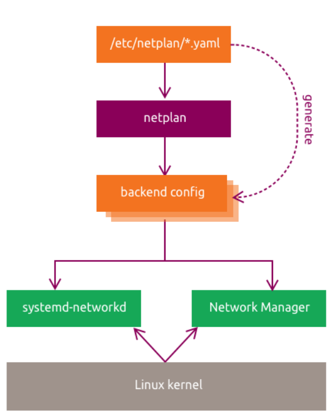
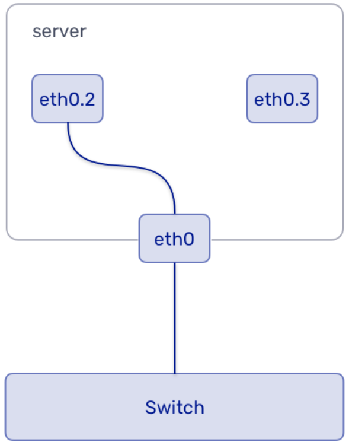
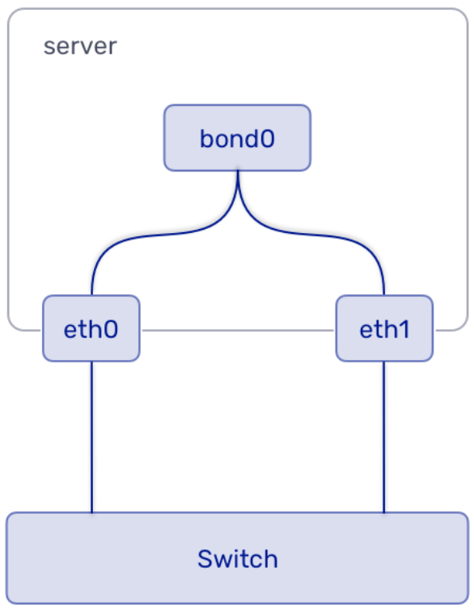

# Advanced Networking Concepts

This chapter explains how Ubuntu uses Netplan for persistent network configuration, then walks through VLAN, bonding, and bridging labs.

In this chapter, you will:

- understand how Netplan describes network configuration on Ubuntu
- recognize physical and virtual device definitions
- review bridges, VLANs, and bonding concepts
- configure static addressing, VLANs, bonds, and bridges in the lab

## :material-book-open-page-variant-outline: 8.1 Netplan

### :material-application-edit-outline: 8.1.1 Netplan General Overview

Netplan is the standard way to describe network configuration on modern Ubuntu systems. You write YAML under `/etc/netplan/*.yaml`, and Netplan renders backend-specific configuration for the active networking daemon.

Ubuntu has used Netplan by default since 18.04 LTS. Installers, cloud-init, and administrators all write Netplan YAML, and Netplan passes the final configuration to the active renderer during boot.

Netplan supports these main renderers:

- `NetworkManager`
- `systemd-networkd`

Wi-Fi and WWAN are usually managed by `NetworkManager`. Other configured devices are typically managed by `systemd-networkd` unless the configuration says otherwise.



#### General Configuration Structure

Every Netplan configuration starts with a top-level `network:` mapping and `version: 2`. Device definitions are grouped by type such as `ethernets:`, `wifis:`, `vlans:`, `bonds:`, or `bridges:`.

```yaml
network:
  version: 2
  renderer: networkd
  ethernets:
    enp1s0:
      addresses:
        - 10.10.10.2/24
      nameservers:
        search: [mydomain, otherdomain]
        addresses: [10.10.10.1, 1.1.1.1]
      routes:
        - to: default
          via: 10.10.10.1
```

### :material-application-edit-outline: 8.1.2 Device Configuration IDs

The keys under each device-type section are called configuration IDs. They must be unique across the full Netplan configuration.

For physical devices, the ID can be a simple interface name or a label used together with `match:` rules.

For virtual devices, the ID is the name of the device that Netplan creates.

#### Physical Devices

Examples include Ethernet and Wi-Fi devices.

These devices can appear dynamically, so Netplan can match them by name, MAC address, driver, or path. If a match identifies one device reliably, `set-name:` can rename it to a stable and friendlier name.

```yaml
match:
  name: enp2*
```

```yaml
match:
  macaddress: 11:22:33:AA:BB:FF
```

```yaml
match:
  driver: ixgbe
  name: en*s0
```

#### Virtual Devices

Examples include bridges, bonds, and veth-style interfaces.

These devices are created from the configuration rather than matched from existing hardware. Because of that, `match:` and `set-name:` do not apply to them.

### :material-application-edit-outline: 8.1.3 Netplan Commands

Common Netplan commands include:

- `netplan generate`: read YAML and render backend configuration files
- `netplan apply`: apply the current configuration to the running system
- `netplan try`: apply changes temporarily and roll them back unless you confirm them

#### Linux Bridges

A bridge connects Ethernet segments at Layer 2 and behaves like a virtual switch. It forwards traffic by MAC address rather than IP address.

```yaml
network:
  version: 2
  renderer: networkd
  ethernets:
    ens1p0:
      dhcp4: no
    ens1p1:
      dhcp4: no
  bridges:
    br0:
      interfaces:
        - ens1p0
        - ens1p1
      addresses:
        - 192.168.100.10/24
      gateway4: 192.168.100.1
      nameservers:
        addresses:
          - 8.8.8.8
          - 1.1.1.1
```

This example creates `br0`, adds two Ethernet interfaces, and places the IP configuration on the bridge itself.

#### VLANs and Trunking



VLANs split a physical network into separate broadcast domains by tagging frames with IEEE 802.1Q headers.

- `VLAN ID`: identifies the VLAN, normally `1` to `4094`
- priority bits: mark traffic class

Access ports send traffic untagged to the host. Trunk ports carry tagged traffic and let one interface participate in multiple VLANs.

VLAN support depends on the `8021q` kernel module.

```bash
# Check whether the 8021q module is currently loaded.
lsmod | grep 8021q
```
??? quote "Reference output"
    ```text
    8021q                  ...
    garp                   ... 8021q
    mrp                    ... 8021q
    ```

```bash
# Show information about the 8021q module.
modinfo 8021q
```
??? quote "Reference output"
    ```text
    filename:       /lib/modules/.../8021q.ko
    description:    IEEE 802.1Q VLAN Support
    license:        GPL
    ...
    ```

```yaml
network:
  version: 2
  renderer: networkd
  ethernets:
    mainif:
      match:
        macaddress: "de:ad:be:ef:ca:fe"
      set-name: mainif
      addresses: ["10.3.0.5/23"]
      nameservers:
        addresses: ["8.8.8.8", "8.8.4.4"]
        search: [example.com]
      routes:
        - to: default
          via: 10.3.0.1
  vlans:
    vlan15:
      id: 15
      link: mainif
      addresses: ["10.3.99.5/24"]
    vlan10:
      id: 10
      link: mainif
      addresses: ["10.3.98.5/24"]
      nameservers:
        addresses: ["127.0.0.1"]
        search: [domain1.example.com, domain2.example.com]
```

This example creates two VLAN interfaces on top of one physical NIC.

#### Network Interface Bonding



Bonding combines multiple interfaces into one logical interface for redundancy, throughput, or both.

Common bond modes:

| Mode | Description |
| - | - |
| `active-backup` | One active NIC, others on standby |
| `balance-rr` | Round-robin load balancing |
| `802.3ad` | LACP-based link aggregation |

```bash
# Create a bond interface in active-backup mode.
sudo ip link add bond0 type bond mode active-backup miimon 100
```
??? quote "Reference output"
    ```text
    No output.
    ```

```yaml
network:
  version: 2
  renderer: networkd
  ethernets:
    enp1s0: {}
    enp2s0: {}
  bonds:
    bond0:
      dhcp4: yes
      interfaces:
        - enp1s0
        - enp2s0
      parameters:
        mode: active-backup
        primary: enp1s0
        mii-monitor-interval: 100
```

This example creates `bond0` from two Ethernet interfaces and configures it for failover.

#### Predictable Interface Naming

Names like `enp1s0`, `ens1p0`, and `enp3s0` follow Ubuntu's predictable naming scheme.

Example format: `enp<bus number>s<slot/function>`

`enp3s0` means:

- `en`: Ethernet
- `p3`: PCI bus 3
- `s0`: slot or function 0

!!! pied-piper "Takeaway"
    Netplan YAML under `/etc/netplan/*.yaml` is the source of truth for persistent network configuration. Match physical interfaces by stable properties such as name or MAC address, define virtual interfaces directly in Netplan, and use `netplan try` before `netplan apply` when changing live settings.

## :material-book-open-page-variant-outline: 8.2 Netplan Lab

!!! info
    Run this lab on `LABVM`. These exercises change live network settings on `LABVM`, so use the VM console when possible, or use `netplan try` before applying changes permanently.

### :material-application-edit-outline: 8.2.1 General Configuration Lab

This lab reviews the current Netplan setup and confirms the primary interface uses the expected static configuration.

!!! info
    This exercise is a consistency check. Success means the live interface state, the Netplan YAML, and the rendered `systemd-networkd` file all describe the same static address, default route, and DNS servers for `enp1s0`.

If your current `/etc/netplan/50-cloud-init.yaml` already matches the target shown later in this lab, you do not need to change the file contents. The goal is to verify the baseline configuration and practice the safe Netplan workflow before later labs make real changes.

Step 1: Review the current address and route information.

```bash
# Show the current address configuration.
ip addr
```
??? example "Expected result"
    ```text
    2: enp1s0: <BROADCAST,MULTICAST,UP,LOWER_UP> mtu 1450 ...
        inet 192.168.101.50/24 brd 192.168.101.255 scope global enp1s0
    ```

```bash
# Show the current routing table.
ip route
```
??? example "Expected result"
    ```text
    default via 192.168.101.1 dev enp1s0
    192.168.101.0/24 dev enp1s0 proto kernel scope link src 192.168.101.50
    ```

Step 2: Review the current Netplan file.

```bash
# Show the active cloud-init Netplan file.
sudo cat /etc/netplan/50-cloud-init.yaml
```
??? example "Expected result"
    ```text
    network:
      version: 2
      renderer: networkd
      ethernets:
        enp1s0:
          addresses:
          - "192.168.101.50/24"
          nameservers:
            addresses:
            - 8.8.8.8
            - 1.1.1.1
          mtu: 1450
          routes:
          - to: "default"
            via: "192.168.101.1"
    ```

Step 3: Review the rendered backend configuration.

```bash
# Show the rendered systemd-networkd configuration.
sudo cat /var/run/systemd/network/10-netplan-enp1s0.network
```
??? example "Expected result"
    ```text
    [Match]
    Name=enp1s0

    [Link]
    MTUBytes=1450

    [Network]
    LinkLocalAddressing=ipv6
    Address=192.168.101.50/24
    DNS=8.8.8.8
    DNS=1.1.1.1

    [Route]
    Destination=0.0.0.0/0
    Gateway=192.168.101.1
    ```

Step 4: Back up `/etc/netplan/50-cloud-init.yaml`, then compare it with the following target static configuration.

```bash
# Back up the current Netplan file.
sudo cp /etc/netplan/50-cloud-init.yaml /etc/netplan/50-cloud-init.yaml.bak
```
??? example "Expected result"
    ```text
    No output.
    ```

Keep this backup so you can quickly restore the original file if a later edit goes wrong.

```yaml
network:
  version: 2
  renderer: networkd
  ethernets:
    enp1s0:
      addresses:
        - 192.168.101.50/24
      nameservers:
        addresses: [8.8.8.8, 1.1.1.1]
      routes:
        - to: default
          via: 192.168.101.1
      mtu: 1450
```

If your current file differs from the target, update it now. If it already matches, leave it unchanged and continue.

Step 5: Test the configuration safely.

```bash
# Try the new Netplan configuration with rollback protection.
sudo netplan try
```
??? example "Expected result"
    ```text
    Do you want to keep these settings?

    Press ENTER before the timeout to accept the new configuration.
    ```

Even when no file change was needed, this step is still useful practice for validating a Netplan configuration with rollback protection.

Step 6: Apply the configuration.

```bash
# Apply the Netplan configuration.
sudo netplan apply
```
??? example "Expected result"
    ```text
    No output.
    ```

### :material-application-edit-outline: 8.2.2 VLAN Lab

This lab creates temporary VLAN interfaces with `ip` and then makes them persistent with Netplan.

!!! info
    This exercise shows that one physical interface can carry multiple VLAN-tagged interfaces. In the base lab setup, the first `lsmod | grep 8021q` usually shows no output. After you create the first VLAN, confirm that `ip -d link show` reports the correct VLAN ID, each VLAN has its own address, and the later `lsmod` check shows `8021q` loaded.

Step 1: Check whether the `8021q` module is already loaded.

```bash
# Check for the VLAN kernel module.
lsmod | grep 8021q
```
??? example "Expected result"
    ```text
    No output.
    ```

Step 2: Create the first VLAN interface.

```bash
# Create VLAN 42 on top of enp1s0.
sudo ip link add link enp1s0 name enp1s0.42 type vlan id 42
```
??? example "Expected result"
    ```text
    No output.
    ```

Step 3: Inspect the VLAN details.

```bash
# Show detailed information for the VLAN interface.
ip -d link show enp1s0.42
```
??? example "Expected result"
    ```text
    ... enp1s0.42@enp1s0: <BROADCAST,MULTICAST> ...
        vlan protocol 802.1Q id 42 <REORDER_HDR>
    ```

Step 4: Assign an address to the VLAN interface.

```bash
# Assign an IPv4 address to VLAN 42.
sudo ip addr add 192.168.42.42/24 brd 192.168.42.255 dev enp1s0.42
```
??? example "Expected result"
    ```text
    No output.
    ```

Step 5: Verify the address assignment.

```bash
# Show the address assigned to VLAN 42.
ip addr show dev enp1s0.42
```
??? example "Expected result"
    ```text
    ...
        inet 192.168.42.42/24 brd 192.168.42.255 scope global enp1s0.42
    ```

Step 6: Bring the VLAN interface up.

```bash
# Enable VLAN 42.
sudo ip link set dev enp1s0.42 up
```
??? example "Expected result"
    ```text
    No output.
    ```

Step 7: Confirm the interface is up.

```bash
# Show the operational state of VLAN 42.
ip addr show enp1s0.42
```
??? example "Expected result"
    ```text
    ... state UP ...
    ```

Step 8: Confirm that `8021q` loaded automatically.

```bash
# Re-check whether 8021q is loaded.
lsmod | grep 8021q
```
??? example "Expected result"
    ```text
    8021q                  ...
    garp                   ... 8021q
    mrp                    ... 8021q
    ```

```bash
# Show module metadata for 8021q.
modinfo 8021q
```
??? example "Expected result"
    ```text
    filename:       /lib/modules/.../8021q.ko
    description:    IEEE 802.1Q VLAN Support
    ...
    ```

```bash
# Check the kernel log for 8021q activity.
sudo dmesg | grep 8021q
```
??? example "Expected result"
    ```text
    [ ... ] 8021q: 802.1Q VLAN Support v1.8
    [ ... ] 8021q: adding VLAN 0 to HW filter on device enp1s0
    ```

Step 9: Create a second VLAN on the same parent interface.

```bash
# Create VLAN 100 on top of enp1s0.
sudo ip link add link enp1s0 name enp1s0.100 type vlan id 100
```
??? example "Expected result"
    ```text
    No output.
    ```

```bash
# Bring VLAN 100 up.
sudo ip link set dev enp1s0.100 up
```
??? example "Expected result"
    ```text
    No output.
    ```

```bash
# Show detailed information for VLAN 100.
ip -d link show enp1s0.100
```
??? example "Expected result"
    ```text
    ... vlan protocol 802.1Q id 100 ...
    ```

```bash
# Assign an IPv4 address to VLAN 100.
sudo ip addr add 192.168.100.42/24 brd + dev enp1s0.100
```
??? example "Expected result"
    ```text
    No output.
    ```

!!! note
    `brd +` tells `ip` to calculate the broadcast address from the prefix automatically.
    For this command, it resolves to `192.168.100.255`, so it is equivalent to `brd 192.168.100.255`.

```bash
# Show the address assigned to VLAN 100.
ip addr show dev enp1s0.100
```
??? example "Expected result"
    ```text
    ...
        inet 192.168.100.42/24 brd 192.168.100.255 scope global enp1s0.100
    ```

Step 10: Review the full interface state.

```bash
# Show all network interfaces and addresses.
ip addr
```
??? example "Expected result"
    ```text
    ...
    enp1s0.42 ...
        inet 192.168.42.42/24 ...
    enp1s0.100 ...
        inet 192.168.100.42/24 ...
    ```

Step 11: Make the VLANs persistent in Netplan.

```bash
# Edit the Netplan file to add VLAN definitions.
sudo vim /etc/netplan/50-cloud-init.yaml
```
??? example "Expected result"
    ```text
    "/etc/netplan/50-cloud-init.yaml" ...
    ```

Use this configuration:

```yaml
network:
  version: 2
  renderer: networkd
  ethernets:
    enp1s0:
      addresses:
        - "192.168.101.50/24"
      nameservers:
        addresses:
          - 8.8.8.8
          - 1.1.1.1
      routes:
        - to: "default"
          via: "192.168.101.1"
      mtu: 1450
  vlans:
    vlan42:
      id: 42
      link: enp1s0
      addresses: [192.168.42.42/24]
    vlan100:
      id: 100
      link: enp1s0
      addresses: [192.168.100.42/24]
```

Step 12: Test the updated configuration.

```bash
# Try the Netplan configuration before committing it.
sudo netplan try
```
??? example "Expected result"
    ```text
    Do you want to keep these settings?
    ```

Step 13: Apply the new configuration.

```bash
# Apply the VLAN-aware Netplan configuration.
sudo netplan apply
```
??? example "Expected result"
    ```text
    No output.
    ```

!!! pied-piper "Takeaway"
    Changes made with `ip` are temporary until you describe them in Netplan and apply the configuration. Creating the first VLAN interface usually autoloads the `8021q` kernel module, and `brd +` tells `ip` to calculate the broadcast address from the subnet.

!!! note
    On modern Ubuntu systems, prefer `iproute2` tools such as `ip addr`, `ip route`, `ip neigh`, and `ss` instead of older `net-tools` commands.

### :material-application-edit-outline: 8.2.3 Bonding and Bridging Lab

This lab uses dummy interfaces to simulate extra NICs for bonding and bridging.

Step 1: Check whether the `dummy` module is loaded, then load it if needed.

```bash
# Check whether the dummy module is loaded.
sudo lsmod | grep dummy
```
??? example "Expected result"
    ```text
    No output.
    ```

```bash
# Load the dummy module.
sudo modprobe dummy
```
??? example "Expected result"
    ```text
    No output.
    ```

```bash
# Confirm that the dummy module is now loaded.
sudo lsmod | grep dummy
```
??? example "Expected result"
    ```text
    dummy                  ...
    ```

Step 2: Create a test interface and rename it.

```bash
# Create a dummy interface.
sudo ip link add dummy0 type dummy
```
??? example "Expected result"
    ```text
    No output.
    ```

```bash
# Rename dummy0 to ens10.
sudo ip link set name ens10 dev dummy0
```
??? example "Expected result"
    ```text
    No output.
    ```

```bash
# Show the renamed interface.
ip link show ens10
```
??? example "Expected result"
    ```text
    ... ens10: <BROADCAST,NOARP> ...
    ```

Step 3: Change the MAC address.

```bash
# Set a custom MAC address on ens10.
sudo ip link set dev ens10 address 00:22:22:ff:ff:ff
```
??? example "Expected result"
    ```text
    No output.
    ```

Step 4: Add and inspect an alias address.

```bash
# Show the interface before adding an alias.
ip link show ens10
```
??? example "Expected result"
    ```text
    ... link/ether 00:22:22:ff:ff:ff ...
    ```

```bash
# Add an alias address on ens10.
sudo ip addr add 192.168.100.199/24 brd + dev ens10 label ens10:0
```
??? example "Expected result"
    ```text
    No output.
    ```

```bash
# Show the full address information for ens10.
ip addr show ens10
```
??? example "Expected result"
    ```text
    ...
        inet 192.168.100.199/24 brd 192.168.100.255 scope global ens10:0
    ```

```bash
# List all IPv4 addresses.
ip a | grep -w inet
```
??? example "Expected result"
    ```text
    inet 127.0.0.1/8 scope host lo
    inet 192.168.101.50/24 ... enp1s0
    inet 192.168.100.199/24 ... ens10:0
    ```

Step 5: Remove the temporary test interface.

```bash
# Remove the alias address from ens10.
sudo ip addr del 192.168.100.199/24 brd + dev ens10 label ens10:0
```
??? example "Expected result"
    ```text
    No output.
    ```

```bash
# Delete the dummy interface.
sudo ip link delete ens10 type dummy
```
??? example "Expected result"
    ```text
    No output.
    ```

```bash
# Unload the dummy module.
sudo rmmod dummy
```
??? example "Expected result"
    ```text
    No output.
    ```

#### Bonding

!!! info
    This exercise demonstrates an `active-backup` bond. The main checks are that `bond0` shows `bond mode active-backup` and that the address is assigned to `bond0`, not to the member interfaces.

Step 1: Reload the `dummy` module, then create two dummy interfaces for the bond.

```bash
# Reload the dummy module if you unloaded it earlier in this lab.
sudo modprobe dummy
```
??? example "Expected result"
    ```text
    No output.
    ```

```bash
# Create the first dummy interface.
sudo ip link add ens10 type dummy
```
??? example "Expected result"
    ```text
    No output.
    ```

```bash
# Create the second dummy interface.
sudo ip link add ens11 type dummy
```
??? example "Expected result"
    ```text
    No output.
    ```

Step 2: Create the bond interface.

```bash
# Create bond0 in active-backup mode.
sudo ip link add bond0 type bond mode active-backup miimon 100
```
??? example "Expected result"
    ```text
    No output.
    ```

Step 3: Attach the member interfaces.

```bash
# Make sure ens10 is down before attaching it to bond0.
sudo ip link set dev ens10 down
```
??? example "Expected result"
    ```text
    No output.
    ```

```bash
# Attach ens10 to bond0.
sudo ip link set dev ens10 master bond0
```
??? example "Expected result"
    ```text
    No output.
    ```

```bash
# Make sure ens11 is down before attaching it to bond0.
sudo ip link set dev ens11 down
```
??? example "Expected result"
    ```text
    No output.
    ```

```bash
# Attach ens11 to bond0.
sudo ip link set dev ens11 master bond0
```
??? example "Expected result"
    ```text
    No output.
    ```

```bash
# Bring the bond member interfaces back up.
sudo ip link set dev ens10 up && sudo ip link set dev ens11 up
```
??? example "Expected result"
    ```text
    No output.
    ```

Step 4: Bring the bond up and assign an address.

```bash
# Bring bond0 up.
sudo ip link set dev bond0 up
```
??? example "Expected result"
    ```text
    No output.
    ```

```bash
# Assign an address to bond0.
sudo ip addr add 172.16.0.14/24 dev bond0
```
??? example "Expected result"
    ```text
    No output.
    ```

Step 5: Inspect the bond.

```bash
# Show detailed information for bond0.
ip -d addr show bond0
```
??? example "Expected result"
    ```text
    ... bond mode active-backup ...
        inet 172.16.0.14/24 scope global bond0
    ```

!!! note
    With dummy interfaces, `bond0` may still report `state DOWN` even after you assign the address.
    Use the bond mode and the configured address as the main checks for this step.

Step 6: Remove the bond interface but keep the dummy interfaces for the bridge lab.

```bash
# Delete bond0.
sudo ip link del bond0
```
??? example "Expected result"
    ```text
    No output.
    ```

#### Bridges

!!! info
    This exercise shows that a bridge acts as the Layer 2 device while the IP configuration lives on the bridge itself. Success means `brctl show` lists `ens10` and `ens11` under `br0`, `ip link show` marks them as bridge members, and `ip -d addr show br0` shows the address on `br0`.

Step 1: Install the bridge utilities.

```bash
# Install the bridge-utils package.
sudo apt install -y bridge-utils
```
??? example "Expected result"
    ```text
    The following NEW packages will be installed:
      bridge-utils
    ...
    Setting up bridge-utils (...)
    ```

Step 2: Create and inspect a bridge.

```bash
# Create the Linux bridge br0.
sudo brctl addbr br0
```
??? example "Expected result"
    ```text
    No output.
    ```

```bash
# Show the current bridge configuration.
sudo brctl show
```
??? example "Expected result"
    ```text
    bridge name	bridge id		STP enabled	interfaces
    br0		...		no
    ```

```bash
# Show the current interface state.
sudo ip link show
```
??? example "Expected result"
    ```text
    ...
    br0: <BROADCAST,MULTICAST> ...
    ens10: <BROADCAST,NOARP> ...
    ens11: <BROADCAST,NOARP> ...
    ```

Step 3: Add the two interfaces to the bridge.

```bash
# Add ens10 to br0.
sudo brctl addif br0 ens10
```
??? example "Expected result"
    ```text
    No output.
    ```

```bash
# Add ens11 to br0.
sudo brctl addif br0 ens11
```
??? example "Expected result"
    ```text
    No output.
    ```

```bash
# Show the bridge members.
sudo brctl show
```
??? example "Expected result"
    ```text
    bridge name	bridge id		STP enabled	interfaces
    br0		...		no		ens10
    						ens11
    ```

```bash
# Show the interface state after adding bridge members.
sudo ip link show
```
??? example "Expected result"
    ```text
    ...
    br0: <BROADCAST,MULTICAST> ...
    ens10: ... master br0 ...
    ens11: ... master br0 ...
    ```

Step 4: Assign an address to the bridge.

```bash
# Assign an IPv4 address to br0.
sudo ip addr add 10.255.0.4/24 dev br0
```
??? example "Expected result"
    ```text
    No output.
    ```

Step 5: Inspect the bridge in detail.

```bash
# Show detailed information for br0.
sudo ip -d addr show br0
```
??? example "Expected result"
    ```text
    ...
        inet 10.255.0.4/24 scope global br0
        bridge ...
    ```

!!! note
    With dummy bridge members, `br0` may still report `state DOWN` while the address is present.
    Use the assigned address and bridge details as the main verification signals.

Step 6: Make the bridge configuration persistent in Netplan.

```bash
# Edit the Netplan file to add the bridge configuration.
sudo vim /etc/netplan/50-cloud-init.yaml
```
??? example "Expected result"
    ```text
    "/etc/netplan/50-cloud-init.yaml" ...
    ```

Use this configuration:

```yaml
network:
  version: 2
  renderer: networkd
  ethernets:
    enp1s0:
      addresses:
        - "192.168.101.50/24"
      nameservers:
        addresses:
          - 8.8.8.8
          - 1.1.1.1
      routes:
        - to: "default"
          via: "192.168.101.1"
      mtu: 1450
    ens10:
      dhcp4: no
    ens11:
      dhcp4: no
  vlans:
    vlan42:
      id: 42
      link: enp1s0
      addresses: [192.168.42.42/24]
    vlan100:
      id: 100
      link: enp1s0
      addresses: [192.168.100.42/24]
  bridges:
    br0:
      addresses: [10.255.0.4/24]
      interfaces: [ens10, ens11]
```

Step 7: Apply the bridge configuration.

```bash
# Apply the updated Netplan configuration.
sudo netplan apply
```
??? example "Expected result"
    ```text
    No output.
    ```

#### Clean Up

!!! info
    The goal of cleanup is to return the machine to its base network state. By the end of this section, the Netplan-managed `br0`, `vlan42`, and `vlan100` interfaces and the dummy interfaces should all be removed.

Step 1: Restore `/etc/netplan/50-cloud-init.yaml` to the base configuration.

```bash
# Edit the Netplan file to remove the VLAN and bridge definitions added earlier in this lab.
sudo vim /etc/netplan/50-cloud-init.yaml
```
??? example "Expected result"
    ```text
    "/etc/netplan/50-cloud-init.yaml" ...
    ```

Restore the file to this base configuration:

```yaml
network:
  version: 2
  renderer: networkd
  ethernets:
    enp1s0:
      addresses:
        - "192.168.101.50/24"
      nameservers:
        addresses:
          - 8.8.8.8
          - 1.1.1.1
      routes:
        - to: "default"
          via: "192.168.101.1"
      mtu: 1450
```

After you apply this base configuration, Netplan removes the persistent `br0`, `vlan42`, and `vlan100` interfaces for you.

Step 2: Apply the restored configuration.

```bash
# Apply the restored base Netplan configuration.
sudo netplan apply
```
??? example "Expected result"
    ```text
    No output.
    ```

Step 3: Remove the remaining dummy interfaces and unload the `dummy` module.

```bash
# Delete ens11.
sudo ip link del ens11
```
??? example "Expected result"
    ```text
    No output.
    ```

```bash
# Delete ens10.
sudo ip link del ens10
```
??? example "Expected result"
    ```text
    No output.
    ```

```bash
# Unload the dummy module.
sudo rmmod dummy
```
??? example "Expected result"
    ```text
    No output.
    ```

!!! pied-piper "Takeaway"
    Dummy interfaces let you practice bonding and bridging safely without extra physical NICs. Test bonds and bridges from the CLI first, then make the final configuration persistent with Netplan and restore the base file during cleanup so the machine returns to its base state.
