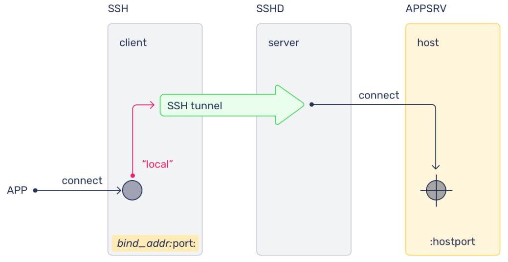
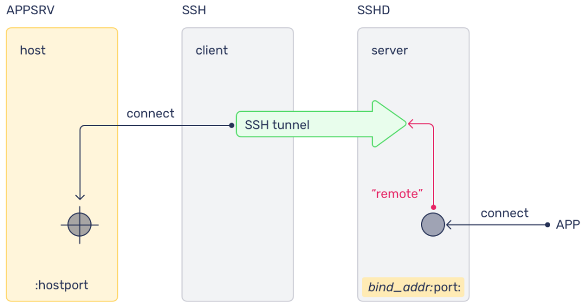

# OpenSSH

This chapter covers OpenSSH client and server usage, key-based authentication, and common SSH workflows used in the lab.

In this chapter you will:

- review core OpenSSH concepts
- generate and manage SSH keys
- use `ssh-agent`, `ssh-add`, `ssh-copy-id`, and `ssh-import-id`
- review server and client configuration files
- use local and remote port forwarding
- connect through a jump host with `ProxyJump`

## :material-book-open-page-variant-outline: 3.1 What Is OpenSSH?

OpenSSH provides secure remote shell access over an untrusted network. On Ubuntu, the SSH client is installed by default, while the server must be installed separately if you want to accept inbound SSH connections.

SSH can authenticate users with passwords, keys, or other mechanisms, but key-based authentication is the recommended default for administrative access.

```bash
# Connect to a remote host over SSH.
ssh user@remote-host
```
??? quote "Reference output"
    ```text
    The authenticity of host 'remote-host (...)' can't be established.
    Are you sure you want to continue connecting (yes/no/[fingerprint])?
    ```

```bash
# Install the OpenSSH server package.
sudo apt install -y openssh-server
```
??? quote "Reference output"
    ```text
    Reading package lists... Done
    Building dependency tree... Done
    The following NEW packages will be installed:
      openssh-server
    ...
    Setting up openssh-server ...
    ```

!!! note
    Ubuntu installs the OpenSSH client by default. Install `openssh-server` only on systems that need to accept SSH connections.

The main server configuration file is `/etc/ssh/sshd_config`. The client configuration file is `/etc/ssh/ssh_config`.

### :material-application-edit-outline: Examples

Make a backup of the server configuration before changing it.

```bash
# Create a backup copy of the default SSH server configuration.
sudo cp /etc/ssh/sshd_config /etc/ssh/sshd_config.factory-defaults
```
??? quote "Reference output"
    ```text
    No output.
    ```

```bash
# Make the backup file read-only.
sudo chmod a-w /etc/ssh/sshd_config.factory-defaults
```
??? quote "Reference output"
    ```text
    No output.
    ```

```bash
# Edit the SSH server configuration.
sudo nano /etc/ssh/sshd_config
```
??? quote "Reference output"
    ```text
    GNU nano ... /etc/ssh/sshd_config
    ```

```bash
# Restart the SSH service after saving configuration changes.
sudo systemctl restart sshd
```
??? quote "Reference output"
    ```text
    No output.
    ```

```bash
# Open the section 5 config-file manual for sshd_config.
man 5 sshd_config
```
??? quote "Reference output"
    ```text
    SSHD_CONFIG(5)                File Formats Manual                SSHD_CONFIG(5)
    ```

## :material-book-open-page-variant-outline: 3.2 SSH Keys

SSH keys allow a client to prove its identity to a remote SSH server without relying on password entry for every login. A key pair consists of a private key, which stays on the client, and a public key, which is placed on the remote host.

When a compatible private key is available locally and the matching public key is present in `~/.ssh/authorized_keys` on the server, SSH can authenticate without transmitting the private key over the network.

### :material-application-edit-outline: 3.2.1 Key-Based SSH Logins

Key-based authentication is generally stronger than password authentication because private keys are harder to guess or brute-force than ordinary passwords.

Modern Ubuntu systems typically default to `ed25519` for new SSH keys. RSA is still supported and may be needed for compatibility with older systems.

To use key-based SSH logins, you need to:

- create a key pair
- keep the private key secure on the client
- place the public key on the remote system

!!! note
    Hardware-backed keys such as FIDO2 security keys can provide stronger protection for private key material when required.

### :material-application-edit-outline: 3.2.2 Generating Keys

To keep the workflow consistent across OpenSSH versions, specify the key algorithm explicitly.

```bash
# Generate a new ed25519 SSH key pair.
ssh-keygen -t ed25519
```
??? quote "Reference output"
    ```text
    Generating public/private ed25519 key pair.
    Enter file in which to save the key (/home/ubuntu/.ssh/id_ed25519):
    ```

This chapter uses `ed25519` in the lab steps. If you need an RSA key explicitly, generate one with `-t rsa`.

```bash
# Generate a new RSA SSH key pair.
ssh-keygen -t rsa
```
??? quote "Reference output"
    ```text
    Generating public/private rsa key pair.
    Enter file in which to save the key (/home/ubuntu/.ssh/id_rsa):
    ```

Copy the public key to a remote server with `ssh-copy-id`.

```bash
# Install your local public key on a remote host.
ssh-copy-id username@remotehost
```
??? quote "Reference output"
    ```text
    /usr/bin/ssh-copy-id: INFO: Source of key(s) to be installed: ...
    Number of key(s) added: 1
    ```

Use verbose mode when troubleshooting authentication.

```bash
# Show verbose SSH connection and key-selection details.
ssh -v username@remotehost
```
??? quote "Reference output"
    ```text
    debug1: Reading configuration data /home/ubuntu/.ssh/config
    debug1: Offering public key: /home/ubuntu/.ssh/id_ed25519
    ```

    Representative verbose output often includes lines like these:

    ```text
    debug1: Offering public key: /home/user/.ssh/id_ed25519
    debug1: Offering public key: /home/user/.ssh/id_rsa
    debug1: Server accepts key: pkalg ssh-ed25519
    ```

!!! pied-piper "Takeaway"
    The key-based login model is:

    - the private key stays on the client
    - the public key is installed on the server
    - `ssh -v` helps you see which keys SSH is actually trying

## :material-book-open-page-variant-outline: 3.3 SSH Tools

### :material-application-edit-outline: 3.3.1 ssh-agent

`ssh-agent` keeps decrypted private keys in memory for the current session so SSH clients can reuse them without repeatedly prompting for the passphrase.

On Ubuntu desktop systems, `ssh-agent` is often started automatically as part of the graphical session. On headless systems and terminal-only sessions, you may need to start it manually.

```bash
# Add the default ed25519 key to the running SSH agent.
ssh-add ~/.ssh/id_ed25519
```
??? quote "Reference output"
    ```text
    Enter passphrase for /home/ubuntu/.ssh/id_ed25519:
    Identity added: /home/ubuntu/.ssh/id_ed25519 (...)
    ```

```bash
# List identities currently held by the SSH agent.
ssh-add -l
```
??? quote "Reference output"
    ```text
    256 SHA256:... /home/ubuntu/.ssh/id_ed25519 (ED25519)
    ```

By default, `ssh-add` looks for these common private key file names:

```text
~/.ssh/id_rsa
~/.ssh/id_dsa
~/.ssh/id_ecdsa
~/.ssh/id_ed25519
~/.ssh/identity
```

You can also start the agent manually in a shell session.

```bash
# Start a new SSH agent for the current shell.
eval $(ssh-agent)
```
??? quote "Reference output"
    ```text
    Agent pid 12345
    ```

```bash
# Add the default private key to the newly started agent.
ssh-add
```
??? quote "Reference output"
    ```text
    Identity added: /home/ubuntu/.ssh/id_ed25519 (...)
    ```

```bash
# Confirm that the agent is holding at least one identity.
ssh-add -l
```
??? quote "Reference output"
    ```text
    256 SHA256:... /home/ubuntu/.ssh/id_ed25519 (ED25519)
    ```

```bash
# Remove all identities from the SSH agent.
ssh-add -D
```
??? quote "Reference output"
    ```text
    All identities removed.
    ```

### :material-application-edit-outline: 3.3.2 Importing And Copying SSH Keys

Ubuntu includes tools that help move public keys into place quickly.

`ssh-copy-id` copies a local public key to a remote server. `ssh-import-id` imports public keys from supported identity providers such as GitHub and Launchpad into the local `authorized_keys` file.

```bash
# Import public keys published on GitHub.
ssh-import-id gh:your-github-username
```
??? quote "Reference output"
    ```text
    2026-... INFO Importing 1 key(s) from gh:your-github-username
    ```

```bash
# Import public keys published on Launchpad.
ssh-import-id lp:your-launchpad-username
```
??? quote "Reference output"
    ```text
    2026-... INFO Importing 1 key(s) from lp:your-launchpad-username
    ```

!!! note
    `ssh-import-id` is useful in automated provisioning flows, including cloud-init based setups.

### :material-application-edit-outline: 3.3.3 Using rsync With ssh

`rsync` can use SSH as its transport so file transfers are encrypted in transit.

```bash
# Copy a file from a remote host to the local system over SSH.
rsync -azvPe ssh user@10.10.10.10:/path-to/file.txt /tmp/
```
??? quote "Reference output"
    ```text
    receiving incremental file list
    file.txt
    ```

```bash
# Copy a local file to a remote host over SSH.
rsync -azvPe ssh file.txt user@10.10.10.10:/pathto/backups/
```
??? quote "Reference output"
    ```text
    sending incremental file list
    file.txt
    ```

!!! pied-piper "Takeaway"
    These SSH helpers solve different problems:

    - `ssh-agent` keeps decrypted keys in memory
    - `ssh-copy-id` installs your public key on a remote host
    - `ssh-import-id` pulls published public keys into `authorized_keys`
    - `rsync -e ssh` copies files securely over SSH

## :material-book-open-page-variant-outline: 3.4 OpenSSH Server Configuration

The main SSH server configuration file on Ubuntu is:

```text
/etc/ssh/sshd_config
```

This file controls server behavior such as authentication methods, login rules, and network binding. Do not confuse it with `/etc/ssh/ssh_config`, which affects client behavior.

By default, the SSH server listens on port `22`, but the listening port can be changed when needed.

```text
Port 2222
```

### :material-application-edit-outline: 3.4.1 SSH Hardening Recommendations

These settings are common hardening examples for `sshd_config`.

Limit which users can log in:

```text
AllowUsers alice bob
```

Disable direct root login:

```text
PermitRootLogin no
```

Require keys instead of passwords:

```text
PasswordAuthentication no
```

Reject empty passwords explicitly:

```text
PermitEmptyPasswords no
```

Restrict the interfaces or addresses the server listens on:

```text
ListenAddress 192.168.1.100
```

Always test SSH changes carefully before closing your current session.

```bash
# Restart the SSH service after validating configuration changes.
sudo systemctl restart ssh
```
??? quote "Reference output"
    ```text
    No output.
    ```

!!! warning
    Keep a second terminal open while testing SSH configuration changes. A bad `sshd_config` change can lock you out of a remote system.

## :material-book-open-page-variant-outline: 3.5 SSH Client Configuration Files

SSH supports both per-user and system-wide client configuration files.

- user configuration: `~/.ssh/config`
- system configuration: `/etc/ssh/ssh_config`

These files let you define reusable connection settings such as host aliases, usernames, ports, and identity files.

Example user configuration:

```text
Host labvm
  HostName 192.168.101.50
  User ubuntu
```

With that entry, this command:

```bash
# Connect using a host alias defined in ~/.ssh/config.
ssh labvm
```
??? quote "Reference output"
    ```text
    Welcome to Ubuntu 24.04 LTS ...
    ubuntu@ubuntu:~$
    ```

is equivalent to:

```bash
# Connect directly without using the SSH host alias.
ssh ubuntu@192.168.101.50
```
??? quote "Reference output"
    ```text
    Welcome to Ubuntu 24.04 LTS ...
    ubuntu@ubuntu:~$
    ```

!!! note
    Use an explicit username or set `User ubuntu` in `~/.ssh/config` when you want `ssh labvm` to land on the `ubuntu` account consistently.

### :material-application-edit-outline: 3.5.1 Typical Use Cases

You can add more options when the target host needs custom settings.

Use a different username:

```text
User myadmin
```

Use a non-default private key:

```text
IdentityFile ~/.ssh/id_custom
```

Use a non-standard port:

```text
Port 2222
```

!!! pied-piper "Takeaway"
    Keep the config split clear:

    - server settings live in `/etc/ssh/sshd_config`
    - client settings live in `/etc/ssh/ssh_config` or `~/.ssh/config`
    - test server-side changes carefully so you do not lock yourself out

    `~/.ssh/config` is useful because it lets you save:

    - host aliases
    - usernames
    - ports
    - identity files

## :material-book-open-page-variant-outline: 3.6 Port Forwarding

### :material-application-edit-outline: 3.6.1 Local Port Forwarding

Local port forwarding exposes a remote service on a local client port through an SSH tunnel.



```bash
# Forward a local port to a remote service through an SSH server.
ssh -L local_port:remote_address:remote_port username@ssh_server
```
??? quote "Reference output"
    ```text
    The SSH session stays open while the tunnel is active.
    ```

This is useful when a remote service is reachable from the SSH server but not directly from your current machine.

### :material-application-edit-outline: 3.6.2 Remote Port Forwarding

Remote port forwarding exposes a local service on a remote system through an SSH tunnel.



```bash
# Expose a local service on a port on the remote SSH server.
ssh -R remote_port:remote_address:local_port username@ssh_server
```
??? quote "Reference output"
    ```text
    The SSH session stays open while the tunnel is active.
    ```

This can be useful when a service on your local machine needs to be reached from the remote side for testing or controlled access.

### :material-application-edit-outline: 3.6.3 SSH Jump Hosts And ProxyJump

When a target host is not directly reachable, SSH can connect through an intermediate jump host with `-J`.

```bash
# Connect to an internal host through a jump host.
ssh -J ubuntu@LABVM ubuntu@INTERNALVM
```
??? quote "Reference output"
    ```text
    Welcome to Ubuntu 24.04 LTS ...
    ubuntu@internalvm:~$
    ```

You can define the same behavior in `~/.ssh/config`.

```text
Host internalvm
  HostName 192.168.100.50
  User ubuntu
  ProxyJump ubuntu@192.168.101.50
```

Then connect with the alias:

```bash
# Connect to the internal host using the configured alias.
ssh internalvm
```
??? quote "Reference output"
    ```text
    Welcome to Ubuntu 24.04 LTS ...
    ubuntu@internalvm:~$
    ```

!!! note
    `ProxyJump` is the preferred modern replacement for older `ProxyCommand` based jump-host setups.

!!! pied-piper "Takeaway"
    The three SSH tunnel patterns to remember are:

    - `ssh -L` exposes a remote service on your local machine
    - `ssh -R` exposes a local service on the remote machine
    - `ssh -J` reaches a target through a jump host

## :material-book-open-page-variant-outline: 3.7 SSH Lab

In this lab you will use OpenSSH from the course lab environment.

- `LABHOST`: the assigned lab host that the student logs in to
- `LABVM`: the virtual machine created earlier in the course
- `INTERNALVM`: an internal VM reachable from `LABVM`

!!! info
    Start this lab on `LABHOST` unless a step explicitly says otherwise.

### :material-application-edit-outline: 3.7.1 SSH Key Generation

!!! info
    This exercise establishes the SSH variables and key pair used throughout the rest of the chapter. Success means the three lab IP variables are available in your shell and `~/.ssh/` contains the generated private and public key files.

Step 1: Define the lab IP variables used throughout the chapter.

!!! note
    These variables are persisted in `~/.bashrc` for later use. If you rerun this step, avoid appending duplicate variable definitions.

```bash
# Export the lab IP variables for the current shell.
export LABHOSTIP=192.168.101.1
```
??? example "Expected result"
    ```text
    No output.
    ```

```bash
# Export the LABVM IP for the current shell.
export LABVMIP=192.168.101.50
```
??? example "Expected result"
    ```text
    No output.
    ```

```bash
# Export the INTERNALVM IP for the current shell.
export INTERNALVMIP=192.168.122.51
```
??? example "Expected result"
    ```text
    No output.
    ```

```bash
# Persist the LABHOST IP in ~/.bashrc.
printf 'LABHOSTIP=192.168.101.1\n' >> ~/.bashrc
```
??? example "Expected result"
    ```text
    No output.
    ```

```bash
# Persist the LABVM IP in ~/.bashrc.
printf 'LABVMIP=192.168.101.50\n' >> ~/.bashrc
```
??? example "Expected result"
    ```text
    No output.
    ```

```bash
# Persist the INTERNALVM IP in ~/.bashrc.
printf 'INTERNALVMIP=192.168.122.51\n' >> ~/.bashrc
```
??? example "Expected result"
    ```text
    No output.
    ```

```bash
# Ensure the USER variable is set to ubuntu for this lab.
export USER=ubuntu
```
??? example "Expected result"
    ```text
    No output.
    ```

Step 2: Generate the local SSH key pair.

```bash
# Generate an ed25519 SSH key pair on LABHOST.
ssh-keygen -t ed25519
```
??? example "Expected result"
    ```text
    Generating public/private ed25519 key pair.
    Enter file in which to save the key (/home/ubuntu/.ssh/id_ed25519):
    Enter passphrase (empty for no passphrase):
    Enter same passphrase again:
    Your identification has been saved in /home/ubuntu/.ssh/id_ed25519
    Your public key has been saved in /home/ubuntu/.ssh/id_ed25519.pub
    ```

!!! note
    Use the default options by pressing `Enter` at each prompt unless you need a custom location or passphrase.

Step 3: List the generated SSH files.

```bash
# List the contents of ~/.ssh after key generation.
ls -al ~/.ssh/
```
??? example "Expected result"
    ```text
    total 28
    drwx------  2 ubuntu ubuntu ... .
    drwxr-x---  5 ubuntu ubuntu ... ..
    -rw-------  1 ubuntu ubuntu ... authorized_keys
    -rw-------  1 ubuntu ubuntu ... id_ed25519
    -rw-r--r--  1 ubuntu ubuntu ... id_ed25519.pub
    -rw-------  1 ubuntu ubuntu ... known_hosts
    ```

### :material-application-edit-outline: 3.7.2 sshd, ssh-agent, ssh-add, and ssh-copy-id

`ssh-add` loads private keys into the running agent. `ssh-copy-id` installs a local public key on a remote server.

!!! info
    This exercise proves that the generated key can log in to `LABVM` and shows how `ssh-agent` manages the private key in memory. Success means `ssh-copy-id` installs the key, `ssh $LABVMIP` logs in without asking for the `ubuntu` password, and `ssh-add -l` lists the loaded identity.

Step 1: Copy the local public key to `LABVM`.

```bash
# Copy your public key to the ubuntu account on LABVM.
ssh-copy-id ubuntu@$LABVMIP
```
??? example "Expected result"
    ```text
    /usr/bin/ssh-copy-id: INFO: Source of key(s) to be installed: "/home/ubuntu/.ssh/id_ed25519.pub"
    /usr/bin/ssh-copy-id: INFO: attempting to log in with the new key(s), to filter out any that are already installed
    Number of key(s) added: 1
    ```

!!! note
    In this lab, the `ubuntu` password on `LABVM` is `ubuntu` if password authentication is still required for the initial copy.

Step 2: Confirm that key-based login works.

```bash
# Connect to LABVM using SSH after copying the key.
ssh $LABVMIP
```
??? example "Expected result"
    ```text
    Welcome to Ubuntu 24.04 LTS ...
    ubuntu@ubuntu:~$
    ```

!!! note
    You can also install the public key manually by appending `~/.ssh/id_ed25519.pub` or `~/.ssh/id_rsa.pub` to `~/.ssh/authorized_keys` on `LABVM`.

Step 3: Return to `LABHOST`.

```bash
# Exit the SSH session back to LABHOST.
exit
```
??? example "Expected result"
    ```text
    logout
    Connection to 192.168.101.50 closed.
    ```

Step 4: Check whether the SSH server is running.

```bash
# Show the current SSH service status.
systemctl status ssh
```
??? example "Expected result"
    ```text
    ● ssh.service - OpenBSD Secure Shell server
         Loaded: loaded (/usr/lib/systemd/system/ssh.service; disabled; preset: enabled)
         Active: active (running)
    ```

!!! note
    On some Ubuntu systems, SSH is activated through `ssh.socket`. In that case, `systemctl status ssh` can still show the server as running even when the unit itself is listed as `disabled`.

Step 5: Check whether `ssh-agent` is already running.

```bash
# Check for a running ssh-agent process.
ps -el | grep ssh-agent
```
??? example "Expected result"
    ```text
    No output.
    ```

Step 6: Start `ssh-agent` manually if it is not already running.

```bash
# Start a new ssh-agent for the current shell session.
eval $(ssh-agent)
```
??? example "Expected result"
    ```text
    Agent pid 12345
    ```

!!! note
    On Ubuntu desktop systems, `ssh-agent` is usually started automatically. Manual startup is more common on headless systems, VMs, and terminal-only sessions.

!!! note
    If you open a new shell later, you may need to start `ssh-agent` again and reload your key in that shell.

Step 7: Add the private key to the agent.

```bash
# Add the generated SSH key to the running ssh-agent.
ssh-add ~/.ssh/id_ed25519
```
??? example "Expected result"
    ```text
    Identity added: /home/ubuntu/.ssh/id_ed25519 (ubuntu@playground-rdu)
    ```

!!! note
    This lab generates `id_ed25519` explicitly, so the later `ssh-add` step always loads the same key type.

Step 8: List the loaded keys.

```bash
# List identities currently available through ssh-agent.
ssh-add -l
```
??? example "Expected result"
    ```text
    256 SHA256:3rNMyyHgbnx9g0E7+JlTEazQ4KOF2XqjQNeG+o69Dks ubuntu@playground-rdu (ED25519)
    ```

!!! pied-piper "Takeaway"
    The practical key-based workflow is:

    - generate a key pair with `ssh-keygen -t ed25519`
    - install the public key with `ssh-copy-id`
    - load the private key into `ssh-agent` with `ssh-add` when needed

### :material-application-edit-outline: 3.7.3 Using SSH User Configuration To Connect With A Custom Identity

SSH client configuration can store reusable connection settings, including a host alias, username, and a specific private key.

!!! info
    This exercise creates a second user on `LABVM`, assigns a separate SSH key to that user, and stores the connection details in `~/.ssh/config`. Success means `ssh labvm` connects you to `LABVM` as `myadmin` using `~/.ssh/id_custom`.

Step 1: Connect to `LABVM`.

```bash
# Connect to LABVM before creating the new user.
ssh $LABVMIP
```
??? example "Expected result"
    ```text
    Welcome to Ubuntu 24.04 LTS ...
    ubuntu@ubuntu:~$
    ```

Step 2: On `LABVM`, create a new user.

```bash
# Create the myadmin user on LABVM.
sudo adduser myadmin
```
??? example "Expected result"
    ```text
    New password:
    Retype new password:
    info: Adding user `myadmin' ...
    info: Adding new group `myadmin' ...
    info: Creating home directory `/home/myadmin' ...
    ```

!!! note
    Set a password you know for `myadmin`. The first `ssh-copy-id` into that account uses this password before key-based login is available.

Step 3: Optionally add the user to `sudo`.

```bash
# Add myadmin to the sudo group.
sudo usermod -aG sudo myadmin
```
??? example "Expected result"
    ```text
    No output.
    ```

Step 4: Return to `LABHOST`.

```bash
# Exit the SSH session back to LABHOST.
exit
```
??? example "Expected result"
    ```text
    logout
    Connection to 192.168.101.50 closed.
    ```

Step 5: On `LABHOST`, generate a second key pair for the custom identity.

```bash
# Generate a dedicated ed25519 key pair for the custom SSH alias.
ssh-keygen -t ed25519 -f ~/.ssh/id_custom
```
??? example "Expected result"
    ```text
    Generating public/private ed25519 key pair.
    Enter passphrase (empty for no passphrase):
    ```

Step 6: Copy the custom public key to the new user on `LABVM`.

```bash
# Install the custom public key for myadmin on LABVM.
ssh-copy-id -i ~/.ssh/id_custom.pub myadmin@$LABVMIP
```
??? example "Expected result"
    ```text
    Number of key(s) added: 1
    ```

!!! note
    When prompted, use the `myadmin` password you set in Step 2.

Step 7: Create the SSH client config file if it does not exist yet.

```bash
# Create ~/.ssh/config if it does not already exist.
touch ~/.ssh/config
```
??? example "Expected result"
    ```text
    No output.
    ```

```bash
# Restrict the SSH config file permissions.
chmod 600 ~/.ssh/config
```
??? example "Expected result"
    ```text
    No output.
    ```

Step 8: Add the host alias configuration.

```bash
# Append a labvm host alias that uses the custom identity.
tee -a ~/.ssh/config <<'EOF'
Host labvm
  HostName 192.168.101.50
  User myadmin
  IdentityFile ~/.ssh/id_custom
EOF
```
??? example "Expected result"
    ```text
    Host labvm
      HostName 192.168.101.50
      User myadmin
      IdentityFile ~/.ssh/id_custom
    ```

Step 9: Connect with the alias.

```bash
# Connect to LABVM as myadmin using the SSH alias.
ssh labvm
```
??? example "Expected result"
    ```text
    Welcome to Ubuntu 24.04 LTS ...
    myadmin@ubuntu:~$
    ```

Step 10: Exit back to `LABHOST`.

```bash
# Exit the SSH session back to LABHOST.
exit
```
??? example "Expected result"
    ```text
    logout
    Connection to 192.168.101.50 closed.
    ```

!!! pied-piper "Takeaway"
    A host alias in `~/.ssh/config` can bundle:

    - the destination host
    - the username
    - the private key to use

    Then you can connect with a short command such as `ssh labvm`.

### :material-application-edit-outline: 3.7.4 Local Port Forwarding Lab

This lab forwards traffic from `LABHOST` through `LABVM` to `www.ubuntu.com`.

!!! info
    This exercise demonstrates local port forwarding. Success means a service reached through `https://127.0.0.1` on `LABHOST` is actually being fetched through the SSH tunnel on `LABVM`.

!!! info "How traffic flows"
    1. The SSH tunnel is created between `LABHOST` and `LABVM`.
    2. Your browser opens `https://127.0.0.1:443` on `LABHOST`.
    3. SSH forwards that traffic through the tunnel to `LABVM`.
    4. `LABVM` reaches `www.ubuntu.com:443` and returns the response back through the tunnel.

!!! note
    Binding to privileged ports up to `1024` requires `sudo`.

Step 1: On `LABHOST`, create the tunnel to `LABVM` using local port `443`.

```bash
# Forward local port 443 through LABVM to www.ubuntu.com:443.
sudo ssh -L 443:www.ubuntu.com:443 ubuntu@$LABVMIP
```
??? example "Expected result"
    ```text
    The SSH session stays open while the tunnel is active.
    ```

!!! note
    Because `sudo ssh` runs as `root`, it may not use the same SSH keys as your normal user. If that happens, authenticate with the `ubuntu` password on `LABVM`, or use an unprivileged local port such as `9000` without `sudo`.

Step 2: In another terminal on `LABHOST`, install `elinks`.

```bash
# Install a text browser for tunnel verification.
sudo apt install -y elinks
```
??? example "Expected result"
    ```text
    Reading package lists... Done
    ...
    Setting up elinks ...
    ```

Step 3: Test the forwarded connection locally.

```bash
# Open the forwarded HTTPS endpoint through the local tunnel.
elinks https://127.0.0.1:443
```
??? example "Expected result"
    ```text
    A CTO's guide to real-time Linux
    Ubuntu 24.04 LTS Noble Numbat is available for download
    ```

!!! note
    Exit `elinks` with `q`.

!!! note
    If you only want to print the page content without opening the interactive browser interface, you can use `elinks -dump https://127.0.0.1:443`.

Step 4: Close the first SSH tunnel and recreate it on port `9000`.

```bash
# Close the current SSH tunnel.
exit
```
??? example "Expected result"
    ```text
    logout
    ```

```bash
# Forward local port 9000 through LABVM to www.ubuntu.com:443.
sudo ssh -L 9000:www.ubuntu.com:443 ubuntu@$LABVMIP
```
??? example "Expected result"
    ```text
    The SSH session stays open while the tunnel is active.
    ```

Step 5: Test the new forwarded port.

```bash
# Open the forwarded HTTPS endpoint on local port 9000.
elinks https://127.0.0.1:9000
```
??? example "Expected result"
    ```text
    Ubuntu | The latest version of Ubuntu is here
    ```

Step 6: Close the SSH tunnel.

```bash
# Exit the SSH session and close the tunnel.
exit
```
??? example "Expected result"
    ```text
    logout
    ```

!!! pied-piper "Takeaway"
    Local forwarding means:

    - you open a port on your local machine
    - SSH carries that traffic through the tunnel
    - the SSH server reaches the final remote service

### :material-application-edit-outline: 3.7.5 Remote Port Forwarding Lab

This lab exposes a service running on `LABHOST` to `LABVM` through an SSH remote port forward.

!!! info
    This exercise demonstrates remote port forwarding. Success means `curl http://localhost:8080/test.txt` on `LABVM` returns `LABHOST`, proving the request reached the Apache service running on `LABHOST` through the SSH tunnel.

!!! info "How traffic flows"
    1. The SSH tunnel is created between `LABHOST` and `LABVM`.
    2. `LABHOST` exposes its local web service on port `8080`.
    3. SSH makes that service reachable on `LABVM` at `localhost:8080`.
    4. A request from `LABVM` to `http://localhost:8080/test.txt` is carried back through the tunnel to `LABHOST`, and the response returns the same way.

Step 1: Install `apache2` on `LABHOST`.

```bash
# Install Apache on LABHOST.
sudo apt install -y apache2
```
??? example "Expected result"
    ```text
    Reading package lists... Done
    ...
    Setting up apache2 ...
    ```

Step 2: Move to the web root.

```bash
# Change to Apache's default document root.
cd /var/www/html
```
??? example "Expected result"
    ```text
    No output.
    ```

Step 3: Create the test file.

```bash
# Create the test file used for remote forwarding verification.
sudo touch test.txt
```
??? example "Expected result"
    ```text
    No output.
    ```

```bash
# Write LABHOST into the test file.
sudo sh -c 'echo LABHOST > /var/www/html/test.txt'
```
??? example "Expected result"
    ```text
    No output.
    ```

Step 4: Change Apache to listen on port `8080`.

```bash
# Update Apache's listen port from 80 to 8080.
sudo sed -i 's/80/8080/' /etc/apache2/ports.conf
```
??? example "Expected result"
    ```text
    No output.
    ```

```bash
# Restart Apache after changing the listening port.
sudo systemctl restart apache2
```
??? example "Expected result"
    ```text
    No output.
    ```

Step 5: Open a remote forward from `LABHOST` to `LABVM`.

```bash
# Expose LABHOST localhost:8080 on LABVM port 8080.
sudo ssh -R 8080:localhost:8080 ubuntu@$LABVMIP
```
??? example "Expected result"
    ```text
    The SSH session stays open while the tunnel is active.
    ```

!!! note
    Leave this SSH session open. The next steps use a second terminal to connect to `LABVM` while the remote forward remains active.

Step 6: In another terminal on `LABHOST`, connect to `LABVM`.

```bash
# Open a second SSH session to LABVM for tunnel verification.
ssh $LABVMIP
```
??? example "Expected result"
    ```text
    Welcome to Ubuntu 24.04 LTS ...
    ubuntu@ubuntu:~$
    ```

Step 7: On `LABVM`, install the tools needed to test the forwarded endpoint.

```bash
# Install curl and net-tools on LABVM.
sudo apt install -y curl net-tools
```
??? example "Expected result"
    ```text
    Reading package lists... Done
    ...
    curl is already the newest version (...).
    Setting up net-tools (...)
    ```

Step 8: Fetch the test page from the forwarded port.

```bash
# Request the test page through the remote forward on LABVM.
curl -v http://localhost:8080/test.txt
```
??? example "Expected result"
    ```text
    > GET /test.txt HTTP/1.1
    < HTTP/1.1 200 OK
    < Server: Apache/2.4.58 (Ubuntu)
    LABHOST
    ```

Step 9: Exit the verification session back to `LABHOST`.

```bash
# Leave the LABVM verification session.
exit
```
??? example "Expected result"
    ```text
    logout
    Connection to 192.168.101.50 closed.
    ```

Step 10: In the original terminal, close the SSH tunnel and return to the home directory on `LABHOST`.

```bash
# Exit the SSH session that is holding the remote port forward.
exit
```
??? example "Expected result"
    ```text
    logout
    ```

```bash
# Return to the ubuntu home directory.
cd ~
```
??? example "Expected result"
    ```text
    No output.
    ```

!!! pied-piper "Takeaway"
    Remote forwarding means:

    - a service on your local machine is published on the remote side
    - the remote host connects to its own forwarded port
    - SSH carries those requests back to your local service

### :material-application-edit-outline: 3.7.6 SSH Jump Host Access With ProxyJump

This lab simulates access to an internal VM through `LABVM` as a jump host.

!!! info
    Use one terminal to `LABVM` for the VM-creation steps in this exercise, then return to `LABHOST` for the final `ProxyJump` tests. Success means `LABVM` can reach `INTERNALVM` directly and `LABHOST` can reach the same VM only through `ssh -J`.

!!! info "How traffic flows"
    1. `INTERNALVM` runs on a private libvirt network inside `LABVM`.
    2. `LABVM` can reach `INTERNALVM` directly on that private network.
    3. `LABHOST` can reach `LABVM`, but not `INTERNALVM` directly.
    4. `ssh -J` uses `LABVM` as the jump host to carry the SSH connection from `LABHOST` to `INTERNALVM`.

!!! note
    Even if `LABHOST` can reach `INTERNALVM` directly in your environment, this exercise assumes access is only allowed through `LABVM`.

!!! note
    In this lab, `INTERNALVM` uses `192.168.122.51` on the libvirt `default` network inside `LABVM`. That address matches `$INTERNALVMIP` from the earlier variable setup step.

!!! note
    In this section, the prepared VM files must be stored under `/var/lib/libvirt/images/` and `virt-install` must use `--connect qemu:///system` so the system libvirt daemon can access them.

!!! note
    If `LABVM` does not already have a suitable base image and `cloud-init-internal.iso`, create them there before running `virt-install`.

If you are not already on `LABVM`, connect now and keep that terminal open for the VM-creation and cleanup steps in this exercise.

Use a separate `LABHOST` terminal for the steps explicitly labeled `On LABHOST` so you do not lose your place on `LABVM`.

```bash
# Connect to LABVM for the internal VM setup steps.
ssh $LABVMIP
```
??? example "Expected result"
    ```text
    Welcome to Ubuntu 24.04 LTS ...
    ubuntu@ubuntu:~$
    ```

Step 1: On `LABVM`, install the tools needed to create `INTERNALVM`.

```bash
# Install the virtualization and cloud-image tools on LABVM.
sudo apt install -y qemu-system libvirt-daemon-system virtinst cloud-image-utils
```
??? example "Expected result"
    ```text
    Reading package lists... Done
    ...
    Setting up virtinst ...
    Setting up cloud-image-utils ...
    ```

Step 2: If `LABVM` is low on disk space, expand its root disk before continuing.

!!! note
    Run these commands only if `df -h /` on `LABVM` shows that the root filesystem is too full to hold the base image and `internalvm.img`.

```bash
# On LABHOST, increase LABVM's primary disk.
sudo virsh blockresize ubuntu vda 32G
```
??? example "Expected result"
    ```text
    Block device 'vda' is resized
    ```

```bash
# On LABVM, grow partition 1 to use the larger disk.
sudo growpart /dev/vda 1
```
??? example "Expected result"
    ```text
    CHANGED: partition=1 ...
    ```

```bash
# On LABVM, grow the ext4 filesystem.
sudo resize2fs /dev/vda1
```
??? example "Expected result"
    ```text
    The filesystem on /dev/vda1 is now ... blocks long.
    ```

```bash
# On LABVM, confirm the root filesystem now has free space.
df -h /
```
??? example "Expected result"
    ```text
    Filesystem      Size  Used Avail Use% Mounted on
    /dev/vda1        30G   17G   14G  57% /
    ```

Step 3: On `LABHOST`, copy the internal cloud-init source files to `LABVM`.

```bash
# Copy the internal VM cloud-init source files to LABVM.
scp /home/ubuntu/user-data-internal /home/ubuntu/meta-data-internal ubuntu@$LABVMIP:/home/ubuntu/
```
??? example "Expected result"
    ```text
    user-data-internal  100% ...
    meta-data-internal  100% ...
    ```

The transfer output can vary, but both files should copy successfully to `/home/ubuntu/` on `LABVM`.

Step 4: On `LABVM`, prepare the internal VM disk and cloud-init ISO.

```bash
# Download a fresh Ubuntu cloud image on LABVM.
curl -L -o /home/ubuntu/noble-server-cloudimg-amd64.img https://cloud-images.ubuntu.com/noble/current/noble-server-cloudimg-amd64.img
```
??? example "Expected result"
    ```text
    100  600M  100  600M    0     0  ...
    ```

```bash
# Create the internal VM disk from the downloaded cloud image.
cp /home/ubuntu/noble-server-cloudimg-amd64.img /home/ubuntu/internalvm.img
```
??? example "Expected result"
    ```text
    No output.
    ```

```bash
# Write the nested-network configuration for INTERNALVM.
tee /home/ubuntu/network-config-internal <<'EOF'
version: 2
ethernets:
  enp1s0:
    addresses:
      - 192.168.122.51/24
    routes:
      - to: default
        via: 192.168.122.1
    nameservers:
      addresses:
        - 8.8.8.8
        - 1.1.1.1
EOF
```
??? example "Expected result"
    ```text
    version: 2
    ethernets:
      enp1s0:
        addresses:
          - 192.168.122.51/24
        ...
    ```

```bash
# Build the internal cloud-init ISO.
cloud-localds -N /home/ubuntu/network-config-internal /home/ubuntu/cloud-init-internal.iso /home/ubuntu/user-data-internal /home/ubuntu/meta-data-internal
```
??? example "Expected result"
    ```text
    No output.
    ```

```bash
# Create the libvirt image directory if needed.
sudo mkdir -p /var/lib/libvirt/images
```
??? example "Expected result"
    ```text
    No output.
    ```

```bash
# Move the prepared VM disk and ISO into libvirt storage.
sudo mv /home/ubuntu/internalvm.img /home/ubuntu/cloud-init-internal.iso /var/lib/libvirt/images/
```
??? example "Expected result"
    ```text
    No output.
    ```

Step 5: Create the internal VM.

```bash
# Create the internal VM attached to the internal libvirt network.
sudo virt-install --connect qemu:///system \
  --name internalvm \
  --ram 1024 \
  --vcpus 1 \
  --disk path=/var/lib/libvirt/images/internalvm.img,format=qcow2,bus=virtio \
  --disk path=/var/lib/libvirt/images/cloud-init-internal.iso,device=cdrom \
  --os-variant ubuntu24.04 \
  --network network=default,model=virtio \
  --graphics none \
  --console pty,target_type=serial \
  --import \
  --noautoconsole
```
??? example "Expected result"
    ```text
    Starting install...
    Domain creation completed.
    ```

!!! note
    Wait for the VM to boot and cloud-init to finish before testing SSH access.

!!! note
    `virt-install` may warn that `1024 MiB` is lower than the recommended memory for `ubuntu24.04`. That warning is expected in this lab and the VM can still be created successfully.

Step 6: From `LABVM`, confirm that `INTERNALVM` responds on the expected address.

```bash
# Ping INTERNALVM on the nested libvirt network.
ping -c 2 $INTERNALVMIP
```
??? example "Expected result"
    ```text
    64 bytes from 192.168.122.51: icmp_seq=1 ttl=64 time=...
    64 bytes from 192.168.122.51: icmp_seq=2 ttl=64 time=...
    ```

!!! note
    If the ping fails immediately after `virt-install`, wait a little longer and try again. `INTERNALVM` may still be finishing cloud-init.

Step 7: From `LABVM`, confirm direct SSH access to `INTERNALVM`.

```bash
# Connect from LABVM to INTERNALVM.
ssh ubuntu@$INTERNALVMIP
```
??? example "Expected result"
    ```text
    Welcome to Ubuntu 24.04 LTS ...
    ubuntu@internalvm:~$
    ```

!!! note
    In this lab, the `ubuntu` password on `INTERNALVM` is `ubuntu` if password authentication is still required.

!!! note
    The first SSH connection to `INTERNALVM` may also ask you to confirm the host key before the login prompt appears.

After you confirm the login works, run `exit` to return to `LABVM`. If that `LABVM` shell was itself opened from `LABHOST`, run `exit` there as well so you are back on `LABHOST` before the next step.

Step 8: From `LABHOST`, connect to `INTERNALVM` through `LABVM` with `ProxyJump`.

```bash
# Connect to INTERNALVM through LABVM as a jump host.
ssh -J ubuntu@$LABVMIP ubuntu@$INTERNALVMIP
```
??? example "Expected result"
    ```text
    Welcome to Ubuntu 24.04 LTS ...
    ubuntu@internalvm:~$
    ```

Step 9: Optionally add a reusable SSH alias for the jump configuration.

```bash
# Append an SSH alias that connects to INTERNALVM through LABVM.
tee -a ~/.ssh/config <<EOF
Host internalvm
  HostName $INTERNALVMIP
  User ubuntu
  ProxyJump ubuntu@$LABVMIP
EOF
```
??? example "Expected result"
    ```text
    Host internalvm
      HostName 192.168.122.51
      User ubuntu
      ProxyJump ubuntu@192.168.101.50
    ```

```bash
# Restrict the SSH config file permissions after editing it.
chmod 600 ~/.ssh/config
```
??? example "Expected result"
    ```text
    No output.
    ```

Step 10: Connect using the shortcut.

```bash
# Connect to INTERNALVM using the SSH alias.
ssh internalvm
```
??? example "Expected result"
    ```text
    Welcome to Ubuntu 24.04 LTS ...
    ubuntu@internalvm:~$
    ```

Step 11: Exit back to `LABHOST`.

```bash
# Exit the SSH session back to LABHOST.
exit
```
??? example "Expected result"
    ```text
    logout
    Connection to 192.168.122.51 closed.
    ```

Step 12: On `LABVM`, stop `INTERNALVM` during cleanup.

!!! note
    Use the `LABVM` terminal you kept open earlier for this cleanup step, or reconnect to `LABVM` first if needed.

```bash
# Stop the nested libvirt VM when the jump-host exercise is complete.
virsh destroy internalvm
```
??? example "Expected result"
    ```text
    Domain 'internalvm' destroyed
    ```

!!! pied-piper "Takeaway"
    `ProxyJump` is for segmented networks:

    - you can reach the jump host directly
    - the jump host can reach the internal target
    - SSH stitches the path together with one command
