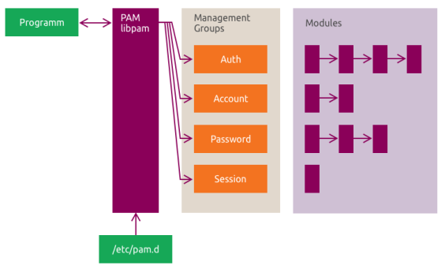

# Security

This chapter covers PAM, ACLs, AppArmor, UFW, and Ubuntu Pro services.

In this chapter, you will:

- explain how PAM handles authentication and service-level access control
- review and manage POSIX ACLs
- understand AppArmor profile modes and profile management
- configure basic host firewall rules with UFW
- review Ubuntu Pro services such as ESM, USG, and Livepatch

!!! warning
    These topics can affect logins, access control, and network access. Test carefully and avoid applying changes blindly on systems with important data.

For a broader overview, see the Ubuntu security documentation: <https://documentation.ubuntu.com/server/explanation/intro-to/security/>

## :material-book-open-page-variant-outline: 9.1 Pluggable Authentication Modules (PAM)

PAM is Ubuntu's authentication framework. Programs such as `login`, `sudo`, `su`, and `sshd` ask PAM to handle authentication, account checks, password policy, and session setup.

The main idea is simple: the application asks, and PAM decides based on its configuration.

!!! note
    Ubuntu 24.04 LTS also introduced `authd` for OpenID Connect (OIDC) integration with cloud identity providers. It complements PAM, but PAM is still the core local authentication framework described here.

### :material-application-edit-outline: PAM Library

Think of PAM as four separate jobs:

- **Account management**: is this account allowed to use the service?
- **Authentication management**: is this user really who they claim to be?
- **Password management**: how are passwords checked or changed?
- **Session management**: what should happen when a session starts or ends?

On Ubuntu, PAM configuration usually lives in `/etc/pam.d/`. When that directory exists, PAM ignores `/etc/pam.conf`.

### :material-application-edit-outline: 9.1.1 Common PAM Modules

Do not try to memorize every module name. Remember which job each module belongs to.

| Category | Example modules | Purpose |
| - | - | - |
| Authentication | `pam_unix.so`, `pam_ldap.so`, `pam_fprintd.so` | Verify identity |
| Account management | `pam_access.so`, `pam_time.so`, `pam_nologin.so` | Allow or deny account use |
| Password management | `pam_pwquality.so`, `pam_pwhistory.so` | Enforce password rules |
| Session management | `pam_mkhomedir.so`, `pam_systemd.so` | Prepare and track sessions |

!!! note
    PAM modules are typically stored under `/lib/*/security/`, depending on the system architecture.

### :material-application-edit-outline: 9.1.2 PAM Configuration

Each PAM rule is one line with three parts:

- a **function type** such as `auth`, `account`, `password`, or `session`
- a **control argument** such as `required`, `requisite`, `sufficient`, or a bracketed rule
- a **module** such as `pam_unix.so`

Example PAM configuration:

```ini
# Authenticate the user.
auth required pam_unix.so

# Ensure the account is still valid.
account required pam_unix.so

# Enforce password policy, then update the password.
password required pam_cracklib.so retry=3 minlen=6 difok=3
password required pam_unix.so use_authtok nullok md5

# Start the user session.
session required pam_unix.so
```

A useful way to read `auth required pam_unix.so` is:

- `auth`: this line is part of user authentication
- `required`: this rule must succeed for the overall result to succeed
- `pam_unix.so`: use the standard local Unix authentication module

### :material-application-edit-outline: 9.1.3 Common Settings

Ubuntu avoids repeating the same PAM rules in every service file. Instead, many services include shared policy files.

| File | Purpose |
| - | - |
| `/etc/pam.d/common-auth` | Shared authentication logic |
| `/etc/pam.d/common-account` | Shared account validation |
| `/etc/pam.d/common-password` | Shared password policy |
| `/etc/pam.d/common-session` | Shared interactive session setup |
| `/etc/pam.d/common-session-noninteractive` | Shared non-interactive session setup |

Example from `/etc/pam.d/common-auth`:

```ini
# /etc/pam.d/common-auth - authentication settings common to all services
auth    [success=1 default=ignore]      pam_unix.so nullok_secure
auth    requisite                       pam_deny.so
auth    required                        pam_permit.so
auth    optional                        pam_cap.so
```

A service can pull those shared rules in with `@include`:

```ini
auth       required   pam_shells.so
auth       sufficient pam_rootok.so
@include common-auth
@include common-account
@include common-session
```

### :material-application-edit-outline: 9.1.4 PAM Architecture

The flow to remember is: `application` -> `libpam` -> `/etc/pam.d/` -> `PAM modules`.

Applications built with PAM support call `libpam`. PAM then reads the matching rules in `/etc/pam.d/` and loads the required modules.



Common PAM-related packages include:

- `libpam0g`: core PAM library
- `libpam-modules`: standard PAM modules
- `libpam-modules-bin`: helper binaries
- `libpam-runtime`: runtime support and common configuration
- `libpam-systemd`: session integration with systemd
- `libpam-doc`: documentation

### :material-application-edit-outline: 9.1.5 PAM Modules Discovery

These commands help you identify where PAM is being used.

```bash
# List PAM-enabled programs under common binary paths.
for i in /usr/{bin,sbin}/* ; do
  ldd $i 2>/dev/null | grep -q libpam
  if [ $? == 0 ] ; then
    echo $i
  fi
done
```
??? quote "Reference output"
    ```text
    /usr/bin/chfn
    /usr/bin/chsh
    /usr/bin/login
    /usr/bin/passwd
    ...
    ```

```bash
# Check whether a specific program uses PAM.
ldd $(which prog_name) | grep libpam
```
??? quote "Reference output"
    ```text
    libpam.so.0 => /lib/x86_64-linux-gnu/libpam.so.0 (...)
    ```

```bash
# List installed PAM modules.
ls /lib/*/security
```
??? quote "Reference output"
    ```text
    pam_access.so
    pam_deny.so
    pam_env.so
    pam_unix.so
    ...
    ```

```bash
# List PAM service configuration files.
ls /etc/pam.d
```
??? quote "Reference output"
    ```text
    common-account
    common-auth
    common-password
    login
    sshd
    sudo
    ...
    ```

!!! pied-piper "Takeaway"
    Remember the model: applications call PAM, PAM reads `/etc/pam.d/`, and modules enforce authentication, account, password, and session policy.

## :material-book-open-page-variant-outline: 9.2 PAM Lab

This lab reinforces two practical skills: reading a PAM rule and locating the PAM pieces Ubuntu uses.

Run this lab on `LABVM`.

!!! info
    This exercise demonstrates two practical checks: you identify which programs and files are part of PAM on Ubuntu, and you verify that the password policy change affects `passwd` by rejecting a password that is shorter than the configured minimum.

!!! note
    You can read module documentation with `man pam_module_name` or browse the Ubuntu manpages online: <https://manpages.ubuntu.com/>

Use the line-by-line reading model from 9.1 as you work through the lab.

Step 1: Review the PAM manual pages.

```bash
# Open the main PAM manual page.
man pam
```
??? example "Expected result"
    ```text
    PAM(8) Linux-PAM Manual
    ```

```bash
# Open the pam_unix manual page.
man pam_unix
```
??? example "Expected result"
    ```text
    PAM_UNIX(8) Linux-PAM Manual
    ```

The `pam_unix` documentation also shows a stack like this:

```ini
# Authenticate the user
auth       required   pam_unix.so
# Ensure the user's account and password are still active
account    required   pam_unix.so
# Change the user's password, but at first check the strength
# with pam_passwdqc(8)
password   required   pam_passwdqc.so config=/etc/passwdqc.conf
password   required   pam_unix.so use_authtok nullok yescrypt
session    required   pam_unix.so
```

Step 2: Find programs in `/bin`, `/sbin`, `/usr/bin`, and `/usr/sbin` that use PAM.

```bash
# Search common binary directories for PAM-linked programs.
for i in /{bin,sbin}/* /usr/{bin,sbin}/* ; do
  ldd $i 2>/dev/null | grep -q libpam
  if [ $? == 0 ] ; then
    echo $i
  fi
done
```
??? example "Expected result"
    ```text
    /bin/login
    /usr/bin/passwd
    /usr/bin/sudo
    ...
    ```

Step 3: Check a specific program for PAM support.

```bash
# Check whether /bin/login links to PAM.
ldd /bin/login | grep pam
```
??? example "Expected result"
    ```text
    libpam.so.0 => /lib/x86_64-linux-gnu/libpam.so.0 (...)
    libpam_misc.so.0 => /lib/x86_64-linux-gnu/libpam_misc.so.0 (...)
    ```

Step 4: List installed PAM modules.

```bash
# List available PAM modules.
ls -l /lib/*/security
```
??? example "Expected result"
    ```text
    ... pam_access.so
    ... pam_env.so
    ... pam_unix.so
    ...
    ```

Step 5: Tighten the shared password policy in `/etc/pam.d/common-password`.

!!! info
    For this lab, edit `/etc/pam.d/common-password` directly because it is the active password policy file. On newer Ubuntu releases, this file may also be managed by `pam-auth-update`, so later runs may warn about local modifications and offer to overwrite them.

```bash
# Edit the common password policy.
sudo vim /etc/pam.d/common-password
```
??? example "Expected result"
    ```text
    "/etc/pam.d/common-password" ...
    ```

Add `minlen=8` to the active `pam_unix.so` password line. The exact line can vary by Ubuntu release. On current Ubuntu, a common line looks like this:

```ini
password        [success=1 default=ignore]      pam_unix.so obscure yescrypt minlen=8
```

If `pam-auth-update` later warns that `/etc/pam.d/common-*` has local modifications, choose the option that keeps your local file so the lab change remains in place.

!!! note
    This lab reuses the `myadmin` account from the earlier OpenSSH lab. If that account is not present on your machine, create it before continuing.

Step 6: Review how `pam-auth-update` reacts to the local change.

```bash
# Open the PAM configuration update tool.
sudo pam-auth-update
```
??? example "Expected result"
    ```text
    pam-auth-update: Local modifications to /etc/pam.d/common-*, not updating.
    pam-auth-update: Run pam-auth-update --force to override.
    ```

Step 7: Test the password policy as `myadmin`.

```bash
# Switch to the myadmin user.
sudo su - myadmin
```
??? example "Expected result"
    ```text
    myadmin@ubuntu:~$
    ```

```bash
# Change the myadmin password.
passwd
```
??? example "Expected result"
    ```text
    Changing password for myadmin.
    Current password:
    New password:
    You must choose a longer password.
    New password:
    Retype new password:
    passwd: password updated successfully
    ```

!!! pied-piper "Takeaway"
    Read PAM a line at a time: function, control, module. Small changes in shared files such as `/etc/pam.d/common-password` can immediately change system-wide behavior, so test carefully.

## :material-book-open-page-variant-outline: 9.3 Access Control Lists (ACLs)

ACLs are useful when the standard owner/group/other permissions are too coarse. They let you grant access to named users and groups, define inherited defaults on directories, and limit effective permissions with a mask.

Use groups where possible. Group-based ACLs are usually easier to manage than many per-user entries.

Common ACL commands:

| Command | Description |
| - | - |
| `getfacl` | Show ACLs for a file or directory |
| `setfacl` | Add or change ACL entries |
| `setfacl -x` | Remove specific ACL entries |
| `setfacl -M` | Load ACL entries from a specification file |
| `setfacl -b` | Remove all ACL entries |

ACL entries can target users, groups, other, and the effective rights mask.

Example commands:

```bash
# Show the ACL on /var/www.
getfacl /var/www
```
??? quote "Reference output"
    ```text
    # file: /var/www
    # owner: root
    # group: root
    user::rwx
    group::r-x
    other::r-x
    ```

```bash
# Grant rwx to the green group on /var/www.
sudo setfacl -m g:green:rwx /var/www/
```

```bash
# Grant rwx to the blue group on /var/www.
sudo setfacl -m g:blue:rwx /var/www/
```

```bash
# Review the updated ACL.
sudo getfacl /var/www/
```
??? quote "Reference output"
    ```text
    group:green:rwx
    group:blue:rwx
    mask::rwx
    ```

```bash
# Remove the green group from the ACL.
setfacl -x g:green /var/www
```

### :material-application-edit-outline: Transfer of ACL Attributes from a Specification File

You can store ACL rules in a file and apply them later.

```bash
# Create an ACL specification file.
echo "g:green:rwx" > aclfile
```

```bash
# Apply the ACL specification to a directory.
setfacl -M aclfile /path/to/dir
```

### :material-application-edit-outline: Copying ACLs

```bash
# Copy ACLs from one directory to another.
getfacl dir1 | setfacl -b -n -M - dir2
```

```bash
# Copy ACLs from one file to another.
getfacl file1 | setfacl --set-file=- file2
```

### :material-application-edit-outline: Default ACLs

Directories can carry default ACLs that new files and subdirectories inherit.

```bash
# Copy the current ACL into the default ACL for the same directory.
getfacl -a /path/to/dir | setfacl -d -M- /path/to/dir
```

### :material-application-edit-outline: ACL Masking

The ACL mask is the ceiling on the effective permissions granted to named users and groups.

```bash
# Restrict effective ACL permissions with a mask.
setfacl -m m:r-x coolcode
```

!!! pied-piper "Takeaway"
    Remember the ACL model: add named entries when mode bits are not enough, use default ACLs for inheritance, and use the mask to cap effective access.

## :material-book-open-page-variant-outline: 9.4 ACL Lab

Run this lab on `LABVM`.

!!! info
    This lab is driven by `getfacl` and `setfacl`. Success means you can see named user and group entries appear in `getfacl` output, transfer them to another directory, and then confirm that access succeeds or fails when the ACL changes.

### :material-application-edit-outline: 9.4.1 Adding, Removing and Transferring Permissions

This lab walks through the core ACL workflow: inspect, add entries, remove entries, copy ACLs, and verify the result.

Step 1: Install the `acl` package.

```bash
# Install ACL tools.
sudo apt install -y acl
```
??? example "Expected result"
    ```text
    acl is already the newest version (...)
    ```

Step 2: Review a sample ACL and identify what access each group has.

```text
# file: program
# owner: ubuntu
# group: students
user::rw-
group::rw-
other::r--
group:qa:rwx
group:uat:rwx
mask::rwx
```

Step 3: Create a test directory and file, then inspect the current ACLs.

```bash
# Create the test directory.
mkdir ~/testpermissions
```
??? example "Expected result"
    ```text
    No output.
    ```

```bash
# Create the test file.
touch ~/testpermissions/coolcode
```
??? example "Expected result"
    ```text
    No output.
    ```

```bash
# Show the ACL on the test directory.
getfacl ~/testpermissions/
```
??? example "Expected result"
    ```text
    # file: /home/ubuntu/testpermissions/
    user::rwx
    group::rwx
    other::r-x
    ```

The exact default mode bits can vary with your `umask`. At this stage, the important point is that there are no named ACL entries yet.

```bash
# Show the ACL on ~/.bashrc.
getfacl ~/.bashrc
```
??? example "Expected result"
    ```text
    # file: /home/ubuntu/.bashrc
    user::rw-
    group::r--
    other::r--
    ```

Step 4: Create the groups and user used in this lab.

```bash
# Create the devops group.
sudo addgroup devops
```
??? example "Expected result"
    ```text
    Adding group `devops' (...)
    ```

```bash
# Create the blue group.
sudo addgroup blue
```
??? example "Expected result"
    ```text
    Adding group `blue' (...)
    ```

```bash
# Create the green group.
sudo addgroup green
```
??? example "Expected result"
    ```text
    Adding group `green' (...)
    ```

```bash
# Create the cm user (if not created already).
sudo adduser cm
```
??? example "Expected result"
    ```text
    Adding user `cm' ...
    New password:
    Retype new password:
    ```

!!! note
    When prompted, set the `cm` password to `ubuntu` so you can use it in the later `su cm` steps, then press Enter to accept the remaining defaults.

### :material-application-edit-outline: Model 1: Groups and Other

!!! info
    In this exercise, you will:

    - grant access to specific groups without changing ownership
    - verify the resulting ACL entries
    - change the `other` entry to see how broad access can be allowed or removed

Step 1: Add ACL permissions for the `devops` group.

```bash
# Change into the test directory.
cd testpermissions
```
??? example "Expected result"
    ```text
    No output.
    ```

```bash
# Grant rwx to the devops group on coolcode.
setfacl -m g:devops:rwx ./coolcode
```
??? example "Expected result"
    ```text
    No output.
    ```

```bash
# Show the ACL on coolcode.
getfacl ./coolcode
```
??? example "Expected result"
    ```text
    group:devops:rwx
    mask::rwx
    ```

Step 2: Add `blue` and `green` to the ACL of the `testpermissions` directory.

```bash
# Grant rwx to green on the directory.
setfacl -m g:green:rwx ~/testpermissions
```
??? example "Expected result"
    ```text
    No output.
    ```

```bash
# Grant rwx to blue on the directory.
setfacl -m g:blue:rwx ~/testpermissions
```
??? example "Expected result"
    ```text
    No output.
    ```

Step 3: Review the updated directory ACL.

```bash
# Show the ACL on the testpermissions directory.
getfacl ~/testpermissions/
```
??? example "Expected result"
    ```text
    group:green:rwx
    group:blue:rwx
    mask::rwx
    ```

Step 4: Add `green` to the ACL of `coolcode`.

```bash
# Grant rwx to green on coolcode.
setfacl -m g:green:rwx ./coolcode
```
??? example "Expected result"
    ```text
    No output.
    ```

Step 5: Review the updated file ACL.

```bash
# Show the ACL on coolcode.
getfacl ./coolcode
```
??? example "Expected result"
    ```text
    group:devops:rwx
    group:green:rwx
    mask::rwx
    ```

Step 6: Remove `green` from the directory ACL.

```bash
# Remove green from the directory ACL.
setfacl -x g:green ~/testpermissions
```
??? example "Expected result"
    ```text
    No output.
    ```

```bash
# Show the ACL after removing green.
getfacl ~/testpermissions
```
??? example "Expected result"
    ```text
    group:blue:rwx
    ```

Step 7: Add permissions for `other`.

```bash
# Return to the test directory.
cd ~/testpermissions
```
??? example "Expected result"
    ```text
    No output.
    ```

```bash
# Grant rwx to other on coolcode.
setfacl -m o:rwx ./coolcode
```
??? example "Expected result"
    ```text
    No output.
    ```

```bash
# Show the updated ACL.
getfacl ./coolcode
```
??? example "Expected result"
    ```text
    other::rwx
    ```

Step 8: Remove permissions for `other`.

```bash
# Remove all permissions for other on coolcode.
setfacl -m o:--- ./coolcode
```
??? example "Expected result"
    ```text
    No output.
    ```

```bash
# Show the updated ACL.
getfacl ./coolcode
```
??? example "Expected result"
    ```text
    other::---
    ```

### :material-application-edit-outline: Model 2: Named Users and ACL Transfer

Step 1: Add a named ACL entry for `ubuntu` on `coolcode`.

```bash
# Change into the test directory.
cd ~/testpermissions
```
??? example "Expected result"
    ```text
    No output.
    ```

```bash
# Review the current ACL.
getfacl ./coolcode
```
??? example "Expected result"
    ```text
    user::rw-
    group::rw-
    other::---
    ...
    ```

```bash
# Grant rwx to user ubuntu on coolcode.
setfacl -m u:ubuntu:rwx ./coolcode
```
??? example "Expected result"
    ```text
    No output.
    ```

Step 2: Remove permissions for the owning group.

```bash
# Remove all permissions from the owning group.
setfacl -m g::--- ./coolcode
```
??? example "Expected result"
    ```text
    No output.
    ```

```bash
# Show the updated ACL.
getfacl ./coolcode
```
??? example "Expected result"
    ```text
    group::---
    ```

Step 3: Remove permissions for `green`.

```bash
# Remove all permissions from green.
setfacl -m g:green:--- ./coolcode
```
??? example "Expected result"
    ```text
    No output.
    ```

```bash
# Show the updated ACL.
getfacl ./coolcode
```
??? example "Expected result"
    ```text
    group:green:---
    ```

Step 4: Create an ACL specification file.

```bash
# Create an ACL specification file named aclfile.
echo "g:green:rwx" > aclfile
```
??? example "Expected result"
    ```text
    No output.
    ```

Step 5: Apply the ACL file to a new directory.

```bash
# Create the second directory.
mkdir dirtwo
```
??? example "Expected result"
    ```text
    No output.
    ```

```bash
# Apply the ACL file to dirtwo.
setfacl -M aclfile dirtwo
```
??? example "Expected result"
    ```text
    No output.
    ```

```bash
# Show the ACL on dirtwo.
getfacl dirtwo
```
??? example "Expected result"
    ```text
    group:green:rwx
    ```

Step 6: Copy ACLs from `testpermissions` to `dirtwo`.

```bash
# Copy ACLs from testpermissions to dirtwo.
getfacl ../testpermissions | setfacl -b -n -M - dirtwo
```
??? example "Expected result"
    ```text
    No output.
    ```

```bash
# Show the ACL on dirtwo after the copy.
getfacl dirtwo
```
??? example "Expected result"
    ```text
    group:blue:rwx
    ...
    ```

Step 7: Check for the `+` marker on files with ACLs.

```bash
# List files and note the ACL marker.
ls -l
```
??? example "Expected result"
    ```text
    -rw-rwx---+ 1 ubuntu ubuntu 0 ... coolcode
    ```

Step 8: Reset all ACL entries on `coolcode`.

```bash
# Remove all ACL entries from coolcode.
setfacl -b ./coolcode
```
??? example "Expected result"
    ```text
    No output.
    ```

### :material-application-edit-outline: 9.4.2 Default ACLs and Masking

!!! info
    This section covers two separate ideas: default ACLs define inherited permissions on directories, and the `mask::` entry is the ceiling for named users and groups. Focus on the `getfacl` output first, then on whether the later access test for `cm` succeeds or fails.

Step 1: Turn an existing ACL into a default ACL.

```bash
# Copy the current ACL on dirtwo into the default ACL on /home/ubuntu.
getfacl -a dirtwo | setfacl -d -M- /home/ubuntu
```
??? example "Expected result"
    ```text
    No output.
    ```

Step 2: Recursively reset ACLs for `testpermissions`.

```bash
# Remove ACLs recursively from the testpermissions tree.
setfacl -R -b ~/testpermissions
```
??? example "Expected result"
    ```text
    No output.
    ```

```bash
# Show the ACL on testpermissions after reset.
getfacl ~/testpermissions
```
??? example "Expected result"
    ```text
    user::rwx
    group::rwx
    other::r-x
    ```

!!! note
    This reset removes named ACL entries from the `testpermissions` tree, but the `coolcode` file still exists. The next steps rebuild a named-user ACL on `coolcode` and then test that access as `cm`.

Step 3: Create a mask entry on `coolcode`.

```bash
# Set an ACL mask on coolcode.
setfacl -m m:rwx ./coolcode
```
??? example "Expected result"
    ```text
    No output.
    ```

```bash
# Show the ACL after applying the mask.
getfacl ./coolcode
```
??? example "Expected result"
    ```text
    mask::rwx
    ```

!!! note
    Because the mask is `rwx` in this exercise, it does not reduce the next named-user entry. The point here is to identify where `mask::` appears in the ACL before you test access as `cm`.

Step 4: Grant `cm` `rwx` on `coolcode`.

```bash
# Grant rwx to user cm on coolcode.
setfacl -m u:cm:rwx ./coolcode
```
??? example "Expected result"
    ```text
    No output.
    ```

Step 5: Switch to `cm` and write to `coolcode`.

```bash
# Switch to the cm user.
su cm
```
??? example "Expected result"
    ```text
    Password:
    cm@ubuntu:/home/ubuntu/testpermissions$ 
    ```

```bash
# Write test text into coolcode.
echo "I am testing" > ./coolcode
```
??? example "Expected result"
    ```text
    No output.
    ```

Step 6: Confirm the write succeeded.

```bash
# Show the contents of coolcode.
cat ./coolcode
```
??? example "Expected result"
    ```text
    I am testing
    ```

Step 7: Exit back to `ubuntu`.

```bash
# Exit the cm shell.
exit
```
??? example "Expected result"
    ```text
    exit
    ```

Step 8: Remove all permissions for `cm`.

```bash
# Remove all ACL permissions for user cm.
setfacl -m u:cm:--- ./coolcode
```
??? example "Expected result"
    ```text
    No output.
    ```

Step 9: Switch back to `cm` and try to append to the file again.

```bash
# Switch to the cm user again.
su cm
```
??? example "Expected result"
    ```text
    Password:
    cm@ubuntu:/home/ubuntu/testpermissions$ 
    ```

```bash
# Try to append to coolcode.
echo "test2" >> ./coolcode
```
??? example "Expected result"
    ```text
    bash: coolcode: Permission denied
    ```

Step 10: Exit back to `ubuntu`.

```bash
# Exit the cm shell.
exit
```
??? example "Expected result"
    ```text
    exit
    ```

!!! pied-piper "Takeaway"
    ACLs let you grant access without changing ownership. Inspect with `getfacl`, change entries with `setfacl`, and always verify the effective result after using defaults or masks.

## :material-book-open-page-variant-outline: 9.5 AppArmor

AppArmor is Ubuntu's default Mandatory Access Control (MAC) system. It limits what a program can do based on a profile.

Three ideas matter most:

- AppArmor controls programs, not users
- profiles are path-based
- profiles usually run in `enforce` or `complain` mode

Profiles can run in two main modes:

- **enforce**: policy is enforced and violations are blocked
- **complain**: policy is not enforced, but violations are logged

To list current AppArmor status:

```bash
# Show loaded AppArmor profiles and modes.
sudo apparmor_status
```
??? quote "Reference output"
    ```text
    apparmor module is loaded.
    ... profiles are loaded.
    ... profiles are in enforce mode.
    ... profiles are in complain mode.
    ```

### :material-application-edit-outline: AppArmor Parser

`apparmor_parser` loads, reloads, and manages profiles.

Use it when you need to load or replace profile definitions in the kernel.

```bash
# Reload and replace an existing profile.
sudo apparmor_parser -r /etc/apparmor.d/bin.ping
```

```bash
# Add a new profile.
sudo apparmor_parser -a /etc/apparmor.d/new_profile
```

### :material-application-edit-outline: AppArmor Profiles

Profiles are stored in `/etc/apparmor.d/`. They are named after the profiled executable path, with `/` replaced by `.`. For example, `/etc/apparmor.d/bin.ping` applies to `/bin/ping`.

If a program has no matching profile, it is not confined by AppArmor.

Example profile excerpt:

```c
#include <tunables/global>
/bin/ping flags=(complain) {
  #include <abstractions/base>
  #include <abstractions/consoles>
  #include <abstractions/nameservice>

  capability net_raw,
  capability setuid,
  network inet raw,

  /bin/ping mixr,
  /etc/modules.conf r,
}
```

Key permissions and flags:

| Flag | Description |
| - | - |
| `r` | Read access |
| `w` | Write access |
| `m` | Memory-map executable |
| `ix` | Execute and inherit profile |
| `Px` | Execute under another profile |
| `Ux` | Execute unconfined |

### :material-application-edit-outline: Managing AppArmor Profiles

```bash
# Install AppArmor helper utilities.
sudo apt install apparmor-utils
```
??? quote "Reference output"
    ```text
    apparmor-utils (...)
    Setting up apparmor-utils (...)
    ```

Package install output can vary depending on whether the tools are already present.

```bash
# Put a profile in enforce mode.
sudo aa-enforce /path/to/bin
```
??? quote "Reference output"
    ```text
    Setting /path/to/bin to enforce mode.
    ```

```bash
# Put a profile in complain mode.
sudo aa-complain /path/to/bin
```
??? quote "Reference output"
    ```text
    Setting /path/to/bin to complain mode.
    ```

```bash
# Disable a profile.
sudo aa-disable /etc/apparmor.d/bin.ping
```
??? quote "Reference output"
    ```text
    Disabling /etc/apparmor.d/bin.ping.
    ```

```bash
# List disabled AppArmor profiles.
ls -l /etc/apparmor.d/disable/
```
??? quote "Reference output"
    ```text
    ... bin.ping -> /etc/apparmor.d/bin.ping
    ```

```bash
# Enforce all configured profiles.
sudo aa-enforce /etc/apparmor.d/*
```
??? quote "Reference output"
    ```text
    Setting ... to enforce mode.
    ```

```bash
# Return all configured profiles to complain mode.
sudo aa-complain /etc/apparmor.d/*
```
??? quote "Reference output"
    ```text
    Setting ... to complain mode.
    ```

!!! pied-piper "Takeaway"
    Remember the AppArmor model: profile the executable path, check the current mode, and switch between `enforce`, `complain`, and `disable` deliberately.

## :material-book-open-page-variant-outline: 9.6 AppArmor Lab

Run this lab on `LABVM`.

!!! info
    This exercise tracks one profile through three states. The main checks are: `tcpdump` disappears from `aa-status` when disabled, appears in complain mode after `aa-complain`, then returns to enforce mode after `aa-enforce`.

This lab is about reading AppArmor state and moving the `tcpdump` profile through disabled, complain, and enforce states.

The exact profile counts on your system may differ. Focus on the mode changes for `tcpdump`.

Step 1: Check AppArmor status.

```bash
# Show AppArmor status with aa-status.
sudo aa-status
```
??? example "Expected result"
    ```text
    apparmor module is loaded.
    ... profiles are loaded.
    ```

!!! note
    `sudo apparmor_status` is an equivalent command.

Step 2: Count profiles by mode.

```bash
# Show the summary lines from aa-status.
sudo aa-status | grep ^[0-9]
```
??? example "Expected result"
    ```text
    142 profiles are loaded.
    47 profiles are in enforce mode.
    4 profiles are in complain mode.
    ```

Step 3: Install AppArmor utilities.

```bash
# Refresh package metadata.
sudo apt update
```
??? example "Expected result"
    ```text
    Hit:1 ...
    Reading package lists... Done
    ```

```bash
# Install apparmor-utils.
sudo apt install apparmor-utils -y
```
??? example "Expected result"
    ```text
    apparmor-utils (...)
    Setting up apparmor-utils (...)
    ```

If the package is already installed, the command may instead report that no new packages were needed.

Step 4: Review the `tcpdump` profile state and then disable it.

```bash
# Show current AppArmor status again.
sudo aa-status
```
??? example "Expected result"
    ```text
    ... tcpdump ...
    ```

```bash
# Disable the tcpdump profile.
sudo aa-disable /etc/apparmor.d/usr.bin.tcpdump
```
??? example "Expected result"
    ```text
    Disabling /etc/apparmor.d/usr.bin.tcpdump.
    ```

```bash
# Confirm the tcpdump profile state.
sudo aa-status | grep tcpdump
```
??? example "Expected result"
    ```text
    No output.
    ```

On this system, disabling the profile removes `tcpdump` from `aa-status` output until it is loaded again.

Step 5: Put the `tcpdump` profile in complain mode.

```bash
# Set the tcpdump profile to complain mode.
sudo aa-complain /etc/apparmor.d/usr.bin.tcpdump
```
??? example "Expected result"
    ```text
    Setting /etc/apparmor.d/usr.bin.tcpdump to complain mode.
    ```

Step 6: Verify that `tcpdump` is now in complain mode.

```bash
# Show AppArmor status again.
sudo apparmor_status
```
??? example "Expected result"
    ```text
    ... profiles are in complain mode.
    ... usr.bin.tcpdump
    ```

Step 7: Trigger a complain event in `tcpdump` while the profile is in complain mode.

```bash
# Create a capture file under the home directory (this path is commonly denied by tcpdump policy).
sudo touch "$HOME/tcpdump-compliance-demo.pcapng"
```
??? example "Expected result"
    ```text
    No output.
    ```

```bash
# Read the file; in complain mode this should generate an AppArmor denial entry while the command exits cleanly.
sudo tcpdump -r "$HOME/tcpdump-compliance-demo.pcapng"
```
??? example "Expected result"
    ```text
    tcpdump: /home/ubuntu/tcpdump-compliance-demo.pcapng: Permission denied
    ```

```bash
# Inspect AppArmor kernel logs for the tcpdump complaint.
sudo journalctl -k --since "2 minutes ago" | grep -i "apparmor" | grep -i "tcpdump" | tail -n 12
```
??? example "Expected result"
    ```text
    ... audit: type=1400 ... apparmor="DENIED" ... profile="tcpdump" operation="open" name="/home/ubuntu/tcpdump-compliance-demo.pcapng" ...
    ```

```bash
# Clean up the temporary file.
sudo rm -f "$HOME/tcpdump-compliance-demo.pcapng"
```
??? example "Expected result"
    ```text
    No output.
    ```

Step 8: Disable the `tcpdump` profile again and inspect the disable symlink.

This step returns the profile to the disabled state so you can confirm the marker AppArmor uses before moving it into enforce mode.

```bash
# Disable the tcpdump profile.
sudo aa-disable /etc/apparmor.d/usr.bin.tcpdump
```
??? example "Expected result"
    ```text
    Disabling /etc/apparmor.d/usr.bin.tcpdump.
    ```

```bash
# Show the disable symlink for the tcpdump profile.
ls -la /etc/apparmor.d/disable/usr.bin.tcpdump
```
??? example "Expected result"
    ```text
    ... /etc/apparmor.d/disable/usr.bin.tcpdump -> /etc/apparmor.d/usr.bin.tcpdump
    ```

Step 9: Return the `tcpdump` profile to enforce mode.

```bash
# Set the tcpdump profile back to enforce mode.
sudo aa-enforce /etc/apparmor.d/usr.bin.tcpdump
```
??? example "Expected result"
    ```text
    Setting /etc/apparmor.d/usr.bin.tcpdump to enforce mode.
    ```

```bash
# Verify the enforced state.
sudo aa-status
```
??? example "Expected result"
    ```text
    ... profiles are in enforce mode.
    ... usr.bin.tcpdump
    ```

!!! pied-piper "Takeaway"
    Focus on profile state: enforce blocks, complain logs, and disable unloads the profile and keeps it from loading automatically at boot. Always verify the state change you expected.

## :material-book-open-page-variant-outline: 9.7 Host Firewall (UFW)

UFW is Ubuntu's simple frontend for host firewall rules. It is the tool to reach for when you need common allow and deny rules without working directly with `iptables` or `nftables`.

To enable or disable UFW:

```bash
# Enable UFW.
sudo ufw enable
```
??? quote "Reference output"
    ```text
    Firewall is active and enabled on system startup
    ```

```bash
# Disable UFW.
sudo ufw disable
```
??? quote "Reference output"
    ```text
    Firewall stopped and disabled on system startup
    ```

!!! warning
    On remote systems, allow SSH before enabling UFW or you may lock yourself out.

Common UFW commands:

Most day-to-day work comes down to five actions: check status, allow, deny, delete, and reset.

| Command | Description |
| - | - |
| `ufw status` | Show current rules |
| `ufw enable` | Enable firewall enforcement |
| `ufw disable` | Disable firewall enforcement |
| `ufw allow 22` | Allow SSH |
| `ufw deny 80` | Block HTTP |
| `ufw delete allow 22` | Delete an existing rule |
| `ufw reset` | Disable UFW and remove all rules |

Example rules:

```bash
# Allow SSH by service name.
sudo ufw allow ssh
```
??? quote "Reference output"
    ```text
    Rule added
    ```

```bash
# Allow inbound HTTPS.
sudo ufw allow 443/tcp
```
??? quote "Reference output"
    ```text
    Rule added
    ```

```bash
# Deny traffic from a specific source IP.
sudo ufw deny from 192.168.1.100
```
??? quote "Reference output"
    ```text
    Rule added
    ```

```bash
# Show detailed UFW status.
sudo ufw status verbose
```
??? quote "Reference output"
    ```text
    Status: active
    Logging: on
    Default: deny (incoming), allow (outgoing), disabled (routed)
    ```

!!! pied-piper "Takeaway"
    Remember the safe UFW workflow: check status, allow required access first, then enable or tighten rules.

## :material-book-open-page-variant-outline: 9.8 UFW Lab

Run this lab on `LABVM`.

!!! info
    This exercise demonstrates the safe UFW workflow. The main checks are that UFW moves from inactive to active, the SSH allow rule appears in status output, the HTTP deny rule appears in numbered status output, and `ufw reset` returns the firewall to its default state.

This lab practices the basic UFW workflow: check status, allow required access, deny a service, remove a rule, and reset.

Step 1: Check the current firewall status.

```bash
# Show verbose UFW status.
sudo ufw status verbose
```
??? example "Expected result"
    ```text
    Status: inactive
    ```

Step 2: Allow SSH access before enabling UFW.

If you are connected remotely over SSH, add this rule first so your current access path is allowed as soon as the firewall becomes active.

```bash
# Allow inbound SSH on TCP port 22.
sudo ufw allow 22/tcp
```
??? example "Expected result"
    ```text
    Rule added
    Rule added (v6)
    ```

Step 3: Enable the firewall.

After the SSH rule is in place, enable UFW. If you are working from a local console, follow the same sequence so the lab stays consistent.

!!! warning
    If you lose SSH access after enabling UFW, recover from the VM console.

```bash
# Open the VM console.
sudo virsh console ubuntu
```
??? example "Expected result"
    ```text
    Connected to domain 'ubuntu'
    Escape character is ^]
    ```

```bash
# Disable UFW from the console.
sudo ufw disable
```
??? example "Expected result"
    ```text
    Firewall stopped and disabled on system startup
    ```

```bash
# Verify that UFW is inactive.
sudo ufw status verbose
```
??? example "Expected result"
    ```text
    Status: inactive
    ```

```bash
# Enable UFW.
sudo ufw enable
```
??? example "Expected result"
    ```text
    Command may disrupt existing ssh connections. Proceed with operation (y|n)?
    Firewall is active and enabled on system startup
    ```

```bash
# Verify the SSH rule.
sudo ufw status
```
??? example "Expected result"
    ```text
    Status: active
    22/tcp                     ALLOW       Anywhere
    22/tcp (v6)                ALLOW       Anywhere (v6)
    ```

Step 4: Block HTTP access.

```bash
# Deny inbound HTTP on TCP port 80.
sudo ufw deny 80/tcp
```
??? example "Expected result"
    ```text
    Rule added
    Rule added (v6)
    ```

```bash
# Show numbered UFW rules.
sudo ufw status numbered
```
??? example "Expected result"
    ```text
    [ 1] 22/tcp                     ALLOW IN    Anywhere
    [ 2] 80/tcp                     DENY IN     Anywhere
    [ 3] 22/tcp (v6)                ALLOW IN    Anywhere (v6)
    [ 4] 80/tcp (v6)                DENY IN     Anywhere (v6)
    ```

Step 5: Remove the HTTP rule.

`ufw deny 80/tcp` usually creates separate IPv4 and IPv6 rules. If both are present, run the delete command once for each HTTP rule number.

```bash
# Delete an HTTP rule by number.
sudo ufw delete <rule-number>
```
??? example "Expected result"
    ```text
    Deleting:
    deny 80/tcp
    Proceed with operation (y|n)?
    ```

Step 6: Deny traffic from a specific IP.

```bash
# Deny traffic from a specific source address.
sudo ufw deny from 192.168.1.100
```
??? example "Expected result"
    ```text
    Rule added
    ```

Step 7: Reset all firewall rules.

```bash
# Reset UFW to defaults.
sudo ufw reset
```
??? example "Expected result"
    ```text
    Resetting all rules to installed defaults. Proceed with operation (y|n)?
    ```

!!! pied-piper "Takeaway"
    UFW is simple, but remote access changes the risk. Verify status first, expect confirmation prompts for disruptive actions, and protect your SSH path before relying on the new rule set.

## :material-book-open-page-variant-outline: 9.9 Ubuntu Pro and Extended Security Maintenance (ESM)

Ubuntu Pro adds extended security maintenance, compliance tooling, and optional services such as Livepatch on top of Ubuntu LTS.

In this section, you will:

- register a machine with Ubuntu Pro
- enable services such as USG and Livepatch
- review security and compliance tooling

Feature overview:

| Feature | What it provides | Common use |
| - | - | - |
| Expanded Security Maintenance (ESM) | 10 years of CVE coverage for `main` and `universe` | Keep older LTS systems secure longer |
| Livepatch | Apply critical kernel patches without rebooting | Reduce downtime |
| Compliance and hardening | CIS, DISA-STIG, FIPS, Common Criteria tooling | Meet security requirements |
| 24/7 Support (add-on) | Phone and ticket support | Enterprise operations |
| Managed services (add-on) | Canonical-operated infrastructure support | Outsource operations |

Ubuntu Pro is free for personal use on a limited number of physical machines.

See also:

- <https://documentation.ubuntu.com/pro/>
- <https://documentation.ubuntu.com/pro-client/en/latest/>

!!! pied-piper "Takeaway"
    Ubuntu Pro extends the security lifecycle of Ubuntu LTS and adds services such as ESM, Livepatch, and compliance tooling. The `pro` CLI is the main interface for attaching a machine and enabling services.

## :material-book-open-page-variant-outline: 9.10 Ubuntu Pro: ESM, USG, and Livepatch Lab

!!! note
    This lab requires a valid Ubuntu Pro token.

!!! info
    This exercise verifies the Ubuntu Pro service workflow. Success means the machine attaches cleanly, `pro status --all` shows the expected service state changes, `which usg` confirms the USG client is installed, and `canonical-livepatch status` reports a supported kernel.

Before you start, obtain a token from the Ubuntu Pro dashboard:

1. Sign in at <https://ubuntu.com/pro/dashboard>.
2. Select or create your Ubuntu Pro subscription.
3. Open the machine or token management page.
4. Copy the attach token shown for your subscription.

If you have not set up Ubuntu Pro before, follow the account setup guide first:

- <https://documentation.ubuntu.com/pro/account-setup/>

Step 1: Attach the machine to Ubuntu Pro.

```bash
# Attach the machine using your Ubuntu Pro token.
sudo pro attach <pro_token>
```
??? example "Expected result"
    ```text
    Enabling Ubuntu Pro: ESM Apps
    Ubuntu Pro: ESM Apps enabled
    Enabling Ubuntu Pro: ESM Infra
    Ubuntu Pro: ESM Infra enabled
    Enabling Livepatch
    Livepatch enabled
    This machine is now attached to 'Ubuntu Pro (...)'
    ```

The exact account and subscription text is specific to your Ubuntu Pro subscription.

Step 2: Check the Ubuntu Pro subscription status.

```bash
# Show all Ubuntu Pro services and their status.
sudo pro status --all
```
??? example "Expected result"
    ```text
    SERVICE          ENTITLED  STATUS       DESCRIPTION
    esm-apps         yes       enabled      Expanded Security Maintenance for Applications
    esm-infra        yes       enabled      Expanded Security Maintenance for Infrastructure
    livepatch        yes       enabled      Canonical Livepatch service
    usg              yes       disabled     Security compliance and audit tools
    ...
    ```

The service list can include additional items such as `cc-eal`, `fips`, `ros`, and realtime kernel variants.

Step 3: Enable USG.

```bash
# Enable the Ubuntu Security Guide service.
sudo pro enable usg
```
??? example "Expected result"
    ```text
    One moment, checking your subscription first
    Configuring APT access to Ubuntu Security Guide
    Installing Ubuntu Security Guide packages
    Ubuntu Security Guide enabled
    ```

Step 4: Recheck enabled services.

```bash
# Show all Ubuntu Pro services again.
sudo pro status --all
```
??? example "Expected result"
    ```text
    usg              yes       enabled      Security compliance and audit tools
    ```

```bash
# Confirm that the usg binary is installed.
which usg
```
??? example "Expected result"
    ```text
    /usr/sbin/usg
    ```

Step 5: Run a USG audit.

!!! note
    `cis_level1_workstation` is a practical baseline security profile from the Center for Internet Security (CIS). It checks for common hardening settings without being as restrictive as higher-level compliance profiles.

```bash
# Run a CIS Level 1 workstation audit.
sudo usg audit cis_level1_workstation
```
??? example "Expected result"
    ```text
    Title   Package "prelink" Must not be Installed
    Result  pass
    Title   Install AIDE
    Result  fail
    ...
    ```

Step 6: Enable Livepatch.

On current Ubuntu releases, `pro attach` may already enable Livepatch automatically. In that case, this command confirms the service is already active.

```bash
# Enable the Livepatch service.
sudo pro enable livepatch
```
??? example "Expected result"
    ```text
    One moment, checking your subscription first
    Livepatch is already enabled - nothing to do.
    Could not enable Livepatch.
    ```

If you see this output, treat it as a confirmation that Livepatch is already active, not as a failure.

Step 7: Check Livepatch status.

```bash
# Show the Canonical Livepatch status.
sudo canonical-livepatch status
```
??? example "Expected result"
    ```text
    status:
    - kernel: ...
      supported: supported
      livepatch:
        patchState: nothing-to-apply
    tier: updates
    ```

Step 8: Detach the machine from Ubuntu Pro.

```bash
# Detach the machine from Ubuntu Pro.
sudo pro detach
```
??? example "Expected result"
    ```text
    Detach will disable the following services:
        cis
        esm-apps
        esm-infra
        livepatch
    Are you sure? (y/N)
    This machine is now detached.
    ```

!!! pied-piper "Takeaway"
    Ubuntu Pro is managed through the `pro` CLI: attach the machine, confirm which services are enabled, turn on extra services such as `usg` when needed, and verify their tools before detaching the system again.
