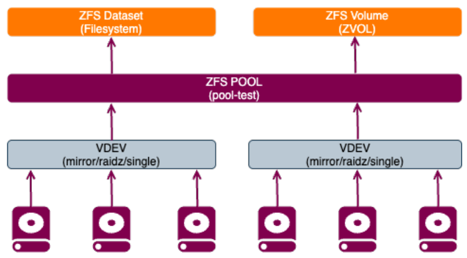
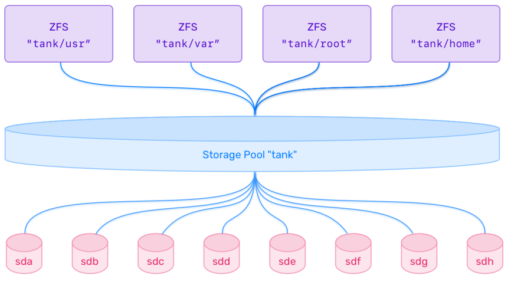

# ZFS

This chapter covers ZFS architecture, storage pools, datasets, snapshots, cloning, replication, and RAID-style layouts.

In this chapter you will:

- understand the core ZFS architecture and terminology
- create and inspect pools, datasets, and volumes
- tune common properties such as compression, quotas, and mountpoints
- work with snapshots, clones, and send/receive
- review scrubbing, deduplication, and RAID-style pool layouts

## :material-book-open-page-variant-outline: 7.1 ZFS Overview

ZFS combines a filesystem and a volume manager in one stack. Instead of creating partitions, layering LVM, and then formatting a separate filesystem, ZFS manages pooled storage directly and presents datasets or block volumes from that pool.

That is what makes ZFS feel different from more traditional Linux storage workflows. It is especially useful when you want built-in snapshots, copy-on-write behavior, integrity checking, and flexible storage management.

The commands in this section are reference examples meant to support the concepts. The hands-on exercises come later in `7.2`.

Here is a quick comparison with more traditional Linux filesystems:

| Feature | ZFS | `ext4` / `xfs` |
| - | - | - |
| Architecture | Volume manager and filesystem together | Filesystem only |
| Snapshots | Native and efficient | Not native |
| Copy-on-write | Yes | No |
| Compression | Built in | Not built in |
| Deduplication | Optional | Not supported |
| Integrity checking | End-to-end checksums | Limited compared with ZFS |
| Overhead | Higher memory and tuning cost | Lower overhead |
| Low-resource suitability | Usually not ideal | Usually better |

There is no single best filesystem for every case. ZFS is strong when integrity, snapshots, and flexible storage management matter more than simplicity.

```bash
# Install the ZFS userland tools.
sudo apt install -y zfsutils-linux
```

Key ZFS features include:

- `zpool` and `zfs` administration commands
- native snapshots and writable clones
- copy-on-write data handling
- checksumming and self-healing when redundancy exists
- transparent compression
- optional deduplication
- pooled storage instead of classic partition-based allocation

### :material-application-edit-outline: 7.1.1 ZFS Architecture and Components



#### Pools, Datasets, and Volumes

ZFS storage is built around three main object types. Once these three make sense, the rest of ZFS becomes much easier to follow:

| Term | Description | Example |
| - | - | - |
| **zpool** | Storage pool built from one or more devices or VDEVs | `pool-test` |
| **dataset** | Mountable ZFS filesystem with its own properties | `pool-test/mystuff` |
| **volume** | Block device, also called a `zvol` | `pool-test/myvolume` |

Use a dataset when you want a normal mounted filesystem. Use a volume when you need a raw block device for a VM, container, filesystem, or another block-oriented workload.

#### Common Dataset Properties

| Property | Description | Example |
| - | - | - |
| `compression` | Enable transparent compression | `zfs set compression=lz4 pool/ds` |
| `atime` | Enable or disable access-time updates | `zfs set atime=off pool/ds` |
| `mountpoint` | Set the mount path | `zfs set mountpoint=/data pool/ds` |
| `recordsize` | Preferred block size | `zfs set recordsize=16K pool/ds` |
| `quota` | Limit dataset space usage | `zfs set quota=10G pool/ds` |
| `reservation` | Reserve space for a dataset | `zfs set reservation=2G pool/ds` |
| `readonly` | Make a dataset read-only | `zfs set readonly=on pool/ds` |
| `copies` | Store extra copies of data blocks | `zfs set copies=2 pool/ds` |

#### VDEVs and Pool Layouts

A **VDEV** is a virtual device that forms part of a zpool. Each VDEV contains one or more block devices, and ZFS distributes data across the VDEVs in the pool.

Common layouts used in this course:

- single-device pools with no redundancy
- mirrors
- `raidz`, `raidz2`, and `raidz3`
- striped mirrors, often compared with RAID10

Advanced layouts can also include:

- hot spares
- cache devices (`L2ARC`)
- log devices (`ZIL` or separate intent log)

#### RAIDZ Levels

| Level | Redundancy | Minimum disks | Description |
| - | - | - | - |
| `raidz` | 1 disk failure | 3 | Similar to RAID5 |
| `raidz2` | 2 disk failures | 4 | Similar to RAID6 |
| `raidz3` | 3 disk failures | 5 | Triple-parity design |

For more detailed tuning guidance, see the [OpenZFS workload tuning guide](https://openzfs.github.io/openzfs-docs/Performance%20and%20Tuning/Workload%20Tuning.html).

#### Pool Structure



ZFS filesystems sit on top of pools called **zpools**. Those pools are built from one or more VDEVs, and the VDEVs are built from disks, partitions, or files. In production, whole disks are usually the preferred choice because they keep the layout simpler and reduce ambiguity.

```bash
# Create a simple striped pool from three devices.
sudo zpool create pool-test /dev/vdb /dev/vdc /dev/vdd
```

By default, that command creates a non-redundant striped pool.

!!! note
    When managing many disks, prefer stable names such as `/dev/disk/by-id/...` instead of device names like `/dev/vdb`.

```bash
# Show the health and layout of pool-test.
sudo zpool status pool-test
```

```bash
# Create a dataset inside pool-test.
sudo zfs create pool-test/mystuff
```

```bash
# Show mounted ZFS filesystems.
mount -t zfs
```

```bash
# Create a 10 GiB ZFS volume.
sudo zfs create -V 10G pool-test/myvolume
```

```bash
# Show the zvol device link.
ls -lh /dev/zvol/pool-test/myvolume
```

!!! note
    A volume is a raw block device. ZFS does not automatically format or mount it.

```bash
# Show the block device created for the zvol.
lsblk /dev/zd0
```

```bash
# List all ZFS objects in the pool.
zfs list
```

```bash
# Destroy the test pool.
sudo zpool destroy pool-test
```

#### Mirrored Pool Example

This next example shows how a pool can be expanded with mirrored VDEVs instead of single disks.

```bash
# Create a mirrored pool from two devices.
sudo zpool create mypool mirror /dev/vdc /dev/vdd
```

```bash
# Add a second mirrored VDEV to mypool.
sudo zpool add mypool mirror /dev/vde /dev/vdf -f
```

```bash
# Inspect the mirrored pool layout.
sudo zpool status mypool
```

This layout is often described as a ZFS equivalent of RAID10: striping across mirrored VDEVs.

#### File-Based Pool Example

File-backed pools are useful for testing and learning, but they are not how you would normally build a production pool.

```bash
# Create a 2 GiB backing file for a test pool.
dd if=/dev/zero of="$HOME/example.img" bs=1M count=2048
```

```bash
# Create a pool on the backing file.
sudo zpool create pool-test "$HOME/example.img"
```

```bash
# Show the file-backed pool status.
sudo zpool status pool-test
```

!!! warning
    File-backed pools depend on the underlying filesystem and are not recommended for production use.

### :material-application-edit-outline: 7.1.2 ZFS Scrubbing

ZFS scrubbing reads pool data, verifies checksums, and repairs damaged blocks when redundancy exists. Think of it as a preventive integrity check rather than a repair step you wait to run only after something goes wrong.

Scrubbing helps to:

- detect silent corruption or bit rot
- verify checksums across the pool
- repair bad data from redundant copies when possible

```bash
# Start a scrub on pool-test.
sudo zpool scrub pool-test
```

```bash
# Show scrub progress and pool status.
sudo zpool status -v pool-test
```

ZFS also schedules regular maintenance on Ubuntu.

```bash
# Show the ZFS maintenance cron jobs.
cat /etc/cron.d/zfsutils-linux
```

!!! note
    Ubuntu schedules a monthly scrub and TRIM job for ZFS by default.

### :material-application-edit-outline: 7.1.3 Configuring and Tuning ZFS

A dataset in ZFS is a filesystem or volume created from a pool. Each dataset can have its own properties, which is one of the most useful parts of ZFS for day-to-day administration.

In practice, this means one dataset can be optimized for general file storage, while another can be tuned for backups, VM images, or an application with stricter limits.

```bash
# Show all properties for pool-test.
zfs get all pool-test
```

#### Dataset Quotas

The `quota` property sets a hard limit on how much space a dataset and its descendants can consume. For a ZFS volume, use `volsize` instead.

```bash
# Limit the dataset to 10 GiB.
sudo zfs set quota=10G pool-test/mystuff
```

```bash
# Verify the quota value.
sudo zfs get quota pool-test/mystuff
```

#### Access Time Updates

By default, ZFS updates file access time on reads. Disabling `atime` can reduce extra writes, which is often a sensible choice for busy datasets.

```bash
# Disable atime updates for the dataset.
sudo zfs set atime=off pool-test/mystuff
```

### :material-application-edit-outline: 7.1.4 ZFS Compression

ZFS can compress data transparently. On modern systems, this is often a net win because reducing the amount of data written or read can matter more than the CPU time spent compressing it.

Supported algorithms commonly used on Ubuntu include:

| Algorithm | Notes |
| - | - |
| `lz4` | Fast default choice for general workloads |
| `zstd` | Good compression ratio for many workloads |
| `gzip-N` | Tunable but slower |
| `lzjb` | Older algorithm |
| `zle` | Useful for data with long zero runs |

```bash
# Enable compression on the pool.
sudo zfs set compression=on pool-test
```

```bash
# Check the inherited compression setting.
sudo zfs get compression pool-test/mystuff
```

```bash
# Set zstd compression on the dataset.
sudo zfs set compression=zstd pool-test/mystuff
```

```bash
# Verify the compression algorithm in use.
sudo zfs get compression pool-test/mystuff
```

```bash
# Show the current compression ratio.
sudo zfs get compressratio pool-test/mystuff
```

!!! note
    `lz4` is the default algorithm behind `compression=on` and is usually the best starting point.

### :material-application-edit-outline: 7.1.5 ZFS Snapshots

Snapshots are lightweight, read-only point-in-time copies of a dataset or volume. They are inexpensive because ZFS stores only changed blocks after the snapshot is taken.

Common uses include:

- protecting a known-good state before changes
- recovering deleted files
- rolling back after a failed update or test

```bash
# Create a recursive snapshot of the dataset.
sudo zfs snapshot -r pool-test/mystuff@snap1
```

```bash
# List all snapshots.
sudo zfs list -t snapshot
```

Snapshots are exposed through the hidden `.zfs/snapshot` path, which makes it easy to inspect old content without immediately rolling anything back.

```bash
# Browse the contents of the snapshot.
ls /pool-test/mystuff/.zfs/snapshot/snap1
```

```bash
# Remove the current files from the dataset.
sudo rm -rf /pool-test/mystuff/*
```

```bash
# Confirm that the dataset is empty.
ls -lah /pool-test/mystuff/
```

```bash
# Roll the dataset back to snap1.
sudo zfs rollback pool-test/mystuff@snap1
```

```bash
# Confirm that the files returned after rollback.
ls -lah /pool-test/mystuff/
```

!!! warning
    Rolling back destroys changes made after the snapshot.

```bash
# Destroy the snapshot when it is no longer needed.
sudo zfs destroy pool-test/mystuff@snap1
```

### :material-application-edit-outline: 7.1.6 ZFS Clones

A clone is a writable copy of a snapshot. It starts from the same data, but it can diverge independently as new writes occur.

Clones are useful for:

- disposable test environments
- rapid VM or container provisioning
- experimenting on a copy of a known-good dataset

```bash
# Re-create snap1 for the clone example.
sudo zfs snapshot -r pool-test/mystuff@snap1
```

```bash
# Clone the snapshot into a writable child dataset.
sudo zfs clone pool-test/mystuff@snap1 pool-test/mystuff/snap1clone
```

```bash
# Show the cloned dataset.
sudo zfs list
```

!!! note
    A snapshot cannot be destroyed while a clone depends on it.

### :material-application-edit-outline: 7.1.7 ZFS Send and Receive

`zfs send` turns a snapshot into a stream. `zfs receive` reconstructs that stream into another dataset. This is one of the most useful ZFS workflows for backups and replication.

Typical uses include:

- local snapshot backups to a file
- remote replication over `ssh`
- incremental transfers between snapshots

### :material-application-edit-outline: 7.1.8 Redundancy Enhancements: Deduplication and Ditto Blocks

#### Deduplication

Deduplication stores identical blocks once and reuses them by reference. It can save space, but it comes with a high RAM cost and can hurt performance if the dedup table grows too large.

```bash
# Enable deduplication on the dataset.
sudo zfs set dedup=on pool-test/mystuff
```

!!! warning
    Deduplication is a specialized feature. Test it carefully before enabling it in real environments.

#### Ditto Blocks

ZFS already stores extra metadata copies internally. The `copies` property increases how many copies of regular data ZFS keeps within the pool.

```bash
# Keep two copies of data blocks in the dataset.
sudo zfs set copies=2 pool-test/mystuff
```

### :material-application-edit-outline: 7.1.9 Mounting ZFS Datasets

ZFS normally mounts datasets automatically based on the `mountpoint` property. In most cases, there is no need to edit `/etc/fstab`, which keeps the workflow simpler than many traditional filesystems.

```bash
# Show the configured mountpoint for the dataset.
zfs get mountpoint pool-test/mystuff
```

```bash
# Show mounted ZFS datasets.
mount -t zfs
```

```bash
# Set a custom mountpoint for the dataset.
sudo zfs set mountpoint=/mnt/docs pool-test/mystuff
```

```bash
# Switch the dataset to legacy mount handling.
sudo zfs set mountpoint=legacy pool-test/mystuff
```

Legacy mode is mainly useful when you intentionally want mounting to be managed outside of ZFS.

### :material-application-edit-outline: 7.1.10 ZFS Pool and Dataset Lifecycle

ZFS includes tools to inspect, export, import, and destroy pools and datasets. This gives you a fairly clean lifecycle from initial creation through migration to another host and eventual cleanup.

```bash
# List the existing pools.
zpool list
```

```bash
# List all datasets and volumes.
zfs list
```

```bash
# Show detailed pool health.
zpool status
```

```bash
# Destroy the clone dataset.
sudo zfs destroy pool-test/mystuff/snap1clone
```

```bash
# Destroy the snapshot named snap1.
sudo zfs destroy pool-test/mystuff@snap1
```

```bash
# Destroy the dataset named mystuff.
sudo zfs destroy pool-test/mystuff
```

```bash
# Export the pool before moving the disks.
sudo zpool export pool-test
```

```bash
# Show pools available for import.
sudo zpool import
```

```bash
# Import pool-test.
sudo zpool import pool-test
```

```bash
# Mount all importable ZFS datasets.
sudo zfs mount -a
```

!!! pied-piper "Takeaway"
    The main ZFS mental model is:

    - the pool and VDEVs define the storage layout and redundancy
    - datasets inherit properties and give you flexible admin boundaries
    - snapshots, clones, scrubs, and send/receive are built into the same stack

## :material-book-open-page-variant-outline: 7.2 ZFS Lab

!!! info
    Run this lab on `LABVM`. These exercises use the extra lab disks and will destroy existing signatures on those devices.

These exercises build on one another. Keep `zfspool` and `/mnt/myzfs` in place until `7.2.9` tells you to remove them.

In this lab you will create pools, datasets, snapshots, clones, and RAID-style layouts.

### :material-application-edit-outline: 7.2.1 Create ZFS Pools and Datasets

!!! info
    This exercise establishes the working pool and datasets used through the rest of `7.2`. Success means `zfspool` exists, both datasets are visible, and `zfspool/mystuff` is mounted at `/mnt/myzfs`.

Step 1: Install the ZFS tools.

```bash
# Install the ZFS userland package.
sudo apt install -y zfsutils-linux
```
??? example "Expected result"
    ```text
    zfsutils-linux is already the newest version (...)
    ```

Step 2: Identify the available lab disks and clear existing signatures.

```bash
# Show the current block devices.
lsblk
```
??? example "Expected result"
    ```text
    NAME   MAJ:MIN RM  SIZE RO TYPE MOUNTPOINTS
    vda    252:0    0   32G  0 disk
    vdb    252:16   0   10G  0 disk
    vdc    252:32   0   10G  0 disk
    vdd    252:48   0   10G  0 disk
    vde    252:64   0   10G  0 disk
    vdf    252:80   0   10G  0 disk
    vdg    252:96   0   10G  0 disk
    ```

```bash
# Remove old signatures from the lab disks.
for disk in vdb vdc vdd vde vdf vdg; do sudo wipefs -a /dev/$disk; done
```
??? example "Expected result"
    ```text
    /dev/vdb: ... bytes were erased at offset ...
    /dev/vdc: ... bytes were erased at offset ...
    ...
    ```

!!! note
    If a disk was already blank, that device may show no output from `wipefs`. The important result is that `vdb` through `vdg` are ready for new pool creation.

!!! note
    ZFS usually works with full raw disks. Separate partitions are not required for this lab.

Step 3: Create a mirrored pool.

```bash
# Create the initial mirrored pool.
sudo zpool create -f testpool mirror /dev/vdb /dev/vdc
```
??? example "Expected result"
    ```text
    No output.
    ```

```bash
# Show the pool status after creation.
sudo zpool status testpool
```
??? example "Expected result"
    ```text
      pool: testpool
     state: ONLINE
    config:

            NAME        STATE     READ WRITE CKSUM
            testpool    ONLINE       0     0     0
              mirror-0  ONLINE       0     0     0
                vdb     ONLINE       0     0     0
                vdc     ONLINE       0     0     0

    errors: No known data errors
    ```

Step 4: Add a single non-redundant VDEV.

```bash
# Add one non-redundant disk to expand capacity.
sudo zpool add -f testpool /dev/vdd
```
??? example "Expected result"
    ```text
    No output.
    ```

!!! note
    On current ZFS versions, mixing a single-disk VDEV into a mirrored pool requires `-f` because it lowers the pool's overall redundancy model.

!!! note
    A single-disk VDEV increases capacity, but it also becomes a single point of failure for the pool.

Step 5: Add a second mirrored VDEV.

```bash
# Add a second mirrored VDEV to the pool.
sudo zpool add testpool mirror /dev/vde /dev/vdf
```
??? example "Expected result"
    ```text
    No output.
    ```

Step 6: Review the updated layout.

```bash
# Show the full testpool layout after expansion.
sudo zpool status testpool
```
??? example "Expected result"
    ```text
      pool: testpool
     state: ONLINE
    config:

            NAME        STATE     READ WRITE CKSUM
            testpool    ONLINE       0     0     0
              mirror-0  ONLINE       0     0     0
                vdb     ONLINE       0     0     0
                vdc     ONLINE       0     0     0
              vdd       ONLINE       0     0     0
              mirror-2  ONLINE       0     0     0
                vde     ONLINE       0     0     0
                vdf     ONLINE       0     0     0

    errors: No known data errors
    ```

!!! info
    The top-level entries under `testpool` are VDEVs. At this point the pool contains one mirror, one single-disk VDEV, and a second mirror, so the least-redundant VDEV now affects the pool's overall failure model.

Step 7: Destroy the temporary pool.

```bash
# Remove the testpool before the next exercise.
sudo zpool destroy testpool
```
??? example "Expected result"
    ```text
    No output.
    ```

Step 8: Create a RAIDZ pool.

```bash
# Create a three-disk RAIDZ pool.
sudo zpool create -f zfspool raidz /dev/vdb /dev/vdc /dev/vdd
```
??? example "Expected result"
    ```text
    No output.
    ```

Step 9: Verify the new pool.

```bash
# Show the status of zfspool.
sudo zpool status zfspool
```
??? example "Expected result"
    ```text
      pool: zfspool
     state: ONLINE
    config:

            NAME        STATE     READ WRITE CKSUM
            zfspool     ONLINE       0     0     0
              raidz1-0  ONLINE       0     0     0
                vdb     ONLINE       0     0     0
                vdc     ONLINE       0     0     0
                vdd     ONLINE       0     0     0

    errors: No known data errors
    ```

Step 10: Create two datasets.

```bash
# Create the first dataset.
sudo zfs create zfspool/mystuff
```
??? example "Expected result"
    ```text
    No output.
    ```

```bash
# Create the second dataset.
sudo zfs create zfspool/myFs2
```
??? example "Expected result"
    ```text
    No output.
    ```

Step 11: Verify datasets and mountpoints.

```bash
# List all datasets in the pool.
sudo zfs list
```
??? example "Expected result"
    ```text
    NAME             USED  AVAIL     REFER  MOUNTPOINT
    zfspool           96K  18.9G       24K  /zfspool
    zfspool/myFs2     24K  18.9G       24K  /zfspool/myFs2
    zfspool/mystuff   24K  18.9G       24K  /zfspool/mystuff
    ```

```bash
# Show the currently mounted ZFS datasets.
mount -t zfs
```
??? example "Expected result"
    ```text
    zfspool on /zfspool type zfs (...)
    zfspool/mystuff on /zfspool/mystuff type zfs (...)
    zfspool/myFs2 on /zfspool/myFs2 type zfs (...)
    ```

```bash
# Show the ZFS-managed mounts.
zfs mount
```
??? example "Expected result"
    ```text
    zfspool           /zfspool
    zfspool/mystuff   /zfspool/mystuff
    zfspool/myFs2     /zfspool/myFs2
    ```

Step 12: Switch one dataset to legacy mounting and mount it manually.

```bash
# Create the manual mount directory.
sudo mkdir /mnt/myzfs
```
??? example "Expected result"
    ```text
    No output.
    ```

```bash
# Set mystuff to legacy mount handling.
sudo zfs set mountpoint=legacy zfspool/mystuff
```
??? example "Expected result"
    ```text
    No output.
    ```

```bash
# Mount the dataset manually.
sudo mount -t zfs zfspool/mystuff /mnt/myzfs
```
??? example "Expected result"
    ```text
    No output.
    ```

Step 13: Confirm the mount state.

```bash
# Show ZFS-managed mounts after switching to legacy mode.
zfs mount
```
??? example "Expected result"
    ```text
    zfspool                         /zfspool
    zfspool/myFs2                   /zfspool/myFs2
    zfspool/mystuff                 /mnt/myzfs
    ```

!!! info
    This is the `legacy` mount demonstration. The dataset is still `zfspool/mystuff`, but it is now mounted where you told `mount` to place it instead of where ZFS would normally auto-mount it.

!!! note
    On current Ubuntu/OpenZFS builds, `zfs mount` may still show a dataset after you switch it to `legacy` if that dataset is currently mounted. The important change is the mount location.

```bash
# Show all mounted ZFS filesystems, including the manual mount.
mount -t zfs
```
??? example "Expected result"
    ```text
    zfspool on /zfspool type zfs (...)
    zfspool/myFs2 on /zfspool/myFs2 type zfs (...)
    zfspool/mystuff on /mnt/myzfs type zfs (...)
    ```

!!! pied-piper "Takeaway"
    In ZFS, pool layout and dataset layout solve different problems:

    - the pool defines capacity and redundancy
    - datasets define mountpoints, properties, and admin boundaries inside the pool

### :material-application-edit-outline: 7.2.2 ZFS Compression

!!! info
    Continue using the `zfspool/mystuff` dataset mounted at `/mnt/myzfs`. Success means the compression setting is explicit on `zfspool` and `zfspool/mystuff` shows a `compressratio` above `1.00x` after writing test data.

Step 1: Review pool properties and the current compression setting.

```bash
# Show all ZFS properties for zfspool.
sudo zfs get all zfspool
```
??? example "Expected result"
    ```text
    NAME     PROPERTY     VALUE        SOURCE
    zfspool  type         filesystem   -
    zfspool  compression  on           default
    ...
    ```

```bash
# Show the current compression property.
sudo zfs get compression zfspool
```
??? example "Expected result"
    ```text
    NAME     PROPERTY     VALUE  SOURCE
    zfspool  compression  on     default
    ```

!!! note
    On current Ubuntu/OpenZFS builds, `compression=on` may already be the default. Running `zfs set compression=on` still makes the setting explicit and changes the source to `local`.

Step 2: Enable compression.

```bash
# Turn on compression for the pool.
sudo zfs set compression=on zfspool
```
??? example "Expected result"
    ```text
    No output.
    ```

```bash
# Verify that compression is enabled.
sudo zfs get compression zfspool
```
??? example "Expected result"
    ```text
    NAME     PROPERTY     VALUE  SOURCE
    zfspool  compression  on     local
    ```

Step 3: Check the compression ratio before writing data.

```bash
# Show the current compression ratio.
sudo zfs get compressratio zfspool
```
??? example "Expected result"
    ```text
    NAME     PROPERTY       VALUE  SOURCE
    zfspool  compressratio  1.00x  -
    ```

Step 4: Write compressible data and recheck the ratio.

```bash
# Create a large zero-filled file in the dataset.
sudo dd if=/dev/zero of=/mnt/myzfs/file1 count=1024 bs=1M
```
??? example "Expected result"
    ```text
    1024+0 records in
    1024+0 records out
    1073741824 bytes (1.1 GB, 1.0 GiB) copied, ... s, ... MB/s
    ```

```bash
# Confirm the test file size.
ls -lh /mnt/myzfs/file1
```
??? example "Expected result"
    ```text
    -rw-r--r-- 1 root root 1.0G ... /mnt/myzfs/file1
    ```

```bash
# Show the new compression ratio on the dataset that received the file.
sudo zfs get compressratio zfspool/mystuff
```
??? example "Expected result"
    ```text
    NAME             PROPERTY       VALUE  SOURCE
    zfspool/mystuff  compressratio  2.00x  -
    ```

!!! info
    The feature is demonstrated in two places: `compression` changed from the default setting to a local setting earlier in the lab, and now the dataset that received the zero-filled file shows a `compressratio` above `1.00x`.

!!! note
    Query the dataset that received the file when you want to see the compression effect clearly. The pool root can remain at `1.00x` even when a child dataset is compressing data effectively.

!!! note
    Compression ratios usually improve more with repetitive data than with already compressed media such as JPEG or MP3 files.

!!! pied-piper "Takeaway"
    For ZFS compression, remember:

    - it is usually a dataset-level tuning choice
    - test it with real data, not just theory
    - check the dataset that actually received the writes

### :material-application-edit-outline: 7.2.3 ZFS Snapshots and Rollbacks

!!! info
    Continue using `zfspool/mystuff` at `/mnt/myzfs`. Success means `file2` disappears after rollback, `snap2` and `snap3` are cleaned up at the end of the exercise, and `snap1` remains available for the clone exercise.

Step 1: Take a snapshot.

```bash
# Create the first recursive snapshot.
sudo zfs snapshot -r zfspool/mystuff@snap1
```
??? example "Expected result"
    ```text
    No output.
    ```

Step 2: List snapshots.

```bash
# Show all snapshots on the system.
sudo zfs list -t snapshot
```
??? example "Expected result"
    ```text
    NAME                   USED  AVAIL  REFER  MOUNTPOINT
    zfspool/mystuff@snap1   ...      -  ...    -
    ```

Step 3: Create another file.

```bash
# Write a second test file after the snapshot.
sudo dd if=/dev/zero of=/mnt/myzfs/file2 count=1024 bs=1M
```
??? example "Expected result"
    ```text
    1024+0 records in
    1024+0 records out
    1073741824 bytes (1.1 GB, 1.0 GiB) copied, ... s, ... MB/s
    ```

```bash
# List the dataset contents by modification time.
ls -alt /mnt/myzfs/
```
??? example "Expected result"
    ```text
    total ...
    -rw-r--r-- 1 root root 1073741824 ... file2
    -rw-r--r-- 1 root root 1073741824 ... file1
    ```

Step 4: Roll back to the snapshot.

```bash
# Roll back to snap1.
sudo zfs rollback zfspool/mystuff@snap1
```
??? example "Expected result"
    ```text
    No output.
    ```

```bash
# Confirm that file2 is gone after rollback.
ls -alt /mnt/myzfs/
```
??? example "Expected result"
    ```text
    total ...
    -rw-r--r-- 1 root root 1073741824 ... file1
    ```

!!! info
    This is the rollback proof. `file2` existed after `snap1`, but it disappears here because the live dataset was moved back to the snapshot state.

Step 5: Create additional snapshots and changes.

```bash
# Create the second snapshot.
sudo zfs snapshot -r zfspool/mystuff@snap2
```
??? example "Expected result"
    ```text
    No output.
    ```

```bash
# Write a third test file.
sudo dd if=/dev/zero of=/mnt/myzfs/file3 count=1024 bs=1M
```
??? example "Expected result"
    ```text
    1024+0 records in
    1024+0 records out
    1073741824 bytes (1.1 GB, 1.0 GiB) copied, ... s, ... MB/s
    ```

```bash
# Review the dataset contents before deleting a file.
ls -alt /mnt/myzfs/
```
??? example "Expected result"
    ```text
    total ...
    -rw-r--r-- 1 root root 1073741824 ... file3
    -rw-r--r-- 1 root root 1073741824 ... file1
    ```

```bash
# Remove file1 before taking snap3.
sudo rm /mnt/myzfs/file1
```
??? example "Expected result"
    ```text
    No output.
    ```

```bash
# Create the third snapshot.
sudo zfs snapshot -r zfspool/mystuff@snap3
```
??? example "Expected result"
    ```text
    No output.
    ```

```bash
# Review the dataset contents after creating snap3.
ls -alt /mnt/myzfs/
```
??? example "Expected result"
    ```text
    total ...
    -rw-r--r-- 1 root root 1073741824 ... file3
    ```

Step 6: Compare snapshot state.

```bash
# List the current snapshots again.
sudo zfs list -t snapshot
```
??? example "Expected result"
    ```text
    NAME                   USED  AVAIL  REFER  MOUNTPOINT
    zfspool/mystuff@snap1  ...      -  ...    -
    zfspool/mystuff@snap2  ...      -  ...    -
    zfspool/mystuff@snap3  ...      -  ...    -
    ```

```bash
# Show differences recorded since snap3.
sudo zfs diff zfspool/mystuff@snap3
```
??? example "Expected result"
    ```text
    No output.
    ```

!!! note
    If nothing changed after creating `snap3`, `zfs diff` returns no output. That still confirms the command worked.

Step 7: Remove the extra snapshots.

```bash
# Delete snap2.
sudo zfs destroy zfspool/mystuff@snap2
```
??? example "Expected result"
    ```text
    No output.
    ```

```bash
# Delete snap3.
sudo zfs destroy zfspool/mystuff@snap3
```
??? example "Expected result"
    ```text
    No output.
    ```

!!! pied-piper "Takeaway"
    For snapshots and rollback, remember:

    - snapshots are cheap read-only restore points
    - rollback does not merge changes
    - rollback moves the active dataset back to the snapshot state

### :material-application-edit-outline: 7.2.4 ZFS Clones and Quotas

!!! info
    This exercise shows two independent dataset controls: cloning from a snapshot and limiting growth with a quota. Success means `snap1clone` appears in `zfs list` and `zfspool/mystuff` shows `quota=10G` with `SOURCE=local`.

Step 1: Clone the snapshot.

```bash
# Create a writable clone from snap1.
sudo zfs clone zfspool/mystuff@snap1 zfspool/mystuff/snap1clone
```
??? example "Expected result"
    ```text
    No output.
    ```

```bash
# Show the cloned dataset.
sudo zfs list
```
??? example "Expected result"
    ```text
    NAME                            USED  AVAIL     REFER  MOUNTPOINT
    zfspool                          ...   ...        24K  /zfspool
    zfspool/mystuff                 ...   ...         ...  legacy
    zfspool/mystuff/snap1clone        0B   ...         ...  legacy
    zfspool/myFs2                    24K   ...        24K  /zfspool/myFs2
    ```

!!! info
    The clone appears as a new dataset under `zfspool/mystuff/...`. The snapshot stays read-only; the clone is the writable copy you can change safely.

!!! note
    Snapshot names use `@`. Dataset and clone names use `/`.

Step 2: Set and verify a quota.

```bash
# Limit the dataset to 10 GiB.
sudo zfs set quota=10G zfspool/mystuff
```
??? example "Expected result"
    ```text
    No output.
    ```

```bash
# Show the quota value.
sudo zfs get quota zfspool/mystuff
```
??? example "Expected result"
    ```text
    NAME             PROPERTY  VALUE  SOURCE
    zfspool/mystuff  quota     10G    local
    ```

!!! info
    `VALUE=10G` with `SOURCE=local` shows the quota is now set directly on this dataset rather than inherited.

!!! pied-piper "Takeaway"
    This section combined two useful controls:

    - a clone is a writable dataset created from a snapshot
    - a quota limits how far a dataset can grow
    - together, they give you safer testing space without changing the whole pool design

### :material-application-edit-outline: 7.2.5 ZFS Send and Receive

!!! info
    This section is reference-only. It shows the shape of `zfs send` and `zfs receive` commands, but this lab does not provide a separate target system to validate a full replication workflow.

Step 1: Create a snapshot for backup.

```bash
# Create snap2 for send/receive.
sudo zfs snapshot -r zfspool/mystuff@snap2
```
??? example "Expected result"
    ```text
    No output.
    ```

Step 2: Send the snapshot to a file.

```bash
# Save the snapshot stream to a file.
sudo zfs send zfspool/mystuff@snap2 > ~/mystuff-snap.zfs
```
??? example "Expected result"
    ```text
    No output.
    ```

Step 3: Receive the stream into a new dataset.

```bash
# Restore the snapshot into a new dataset.
sudo zfs receive -F zfspool/mystuff-copy < ~/mystuff-snap.zfs
```
??? example "Expected result"
    ```text
    No output.
    ```

!!! info
    Use these commands to understand the workflow. The SSH pipeline below is included as a reference pattern for a real remote target.

```bash
# Example remote send over SSH.
sudo zfs send zfspool/mystuff@snap2 | ssh remotehost sudo zfs receive -F zfspool/mystuff-copy
```
??? example "Expected result"
    ```text
    No output.
    ```

!!! note
    `remotehost` is a placeholder. Treat this as a reference example of the command shape, not as a practical step to execute unchanged in the lab.

!!! note
    The remote system must have `zfsutils-linux` installed and a suitable target pool available.

!!! pied-piper "Takeaway"
    `zfs send` and `zfs receive` are useful because:

    - they work from snapshots
    - the transfer is based on a consistent point in time
    - they fit backup, migration, and replication workflows well

### :material-application-edit-outline: 7.2.6 ZFS Ditto Blocks

!!! info
    This exercise focuses on the dataset property itself. Success means `zfspool/mystuff` shows `copies=3` with `SOURCE=local`.

Step 1: Increase the number of stored copies.

```bash
# Store three copies of data blocks in the dataset.
sudo zfs set copies=3 zfspool/mystuff
```
??? example "Expected result"
    ```text
    No output.
    ```

Step 2: Verify the setting.

```bash
# Show the copies property.
sudo zfs get copies zfspool/mystuff
```
??? example "Expected result"
    ```text
    NAME             PROPERTY  VALUE  SOURCE
    zfspool/mystuff  copies    3      local
    ```

!!! info
    The goal here is to confirm the property change itself. The lab does not try to force a failure to prove the extra block copies on disk.

!!! pied-piper "Takeaway"
    The `copies` property means:

    - extra block copies inside the dataset itself
    - better local resilience for that dataset
    - not a replacement for mirrored or RAIDZ pool redundancy

### :material-application-edit-outline: 7.2.7 ZFS Deduplication

!!! info
    This exercise is only about enabling and verifying the property. Success means `zfspool/mystuff` shows `dedup=on` with `SOURCE=local`.

Step 1: Enable deduplication.

```bash
# Turn on deduplication for the dataset.
sudo zfs set dedup=on zfspool/mystuff
```
??? example "Expected result"
    ```text
    No output.
    ```

Step 2: Verify the setting.

```bash
# Show the dedup property.
sudo zfs get dedup zfspool/mystuff
```
??? example "Expected result"
    ```text
    NAME             PROPERTY  VALUE  SOURCE
    zfspool/mystuff  dedup     on     local
    ```

!!! info
    The goal here is to verify that deduplication was enabled. It does not try to measure real space savings in a short lab run.

!!! pied-piper "Takeaway"
    Deduplication should be treated as a special-case feature:

    - it can save space
    - it can cost a lot of RAM and performance
    - only enable it when you have a clear reason

### :material-application-edit-outline: 7.2.8 ZFS Scrubbing and Fault Simulation

!!! info
    This exercise demonstrates the recovery workflow on a degraded pool. Success means `zfspool` becomes degraded after the device is offlined, then shows replacement and resilver activity after `zpool replace`.

Step 1: Write test data into the pool.

```bash
# Write random data into the pool.
sudo dd if=/dev/urandom of=/zfspool/random.dat bs=1M count=20
```
??? example "Expected result"
    ```text
    20+0 records in
    20+0 records out
    20971520 bytes (21 MB, 20 MiB) copied, ... s, ... MB/s
    ```

```bash
# Calculate the checksum of the test file.
md5sum /zfspool/random.dat
```
??? example "Expected result"
    ```text
    e2fc714c4727ee9395f324cd2e7f331f  /zfspool/random.dat
    ```

Step 2: Simulate disk damage.

```bash
# Take /dev/vdd offline to simulate a failed device.
sudo zpool offline zfspool /dev/vdd
```
??? example "Expected result"
    ```text
    No output.
    ```

!!! note
    Offlining the device gives you a predictable degraded-pool state to observe immediately. It is a safer and more reliable lab path than trying to corrupt on-disk labels and hoping the active pool notices right away.

Step 3: Review the pool state.

```bash
# Show the degraded or unavailable device state.
sudo zpool status zfspool
```
??? example "Expected result"
    ```text
      pool: zfspool
     state: DEGRADED
    status: One or more devices has been taken offline by the administrator.
    ```

Step 4: Start a scrub.

```bash
# Start a scrub on zfspool.
sudo zpool scrub zfspool
```
??? example "Expected result"
    ```text
    No output.
    ```

Step 5: Check scrub progress.

```bash
# Show detailed scrub progress.
sudo zpool status -v zfspool
```
??? example "Expected result"
    ```text
      pool: zfspool
     state: DEGRADED
      scan: scrub repaired 0B in 00:00:00 with 0 errors on ...
    ```

!!! note
    You can stop or pause a scrub with `zpool scrub -s` or `zpool scrub -p`.

Step 6: Replace the failed disk.

```bash
# Replace the damaged device with /dev/vdg.
sudo zpool replace zfspool /dev/vdd /dev/vdg -f
```
??? example "Expected result"
    ```text
    No output.
    ```

```bash
# Confirm that the replacement is in progress or complete.
sudo zpool status -v zfspool
```
??? example "Expected result"
    ```text
    pool: zfspool
    state: ONLINE
    scan: resilvered ...
    ```

!!! info
    The key result is the workflow, not just the final `ONLINE` state: the pool went degraded, you inspected it, replaced the failed device, and then watched ZFS resilver the data.

!!! pied-piper "Takeaway"
    The core recovery flow is:

    - detect the problem
    - inspect pool health
    - replace or reattach the device
    - confirm the resilver with `zpool status`

### :material-application-edit-outline: 7.2.9 Destroy a ZFS Pool

!!! info
    This is the cleanup exercise for `7.2`. Success means `zfspool` and its child objects are gone, leaving the extra lab disks ready for the RAID exercises in `7.3`.

Step 1: Review all ZFS object types.

```bash
# List ZFS filesystems.
sudo zfs list -t filesystem
```
??? example "Expected result"
    ```text
    NAME                            USED  AVAIL     REFER  MOUNTPOINT
    zfspool                          ...   ...        24K  /zfspool
    zfspool/mystuff                 ...   ...         ...  legacy
    zfspool/mystuff/snap1clone      ...   ...         ...  legacy
    zfspool/mystuff-copy            ...   ...         ...  /zfspool/mystuff-copy
    ```

!!! info
    This review step should still show the objects you created earlier in the lab, including the clone and the send/receive target, before you remove them during cleanup.

```bash
# List ZFS snapshots.
sudo zfs list -t snapshot
```
??? example "Expected result"
    ```text
    NAME                   USED  AVAIL  REFER  MOUNTPOINT
    zfspool/mystuff@snap1  ...      -   ...    -
    zfspool/mystuff@snap2  ...      -   ...    -
    ```

```bash
# List ZFS volumes.
sudo zfs list -t volume
```
??? example "Expected result"
    ```text
    no datasets available
    ```

```bash
# List all ZFS object types.
sudo zfs list -t all
```
??? example "Expected result"
    ```text
    NAME                            USED  AVAIL     REFER  MOUNTPOINT
    zfspool                          ...   ...        24K  /zfspool
    ...
    ```

Step 2: Destroy datasets, snapshots, and volumes inside the pool.

```bash
# Destroy the entire dataset tree recursively.
sudo zfs destroy -r zfspool
```
??? example "Expected result"
    ```text
    No output.
    ```

Step 3: Destroy the pool itself.

```bash
# Remove the zfspool storage pool.
sudo zpool destroy zfspool
```
??? example "Expected result"
    ```text
    No output.
    ```

!!! pied-piper "Takeaway"
    ZFS cleanup is layered too:

    - remove datasets, snapshots, and clones first when needed
    - destroy the pool itself last

## :material-book-open-page-variant-outline: 7.3 ZFS RAID Lab

!!! info
    Run this lab on `LABVM`. Each exercise creates its own pool and destroys it before the next exercise reuses the same disks.

!!! note
    If a pool creation step fails because a disk still has old labels, rerun the wipe loop from `7.2.1` Step 2 before trying again.

### :material-application-edit-outline: 7.3.1 RAIDZ Exercises

!!! info
    This exercise compares `raidz` and `raidz2`. Success means you can identify `raidz1-0` versus `raidz2-0` in `zpool status` and relate the extra parity in `raidz2` to reduced usable capacity.

Step 1: Create a RAIDZ pool.

```bash
# Create a RAIDZ pool across four disks.
sudo zpool create -f zfsraid5 raidz /dev/vdb /dev/vdc /dev/vdd /dev/vde
```
??? example "Expected result"
    ```text
    No output.
    ```

Step 2: Inspect the pool.

```bash
# Show the RAIDZ pool status.
sudo zpool status zfsraid5
```
??? example "Expected result"
    ```text
      pool: zfsraid5
     state: ONLINE
    config:

            NAME        STATE     READ WRITE CKSUM
            zfsraid5    ONLINE       0     0     0
              raidz1-0  ONLINE       0     0     0
                vdb     ONLINE       0     0     0
                vdc     ONLINE       0     0     0
                vdd     ONLINE       0     0     0
                vde     ONLINE       0     0     0
    ```

```bash
# Show the dataset view of the pool.
zfs list
```
??? example "Expected result"
    ```text
    NAME      USED  AVAIL     REFER  MOUNTPOINT
    zfsraid5   24K  28.5G       24K  /zfsraid5
    ```

Step 3: Destroy the RAIDZ pool so the disks can be reused.

```bash
# Remove the RAIDZ pool before creating the RAIDZ2 example.
sudo zpool destroy zfsraid5
```
??? example "Expected result"
    ```text
    No output.
    ```

!!! note
    These examples reuse the same lab disks. Destroy the first pool before creating the next one.

Step 4: Create a RAIDZ2 pool.

```bash
# Create a RAIDZ2 pool across five disks.
sudo zpool create -f zfsraid6 raidz2 /dev/vdb /dev/vdc /dev/vdd /dev/vde /dev/vdf
```
??? example "Expected result"
    ```text
    No output.
    ```

Step 5: Inspect the RAIDZ2 pool.

```bash
# Show the RAIDZ2 pool status.
sudo zpool status zfsraid6
```
??? example "Expected result"
    ```text
      pool: zfsraid6
     state: ONLINE
    config:

            NAME        STATE     READ WRITE CKSUM
            zfsraid6    ONLINE       0     0     0
              raidz2-0  ONLINE       0     0     0
                vdb     ONLINE       0     0     0
                vdc     ONLINE       0     0     0
                vdd     ONLINE       0     0     0
                vde     ONLINE       0     0     0
                vdf     ONLINE       0     0     0
    ```

```bash
# Show the dataset view of the RAIDZ2 pool.
zfs list
```
??? example "Expected result"
    ```text
    NAME      USED  AVAIL     REFER  MOUNTPOINT
    zfsraid6   24K  27.6G       24K  /zfsraid6
    ```

!!! info
    Compare this with the earlier `raidz1` example. The important difference is the `raidz2-0` layout in `zpool status`, which shows double parity in exchange for less usable capacity.

Step 6: Review the RAIDZ2 pool and then clean it up.

```bash
# Review the RAIDZ2 pool before cleanup.
sudo zpool status zfsraid6
```
??? example "Expected result"
    ```text
      pool: zfsraid6
     state: ONLINE
    ```

```bash
# Destroy the RAIDZ2 pool.
sudo zpool destroy zfsraid6
```
??? example "Expected result"
    ```text
    No output.
    ```

!!! pied-piper "Takeaway"
    For `raidz` layouts, remember:

    - more parity means better failure tolerance
    - more parity also means less usable space for data

### :material-application-edit-outline: 7.3.2 Nested RAIDZ1

!!! info
    This exercise shows how a pool can stripe across multiple RAIDZ VDEVs. Success means `zpool status` shows two top-level `raidz1-*` VDEVs inside `zfsraid60`.

Step 1: Create the first RAIDZ VDEV.

```bash
# Create a pool with the first RAIDZ VDEV.
sudo zpool create zfsraid60 raidz /dev/vdb /dev/vdc /dev/vdd -f
```
??? example "Expected result"
    ```text
    No output.
    ```

Step 2: Add a second RAIDZ VDEV.

```bash
# Add the second RAIDZ VDEV to the pool.
sudo zpool add zfsraid60 raidz /dev/vde /dev/vdf /dev/vdg
```
??? example "Expected result"
    ```text
    No output.
    ```

!!! note
    This creates a striped layout across two RAIDZ VDEVs, commonly compared with RAID60.

Step 3: Inspect the layout.

```bash
# Show the nested RAIDZ layout.
sudo zpool status zfsraid60
```
??? example "Expected result"
    ```text
      pool: zfsraid60
     state: ONLINE
    config:

            NAME        STATE     READ WRITE CKSUM
            zfsraid60   ONLINE       0     0     0
              raidz1-0  ONLINE       0     0     0
                vdb     ONLINE       0     0     0
                vdc     ONLINE       0     0     0
                vdd     ONLINE       0     0     0
              raidz1-1  ONLINE       0     0     0
                vde     ONLINE       0     0     0
                vdf     ONLINE       0     0     0
                vdg     ONLINE       0     0     0
    ```

```bash
# Show the dataset view of the pool.
zfs list
```
??? example "Expected result"
    ```text
    NAME       USED  AVAIL     REFER  MOUNTPOINT
    zfsraid60   24K  36.7G       24K  /zfsraid60
    ```

!!! info
    The feature here is the two top-level `raidz1-*` VDEVs shown in `zpool status`. ZFS stripes across those VDEVs, which is why this is compared with RAID60-style layouts.

Step 4: Destroy the pool.

```bash
# Remove the nested RAIDZ pool.
sudo zpool destroy zfsraid60
```
??? example "Expected result"
    ```text
    No output.
    ```

!!! pied-piper "Takeaway"
    A pool can stripe across multiple top-level VDEVs:

    - that improves scale
    - each top-level VDEV still affects the pool's failure model
    - layout choices matter early

### :material-application-edit-outline: 7.3.3 RAID10 Equivalent

!!! info
    This exercise demonstrates striped mirrors and a mirror repair workflow. Success means `zpool status` shows two `mirror-*` VDEVs, the pool survives the simulated disk damage, and the replacement step starts or completes a resilver.

Step 1: Create striped mirrors.

```bash
# Create a pool from two mirrored VDEVs.
sudo zpool create zfsraid10 mirror /dev/vdb /dev/vdc mirror /dev/vdd /dev/vde -f
```
??? example "Expected result"
    ```text
    No output.
    ```

Step 2: Inspect the mirrored layout.

```bash
# Show the RAID10-style pool status.
sudo zpool status zfsraid10
```
??? example "Expected result"
    ```text
      pool: zfsraid10
     state: ONLINE
    config:

            NAME        STATE     READ WRITE CKSUM
            zfsraid10   ONLINE       0     0     0
              mirror-0  ONLINE       0     0     0
                vdb     ONLINE       0     0     0
                vdc     ONLINE       0     0     0
              mirror-1  ONLINE       0     0     0
                vdd     ONLINE       0     0     0
                vde     ONLINE       0     0     0
    ```

```bash
# Show the dataset view of the mirrored pool.
zfs list
```
??? example "Expected result"
    ```text
    NAME        USED  AVAIL     REFER  MOUNTPOINT
    zfsraid10    24K  18.4G       24K  /zfsraid10
    ```

!!! info
    The important part is the two `mirror-*` VDEVs in `zpool status`. That striped-mirror layout is why this pool is compared with RAID10.

Step 3: Write test data into the pool.

```bash
# Write random data into the mirrored pool.
sudo dd if=/dev/urandom of=/zfsraid10/random.dat bs=1M count=20
```
??? example "Expected result"
    ```text
    20+0 records in
    20+0 records out
    20971520 bytes (21 MB, 20 MiB) copied, ... s, ... MB/s
    ```

Step 4: Simulate disk damage.

```bash
# Overwrite the beginning of /dev/vde.
sudo dd if=/dev/zero of=/dev/vde bs=1M count=10
```
??? example "Expected result"
    ```text
    10+0 records in
    10+0 records out
    10485760 bytes (10 MB, 10 MiB) copied, ... s, ... MB/s
    ```

Step 5: Start a scrub.

```bash
# Start a scrub on the mirrored pool.
sudo zpool scrub zfsraid10
```
??? example "Expected result"
    ```text
    No output.
    ```

Step 6: Review the scrub status.

```bash
# Show detailed status for zfsraid10.
sudo zpool status -v zfsraid10
```
??? example "Expected result"
    ```text
    pool: zfsraid10
    state: ONLINE
    status: One or more devices has experienced an unrecoverable error. An
        attempt was made to correct the error. Applications are unaffected.
    scan: scrub repaired ... with 0 errors on ...
    ```

!!! note
    On current Ubuntu/OpenZFS builds, this test can remain `ONLINE` after scrub if ZFS repairs the damaged blocks from the mirror immediately. The important signal is that the affected device shows checksum errors and the pool reports the repair activity.

Step 7: Replace the failed device.

```bash
# Replace /dev/vde with /dev/vdg.
sudo zpool replace zfsraid10 /dev/vde /dev/vdg -f
```
??? example "Expected result"
    ```text
    No output.
    ```

```bash
# Confirm the pool recovered after replacement.
sudo zpool status -v zfsraid10
```
??? example "Expected result"
    ```text
      pool: zfsraid10
     state: ONLINE
      scan: resilvered ...
    ```

Step 8: Destroy the pool.

```bash
# Remove the mirrored test pool.
sudo zpool destroy zfsraid10
```
??? example "Expected result"
    ```text
    No output.
    ```

!!! pied-piper "Takeaway"
    Mirrored VDEVs are common because:

    - they are easy to reason about
    - they are easy to repair
    - they are the usual ZFS way to build a RAID10-style layout

### :material-application-edit-outline: 7.3.4 File-Based Pool

!!! info
    This exercise is only for testing and demonstration. Success means you create a pool backed by a regular file, confirm its mountpoint, and then remove both the pool and the backing file.

Step 1: Create a file to back the test pool.

```bash
# Create a 2 GiB file for a file-backed pool.
dd if=/dev/zero of="$HOME/zfsraidpool.img" bs=1M count=2048
```
??? example "Expected result"
    ```text
    2048+0 records in
    2048+0 records out
    2147483648 bytes (2.1 GB, 2.0 GiB) copied, ... s, ... MB/s
    ```

```bash
# Create a pool on the file.
sudo zpool create zfsraidpool "$HOME/zfsraidpool.img"
```
??? example "Expected result"
    ```text
    No output.
    ```

Step 2: Review the pool and its mountpoint.

```bash
# Show the file-backed pool status.
sudo zpool status zfsraidpool
```
??? example "Expected result"
    ```text
      pool: zfsraidpool
     state: ONLINE
    config:

            NAME                          STATE     READ WRITE CKSUM
            zfsraidpool                   ONLINE       0     0     0
              /home/ubuntu/zfsraidpool.img    ONLINE       0     0     0
    ```

```bash
# Show the mountpoint property.
sudo zfs get mountpoint zfsraidpool
```
??? example "Expected result"
    ```text
    NAME         PROPERTY    VALUE         SOURCE
    zfsraidpool  mountpoint  /zfsraidpool  default
    ```

```bash
# Show the dataset view of the file-backed pool.
zfs list
```
??? example "Expected result"
    ```text
    NAME         USED  AVAIL     REFER  MOUNTPOINT
    zfsraidpool   24K  1.88G       24K  /zfsraidpool
    ```

Step 3: Destroy the pool.

```bash
# Remove the file-backed test pool.
sudo zpool destroy zfsraidpool
```
??? example "Expected result"
    ```text
    No output.
    ```

Step 4: Remove the backing file.

```bash
# Delete the file that backed the test pool.
rm -f "$HOME/zfsraidpool.img"
```
??? example "Expected result"
    ```text
    No output.
    ```

!!! pied-piper "Takeaway"
    File-backed pools are mainly for labs because:

    - they are useful for learning and quick testing
    - they add another filesystem layer underneath ZFS
    - they are not a normal production design

### :material-application-edit-outline: 7.3.5 Cache and ZIL Devices

!!! info
    This exercise is about recognizing special device classes in the pool layout. Success means `zpool status` shows separate `cache` and `logs` sections, and the later status output shows that the cache device was removed cleanly.

Step 1: Create a mirrored pool.

```bash
# Create a mirrored pool for cache and log testing.
sudo zpool create zfsmirror mirror /dev/vdd /dev/vde -f
```
??? example "Expected result"
    ```text
    No output.
    ```

Step 2: Inspect the initial pool.

```bash
# Show the pool status before adding special devices.
sudo zpool status zfsmirror
```
??? example "Expected result"
    ```text
      pool: zfsmirror
     state: ONLINE
    config:

            NAME        STATE     READ WRITE CKSUM
            zfsmirror   ONLINE       0     0     0
              mirror-0  ONLINE       0     0     0
                vdd     ONLINE       0     0     0
                vde     ONLINE       0     0     0
    ```

Step 3: Add a cache device.

```bash
# Add /dev/vdc as a cache device.
sudo zpool add zfsmirror cache /dev/vdc
```
??? example "Expected result"
    ```text
    No output.
    ```

Step 4: Add a log device.

```bash
# Add /dev/vdf as a log device.
sudo zpool add zfsmirror log /dev/vdf
```
??? example "Expected result"
    ```text
    No output.
    ```

Step 5: Review the updated pool.

```bash
# Show the pool after adding cache and log devices.
sudo zpool status zfsmirror
```
??? example "Expected result"
    ```text
      pool: zfsmirror
     state: ONLINE
    config:

            NAME        STATE     READ WRITE CKSUM
            zfsmirror   ONLINE       0     0     0
              mirror-0  ONLINE       0     0     0
                vdd     ONLINE       0     0     0
                vde     ONLINE       0     0     0
            logs
              vdf       ONLINE       0     0     0
            cache
              vdc       ONLINE       0     0     0
    ```

!!! info
    This exercise is mainly about recognizing the extra device classes in `zpool status`. Look for the separate `logs` and `cache` sections rather than expecting a visible performance difference in a short lab run.

!!! note
    The order of `logs` and `cache` sections in `zpool status` can vary by OpenZFS version. Either order is fine as long as both device classes are present.

Step 6: Remove the cache device.

```bash
# Remove the cache device from the pool.
sudo zpool remove zfsmirror vdc
```
??? example "Expected result"
    ```text
    No output.
    ```

Step 7: Review the pool again.

```bash
# Show the pool after removing the cache device.
sudo zpool status zfsmirror
```
??? example "Expected result"
    ```text
      pool: zfsmirror
     state: ONLINE
    config:

            NAME        STATE     READ WRITE CKSUM
            zfsmirror   ONLINE       0     0     0
              mirror-0  ONLINE       0     0     0
                vdd     ONLINE       0     0     0
                vde     ONLINE       0     0     0
            logs
              vdf       ONLINE       0     0     0
    ```

Step 8: Destroy the pool.

```bash
# Remove the cache and log test pool.
sudo zpool destroy zfsmirror
```
??? example "Expected result"
    ```text
    No output.
    ```

!!! pied-piper "Takeaway"
    `cache` and `log` devices are specialized tuning tools:

    - `cache` mainly helps repeated reads
    - `log` mainly helps synchronous writes
    - neither replaces a solid base pool layout and enough RAM
